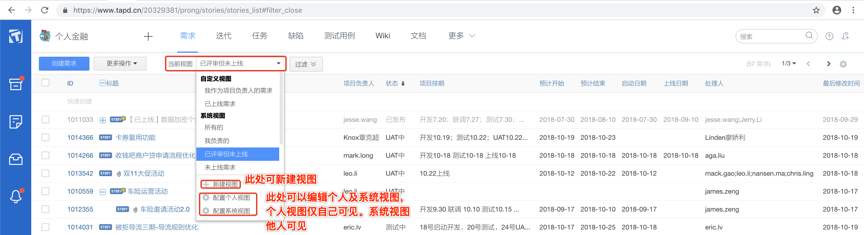

****
### TAPD的使用
说明：此文档主要给TAPD的项目管理员提供参考

## 目录
* [tapd的简介](#tapd的简介)
* [tapd的作用](#tapd的作用)
* [tapd的好处](#tapd的好处)
* [tapd使用的基本要求](#tapd使用的基本要求)
* [tapd的配置及使用](#tapd的配置及使用)
    * [项目成员配置](#项目成员配置)
    * [用户组权限配置](#用户组权限配置)
    * [迭代配置](#迭代配置)
    * [需求配置](#需求配置)
    * [任务配置](#任务配置)
    * [缺陷配置](#缺陷配置)
* [tapd与工单系统的配合使用](#tapd与工单系统的配合使用)
* [tapd与oa系统的配合使用](#tapd与oa系统的配合使用)
* [tapd与考勤系统的配合使用](#tapd与考勤系统的配合使用)
* [tapd的综合使用](#tapd的综合使用)
* [其它辅助信息](#其它辅助信息)
    * [新员工入职指引](#新员工入职指引)
    * [员工基础信息的收集](#员工基础信息的收集)
    * [测试环境专人维护及问题的专人跟踪](#测试环境专人维护及问题的专人跟踪)
    * [人员的备份机制及业务的轮换](#人员的备份机制及业务的轮换)
    * [人员结构的动态调整](#人员结构的动态调整)
    * [自动化测试的推进](#自动化测试的推进)
    * [测试进度及测试通过邮件的及时发送](#测试进度及测试通过邮件的及时发送)
    * [技术栈的统一](#技术栈的统一)
    * [人员培训及文档传承](#人员培训及文档传承)

# tapd的简介
TAPD是Tencent Agile Product Development的缩写，即：腾讯敏捷产品研发，是互联网高效协作专业实践，凝聚腾讯多年团队协作理念和敏捷研发精髓。 
 
TAPD提供轻量协作和敏捷研发两种解决方案，看板、文档、迭代计划&跟踪、产品需求规划、缺陷跟踪管理等丰富功能，帮助团队可视化工作进展、沉淀分享项目知识、提升团队协作效率。

引自：https://www.tapd.cn/help/view#1120003271001001582

# tapd的作用
对迭代、需求、任务及缺陷进行分类及管理；对需求的项目负责人、排期、进度及状态进行管理；为人员的管理、工作安排、绩效评估提供客观的数据支撑。总体关系是这样的，迭代里建需求，需求里建任务。缺陷关联需求。总的来说，tapd可以作为项目管理及人员管理的工具，同时产出的数据可以作为绩效评估的依据。

# tapd的好处
1、项目及人员的管理一目了然，可以随时了解项目及人员的情况，节省了管理的成本；  
2、跨部门沟通更方便，提升了沟通的效率，例如：负责人、进度、排期等，直接在TAPD上看就行了；  
3、需要进行绩效评估的时候，可以将数据导出，包括考勤的数据，员工级别等，结合数据综合进行绩效评估，相对客观公正；  
4、节省了管理人员的时间，有问题沟通直接找项目负责人，不用通过各小组的Leader去找人，提高了效率。

# tapd使用的基本要求
1、所有的需求必须在TAPD上建立需求链接（不接受邮件及口头需求，需求的变更需要在TAPD上提现）；  
2、上线发布的工单必须填写TAPD的需求或迭代地址（工单没有填写TAPD链接或填写错误的打回不予发布）；  
3、上线发布前TAPD上的相关数据必须填写完整（项目负责人、排期、工作量、启动日期、上线日期等）；  
4、项目负责人制度：每个需求都对应一个项目负责人，大型的项目可以前后端分别制定负责人，一般的项目指定一个主负责人就行了，负责人整个项目的任务拆分、资源协调、人员排期、进度跟进等，以及需求的状态变更，排期、工作量及状态数据补齐等。通过这种制度，可以培养部分骨干具备基本的项目管理的能力，储备部分干部资源。  

# tapd的配置及使用  
注明：以下实例均以“个人金融”项目为例说明：

## 项目成员配置
   

   

   

可以修改真实名字，分配组。（TAPD账户一般入职的时候会分配，不用另外添加，名字和组信息可能不对，可以在这里修改。组涉及到权限，建议分配正确），见下图：  
   

## 用户组权限配置
  
 
   

给不同的角色配置不同的权限，如下图：
   

## 迭代配置
迭代由产品部门负责维护，开发人员可以不用太关注
   

## 需求配置
一般的迭代需求由产品统一添加，内部迭代优化的需求由开发人员添加，需求页面的整体介绍，如下图：  
   
  
自定义字段  
 
 
  

  

设置显示字段  
   

  

隐藏、展现需求分类  
   

新增需求子分类
  

过滤  
  

快速添加需求  
  

定制视图  
  
以其中一个视图为例子：
  
 
  

需求分布统计及需求导出
  

## 任务配置
任务一般由项目负责人统一拆分，并分配人员。以下是任务的整体概览。说明：字段显示设置、任务视图设置、任务导出及过滤等跟需求类似，这里就不赘述了。总而言之，前后端开发及测试需要根据需求拆分任务，并填写各任务投入的实际工作量。  
   

自定义字段  
   
  
    
 
   
  
   

## 缺陷配置
缺陷一般由测试人员新增。设置里可以配置缺陷的必填字段、模版等。其它配置跟需求、任务等比较类似，这里就不赘述了。
   

创建专用模版
   

## tapd与工单系统的配合使用
在工单提交的时候检查TAPD地址是有填对，同时检查需求里的项目负责人、排期、进度、工作量及状态等是否完整，不完整不予发版。  
  

## tapd与oa系统的配合使用
  

## tapd与考勤系统的配合使用
   

   

  

## tapd的综合使用
通过任务跟踪员工的当前工作内容、任务的完成时间以及合理安排后续的工作，即可以同时进行项目管理及人员管理
  

另外，需求及任务的导出功能，后续可以通过导出一定时间区间的全部数据进行分析，为绩效评估提供依据。

# 其它辅助信息

## 新员工入职指引
专门针对新员工入职，持续优化文档，减少新员工入职流程的人工干预。
   

## 员工基础信息的收集
包括员工的生日（提醒生日假期）、职级（根据级别给员工分配任务，级别高的员工应该承担压力更大的任务）、工作经历（了解个人优势）、教育经历、学历、婚否、年龄、大概居住地（例如：南山西丽）、主要负责的业务等。

## 测试环境专人维护及问题的专人跟踪
测试环境安排专人维护，问题有专人跟踪解决。保持测试环境的稳定性，简介提高交付的效率和质量。

## 人员结构的动态调整
优胜劣汰，靠谱的、责任心强的人，会省很多事情。人员只进不出，时间长了肯定出问题。另外，需要加强人员业务的轮换机制，避免出现人员的单点问题。做到哪怕走一半的人，团队不至于散架，业务不断档。长期低效的人员不进行处理，产出低且影响了整个团队的氛围，占着编制不出活。

## 自动化测试的推进
优先实现核心业务流程的自动化测试。逐步提交自动化测试的覆盖率，最终实现接口的自动化覆盖率近100%，手工的测试主要集中在界面UI、体验及WEB页面逻辑的测试。自动化测试测出的问题，需要给指定的人发送邮件，并有专门的人跟踪、确认并解决问题。

## 测试进度及测试通过邮件的及时发送
项目进入测试阶段后，测试人员每天同步下核心项目的测试进度，并在测试通过后发送测试通过邮件，进行后面的流程。

## 技术栈的统一
尽量使用互联网主流的技术栈，尤其是WEB前端，尽可能使用通用、主流、成熟的技术，降低后续的维护成本。

## 人员培训及文档传承
培训要作为一项长期的事项来推动，且要有文档的沉淀。安排业务熟悉的人进行业务的分享，安排技术过硬的人针对技术进行分享，分享的内容建议围绕工作相关的内容进行分享，好钢用在刀刃上。