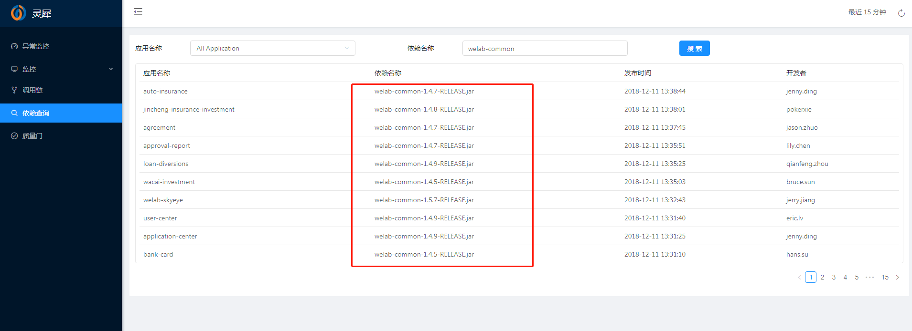

## welab-common版本升级

#### 问题
welab-common基础包低于1.4.9-RELEASE版本存在安全缺陷，具体原因等大部分项目修改完成后再描述，其他版本也存在apollo缓存配置文件会写本地造成安全隐患

#### 解决方案
所有项目welab-common基础包版本统一升级至1.6.5-RELEASE，也保持公司项目一致性。  
测试环境可在[灵犀系统](http://saas-dev.wolaidai.com/skyeye/depend)中查看各个项目的jar依赖，详见：
  

安全起见，还是要注意以下风险点,放到测试环境运行段时间再部署至线上：
1. welab-common在1.3.3-RELEASE版本及其之前有少量api存在不兼容升级，如果存在会编译出错
2. welab-common在1.4.2-RELEASE版本及其之前Response类中字段code是Integer类型的，项目如果引用引类编译会报错，如果提供rpc接口中使用该要及时跟allen.xie反馈（此种情况应该较少）
3. 之后的api都是采用兼容性升级的，还是可能存在jar版本依赖问题，通常在启动时报错