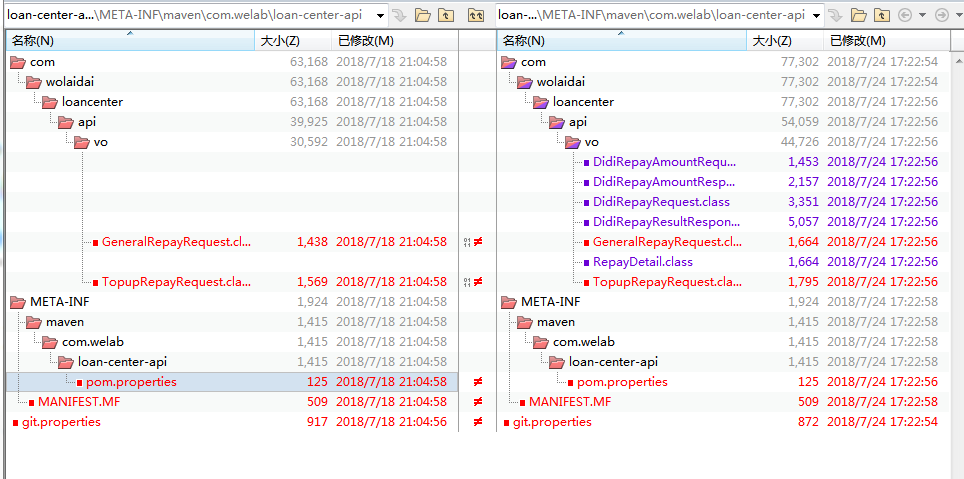

# maven库比较
比较不同环境同一个版本中jar、pom文件是否一致，适用于比较(生产环境nexus库和测试环境nuxus库)、(生产环境nexus库和生产环境缓存)

### 实现步骤

###### 一. 整合需要对比的文件夹至同一文件系统，以下简称src和target  
###### 二. 分析src每个目录，若该目录含有pom.xml或者*.jar，对maven来说这是最终的叶子目录，进入下一步比较，否则递归遍历每个子目录  
###### 三. 找出该目录最终版本文件  
找出该目录对应的jar文件(无需对比source.jar)和pom.xml，release目录文件比较简单，每个版本只会有一个jar和pom.xml文件，但snapshot比较麻烦，每次打包都会生成相应时间戳的文件，按文件后缀过滤再按名称排序取最大的文件即是，再到对应target找出对应的文件，进行检查是否一致  
  
###### 四. 检查逻辑   
pom检查：比较两个文件的md5值是否一致  
jar检查：不能直接比较md5，需要读取jar内部文件，先比较下归档文件数量是否一致，再比较不属于描述类型的归档文件(描述类型：git.properties和META-INF文件夹)的CRC-32值是否一致  
