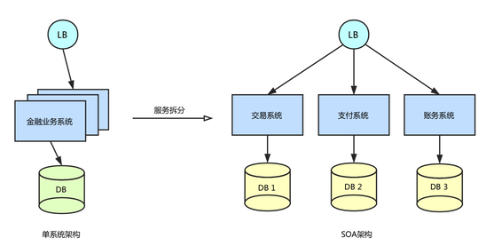
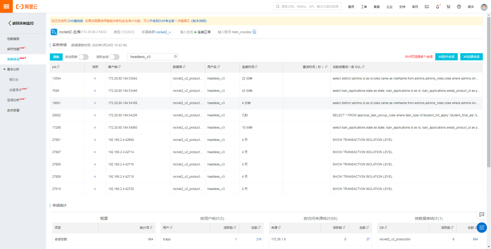
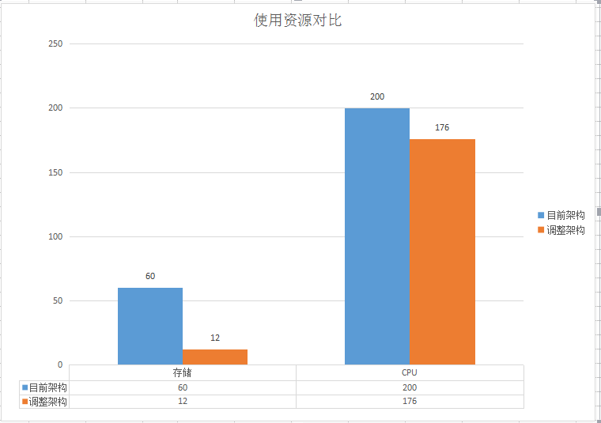
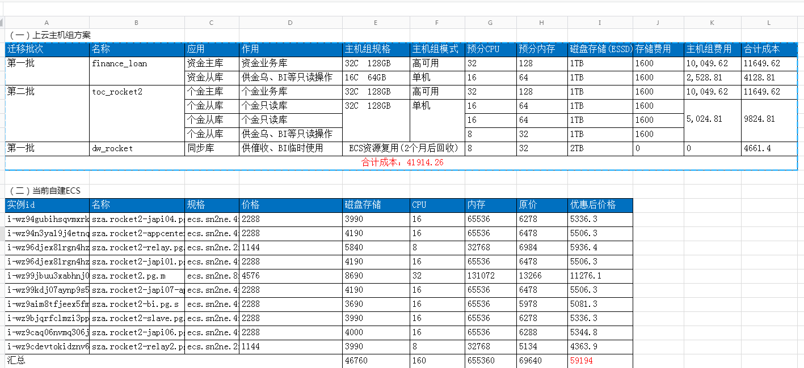
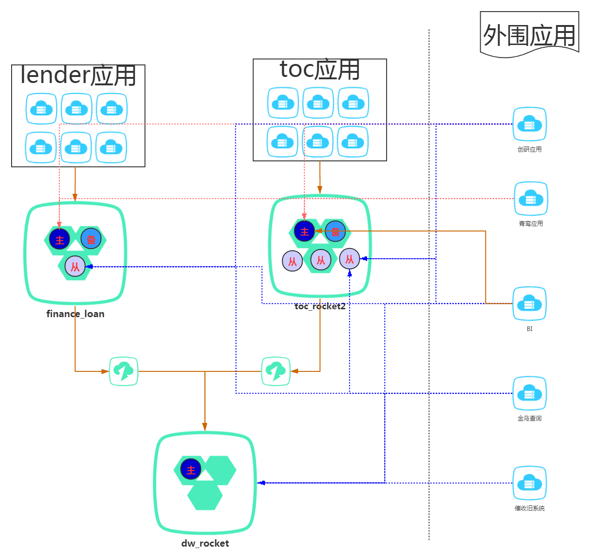
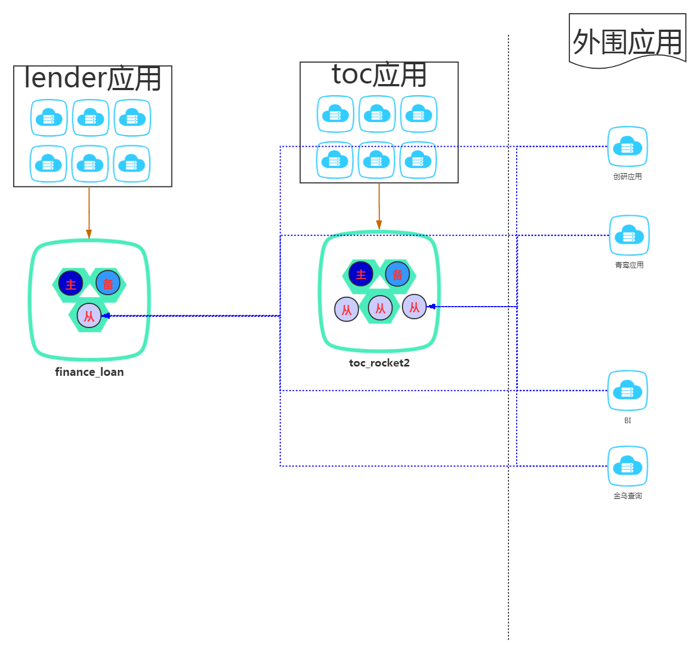

## 一、项目背景

2020年3月份pg出现几次性能问题导致分钟级主从延迟，短期内可以优化慢SQL来解决，但是需要从根本上解决该问题，同时也从以下几方面出发提供PG拆库上云的规划。
1. 微服务架构设计的需要，不同应用访问相应的业务库，便于开发与维护
2. 数据库高可用和可扩展需要
3. 存储成本的考虑

这是从单体架构向微服务架构演化必然经历，我们之前只将应用层次进行了拆分，但db还是耦合在一起。   
 

## 二、业务梳理

#### 代码静态分析 

扫描所有项目的代码，目前应用的DAO层主要使用mybatis和xdao这两种框架(部分旧项目人工分析):
* mybatis: 解析xml文件，将每个select/update/insert/delete/sql标签转换成对应的SQL，所有条件判断进行最大化匹配，
得到的SQL是包含最全的表名，再提取SQL中的表。
* xdao: 比较简单，只要使用xdao生成的java类，就以为使用的这张表

核心代码：https://git.wolaidai.com/WelabCo/Architecture/middleware/data-migration/blob/master/gitlab/src/main/java/com/welab/gitlab/ProjectAnalyze.java

扫描结果：https://git.wolaidai.com/WelabCo/Architecture/middleware/data-migration/blob/master/gitlab/src/main/resources/pg2mysql-code.json

#### 开发人员核对
在代码静态分析的基础上，由开发人员对数据表的业务归属进行最终核对，特别是有共同流量访问的表，其他应用要配合改造。

#### 数据库自治服务

通过阿里云产品(数据库自治服务)可以监控每个PG实例当前会话连接的使用账号、执行SQL等信息，辅助分析各应用使用情况。

 

#### 生产流量分析

使用pgbadger插件记录生产环境PG实例的流量，目前主库每天可产生300G+的日志，然后用程序分析每个SQL语句的执行用户、操作表等维度信息。
对不符合调用关系的SQL找出对应的上层应用，让业务开发人员重构。 

```
2020-04-16 14:18:06 CST 172.27.2.3(59292) tcapp@rocket2_v2_production: LOG:  duration: 0.095 ms  execute S_2: SELECT * FROM partner_financial_institution_diversions WHERE application_id = $1 AND partner_code = $2 LIMIT 1
2020-04-16 14:18:06 CST 172.27.1.6(34634) lenderapp@rocket2_v2_production: LOG:  duration: 0.127 ms  execute S_3: SELECT created_at ,updated_at,id,org_id,user_id,application_id,payment_schedule_type,overdue_penalty_type,overdue_penalty_value,outsourcing_type,outsourcing_value,repayment_type,next_repayment_date,reimbursement_type,next_reimbursement_date,is_allow_early_settle,early_settle_fee_type,early_settle_fee_value,loan_mode,repay_mode,clear_mode FROM loan_attribute WHERE application_id=$1
2020-04-16 14:18:06 CST 172.26.1.14(36862) lenderapp@rocket2_v2_production: LOG:  duration: 0.032 ms  execute <unnamed>: SELECT id, order_no, application_id, step, type, description, state, ret_code, remark, created_at, updated_at, user_id, service_no, ret_msg FROM aibank_task_details WHERE state = $1 AND service_no = $2
2020-04-16 14:18:06 CST 172.26.1.13(44538) lenderapp@rocket2_v2_production: LOG:  duration: 1.069 ms  bind S_2157: SELECT t0.id,t0.org_id,t0.user_id,t0.application_id,t0.loan_type,t0.amount,t0.tenor,t1.status,t1.created_at AS confirmed_at,t0.disbursed_at,t0.interest_rate,t0.total_rate,t0.bank_card_id,t0.partner_code,t0.channel_code,t0.writeoff,t0.external_order_no,t0.product_code,t0.closed_at,t0.created_at,t0.updated_at FROM loans t0 LEFT JOIN loan_application t1 ON t1.application_id=t0.application_id WHERE t1.application_id IN ($1,$2)
2020-04-16 14:18:06 CST 172.27.2.3(58440) tcapp@rocket2_v2_production: LOG:  duration: 0.099 ms  execute S_1: SELECT * FROM partner_financial_institution_diversions WHERE application_id = $1 AND partner_code = $2 LIMIT 1
```

每天访问记录可以汇总如下：https://git.wolaidai.com/WelabCo/Architecture/middleware/data-migration/blob/master/gitlab/src/main/resources/log/2020-04-13_res.json。

#### 账号梳理

由dba梳理现有的pg访问账号，确认是否有应用访问、权限是否合适，进一下确认无遗漏的流量，提前停用废弃账号，减少迁移工作量。

## 三、改造

#### 微服务改造

应用不能直连访问其他应用的数据，一定要使用rpc接口来访问。完成应用微服务改造后，后续进行垂直扩展、水平扩展成本都可控，开发人员维护、迭代都简单。
但本次改造仅仅拆至至业务组，还未拆分至应用。

#### 驱动升级

在测试环境中发现现有应用使用旧版本PG JDBC会存在兼容性问题，根据官方文档进行相应的驱动升级。相关细节见文件，
https://git.wolaidai.com/WelabCo/Architecture/work-profile/blob/master/data-migration/pg%E9%A9%B1%E5%8A%A8%E7%89%88%E6%9C%AC.md。
在生产环境发现应用更新驱动使用now()函数会出现时区错误问题，重新在连接池中初始化中设置时区即可。

#### 数据库规范

高并发大数据的互联网业务，架构设计思路是"解放数据库CPU，将计算转移到服务层"，并发量大的情况下，这些功能很可能将数据库拖死，
业务逻辑放到服务层具备更好的扩展性，能够轻易实现“增机器就加性能”。数据库擅长存储与索引，CPU计算由应用层来负责。
同时关系型数据库设计尽可能简单，将来应用的重构，如分表分库\迁移至NoSQL都很方便。

###### 触发器

目前共使用16个触发器，已完成下线或重构，详情见https://docs.qq.com/sheet/DZnhBUUpJR1RCSHpT?tab=5p4wgv&c=A8A0A0。

###### 视图与物化视图

5张视图与22张物化视图已全部确认不使用，准备下线，后续禁止使用视图。

## 四、容量规划

1. 从ECS直接往云RDS上迁移有两部分资源需评估：
* 计算资源：这部分是一致的，之前使用何种CPU内存规格，也应该选用相应配置的RDS实例。
* 存储资源：这部分是有优化空间的，数据库的备份、日志、审计可以使用阿里云更专业的产品来代替。

2. 高可用建设
需要为原来的主库增加台备库解决单点问题，会多一台数据库相同规格实例费用。

3. 架构优化
将原先单体数据库按垂直维度进行拆分，各个数据库根据应用需要增加从实例时，只需要低规格的计算资源与存储资源，而不是原先需要拷贝所有的数据库数据。
当然生产环境要比较谨慎，注意容量预估可能跟实际有偏差的风险，目前拆分后两个主库跟原生的主库是同一规格(32C128G)，相当于总体性能是提高一倍的。后续可以根据实际指标监控进行缩容。

 

截止2020年3月底，生产环境共使用13台ECS机器自建个PG集群，4月底进一下缩容至8个节点，各项资源如下：  

<table width="880" border="0" cellpadding="0" cellspacing="0" style='width:660.00pt;border-collapse:collapse;table-layout:fixed;'>
   <tr height="18" style='height:13.50pt;'>
    <td align="center" height="18" width="197" style='height:13.50pt;width:147.75pt;' >名称</td>
    <td align="center" width="72" style='width:54.00pt;' >存储</td>
    <td align="center" width="72" style='width:54.00pt;' >CPU</td>
    <td align="center" width="72" style='width:54.00pt;' >内存</td>
    <td align="center" width="72" style='width:54.00pt;' >存储费用</td>
    <td align="center" width="72" style='width:54.00pt;' >计算费用</td>
    <td align="center" width="72" style='width:54.00pt;' >原价</td>
    <td align="center" width="113" style='width:84.75pt;' >优惠后价格</td>
    <td align="center" width="138" style='width:103.50pt;' >控制台工单合计</td>
   </tr>
   <tr height="18" style='height:13.50pt;'>
    <td align="center">sza.rocket2-japi04.pg.s</td>
    <td align="right">3990</td>
    <td align="right">16</td>
    <td align="right">64</td>
    <td align="right">3990</td>
    <td align="right">2288</td>
    <td align="right">6278</td>
    <td align="right">5336.3</td>
    <td align="right">5366.96</td>
   </tr>
   <tr height="18" style='height:13.50pt;'>
    <td align="center">sza.rocket2-appcenter.pg.s</td>
    <td align="right">4190</td>
    <td align="right">16</td>
    <td align="right">64</td>
    <td align="right">4190</td>
    <td align="right">2288</td>
    <td align="right">6478</td>
    <td align="right">5506.3</td>
    <td align="right">5641.27</td>
   </tr>
   <tr height="18" style='height:13.50pt;'>
    <td align="center">sza.rocket2-relay.pg.s</td>
    <td align="right">5840</td>
    <td align="right">8</td>
    <td align="right">32</td>
    <td align="right">5840</td>
    <td align="right">1144</td>
    <td align="right">6984</td>
    <td align="right">5936.4</td>
    <td align="right">5936.4</td>
   </tr>
   <tr height="18" style='height:13.50pt;'>
    <td align="center">sza.rocket2-japi01.pg.s</td>
    <td align="right">4190</td>
    <td align="right">16</td>
    <td align="right">64</td>
    <td align="right">4190</td>
    <td align="right">2288</td>
    <td align="right">6478</td>
    <td align="right">5506.3</td>
    <td align="right">5556.96</td>
   </tr>
   <tr height="18" style='height:13.50pt;'>
    <td align="center">sza.rocket2-japi03.pg.s</td>
    <td align="right">3990</td>
    <td align="right">16</td>
    <td align="right">64</td>
    <td align="right">3990</td>
    <td align="right">2288</td>
    <td align="right">6278</td>
    <td align="right">5336.3</td>
    <td align="right">5366.98</td>
   </tr>
   <tr height="18" style='height:13.50pt;'>
    <td align="center">sza.rocket2-datasync.pg.s</td>
    <td align="right">4340</td>
    <td align="right">8</td>
    <td align="right">32</td>
    <td align="right">4340</td>
    <td align="right">1144</td>
    <td align="right">5484</td>
    <td align="right">4661.4</td>
    <td align="right">4661.4</td>
   </tr>
   <tr height="18" style='height:13.50pt;'>
    <td align="center">sza.rocket2.pg.m</td>
    <td align="right">8690</td>
    <td align="right">32</td>
    <td align="right">128</td>
    <td align="right">8690</td>
    <td align="right">4576</td>
    <td align="right">13266</td>
    <td align="right">11276.1</td>
    <td align="right">10754.55</td>
   </tr>
   <tr height="18" style='height:13.50pt;'>
    <td align="center">sza.rocket2-japi07-appcenter.pg.s</td>
    <td align="right">4190</td>
    <td align="right">16</td>
    <td align="right">64</td>
    <td align="right">4190</td>
    <td align="right">2288</td>
    <td align="right">6478</td>
    <td align="right">5506.3</td>
    <td align="right">5556.97</td>
   </tr>
   <tr height="18" style='height:13.50pt;'>
    <td align="center">sza.rocket2-bi.pg.s</td>
    <td align="right">3690</td>
    <td align="right">16</td>
    <td align="right">64</td>
    <td align="right">3690</td>
    <td align="right">2288</td>
    <td align="right">5978</td>
    <td align="right">5081.3</td>
    <td align="right">5081.3</td>
   </tr>
   <tr height="18" style='height:13.50pt;'>
    <td align="center">sza.rocket2-slave.pg.s</td>
    <td align="right">3990</td>
    <td align="right">16</td>
    <td align="right">64</td>
    <td align="right">3990</td>
    <td align="right">2288</td>
    <td align="right">6278</td>
    <td align="right">5336.3</td>
    <td align="right">10694.39</td>
   </tr>
   <tr height="18" style='height:13.50pt;'>
    <td align="center">sza.rocket2-japi06.pg.s</td>
    <td align="right">4000</td>
    <td align="right">16</td>
    <td align="right">64</td>
    <td align="right">4000</td>
    <td align="right">2288</td>
    <td align="right">6288</td>
    <td align="right">5344.8</td>
    <td align="right">5081.3</td>
   </tr>
   <tr height="18" style='height:13.50pt;'>
    <td align="center">sza.rocket2-relay2.pg.s</td>
    <td align="right">3990</td>
    <td align="right">8</td>
    <td align="right">32</td>
    <td align="right">3990</td>
    <td align="right">1144</td>
    <td align="right">5134</td>
    <td align="right">4363.9</td>
    <td align="right">4363.9</td>
   </tr>
   <tr height="18" style='height:13.50pt;'>
    <td align="center">sza.rocket2-japi05.pg.s</td>
    <td align="right">4190</td>
    <td align="right">16</td>
    <td align="right">64</td>
    <td align="right">4190</td>
    <td align="right">2288</td>
    <td align="right">6478</td>
    <td align="right">5506.3</td>
    <td align="right">5709.45</td>
   </tr>
   <tr height="18" style='height:13.50pt;'>
    <td align="center">合计</td>
    <td align="right">59280</td>
    <td align="right">200</td>
    <td align="right">800</td>
    <td align="right">59280</td>
    <td align="right">28600</td>
    <td align="right">87880</td>
    <td align="right">74698</td>
    <td align="right">79771.83</td>
   </tr>
  </table>

新主机组方案预计共使用8个实例，各项资源如下：  

 

## 五、架构图

重构后架构解读：

1. 将原来jrocket2数据库合计约3T数据拆成两个库，其中一库finance_loan归属lender应用，一主一备一从，共590张表，约2.2T数据；
另一库toc_rocket2归属lender应用，一主二备三从，共286张表，约700GT数据。  
2. 同步库dw_rocket，共317张表，约1.8T数据，开放给旧催收系统和smartbi使用，且不再新增表的同步。是因为兼容这两个系统会同时连接查询toc与lender数据表，
改造工作量巨大，人力投入产出不划算。
3. 实时同步： 目前创研中心、青鸾系统会使用wal2json插件进行实时逻辑复制技术，目前只能通过主库，正常情况下数据量小，要注意同步进程的监控。
4. 全量同步： 目前创研中心、BI等系统会sqoop全量同步部分数据表，这部分数据量大，需使用专门的从库，与线上应用使用的读库隔离开。
5. BI写数据： 目前BI与toc使用数据库进行数据传输，暂时保留主库相关表的写权限。
6. 金乌查询：与其他的数据库类似，代理访问使用的专用从库。

 

当然目前的架构还有些不完善的地方，后续要持续推进调整：

1. 同步库dw_rocket属于过度的方案，6月份旧催收系统即将下线，smartbi后续慢慢不使用此同步库。
2. 使用数据库传输是种比较不优雅的设计，数据交互可以使用接口、oss文件等，BI写需要调整。
3. 线上应用只能读写相应业务的数据库，非核心业务只允许使用从库。

 
