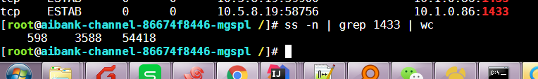
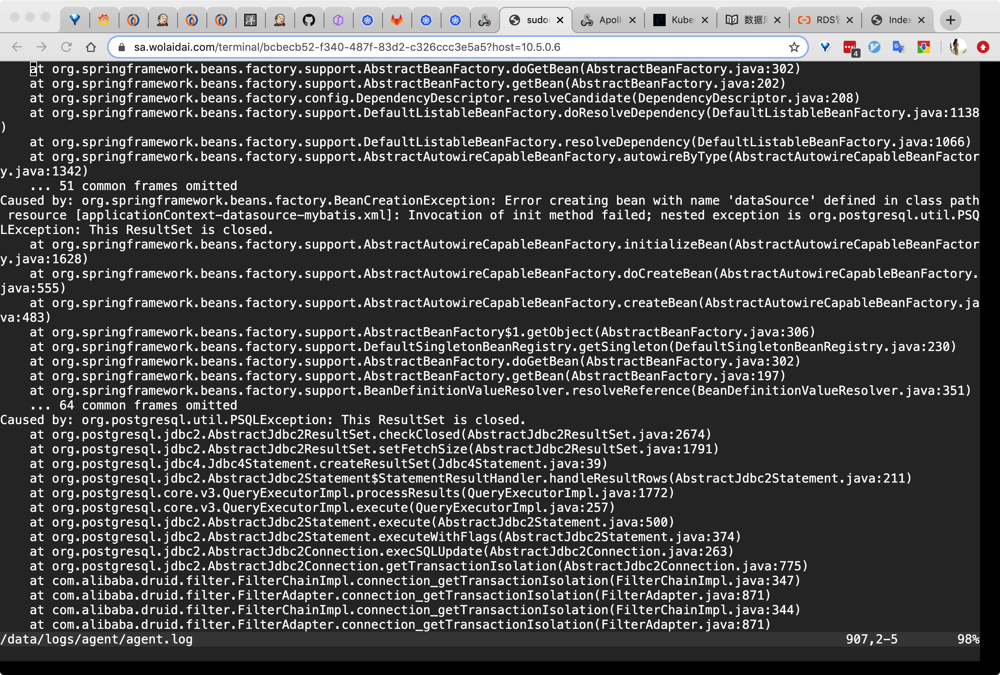

## 1、本次fat存在的问题
* 数据库连接池  
  
  
* 加密服务：提前配置且高可用
* JDBC驱动版本:https://git.wolaidai.com/WelabCo/Architecture/work-profile/blob/master/data-migration/pg%E9%A9%B1%E5%8A%A8%E7%89%88%E6%9C%AC.md
  
* 应用过多，可能有疏漏
* 下周PG 表DDL、新应用和加密配置

## 2、dba
* 数据库目前存在的问题
* 性能与兼容性测试
* 生产配置规模

## 3、讨论问题的解决方法并讨论接下的测试计划
* 如何规划多次迁移和生产演练
* 其他问题