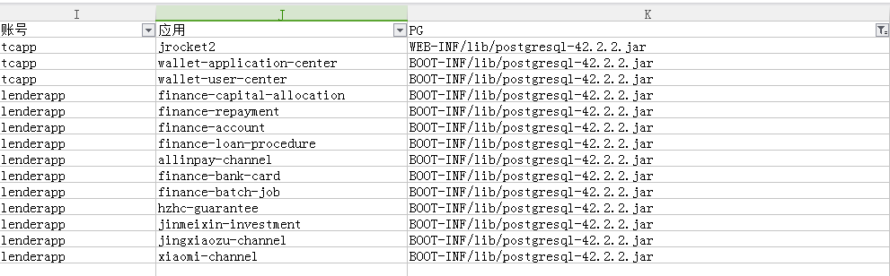

## PG的版本命名规则

PG JDBC驱动程序版本之前命名不规范，如postgresql-9.1-901.jdbc4.jar会让人识以为仅支持pg 9版本，所以官方从2017年开始pg进行了版本调整，使用
42这个比较大且随机的数字避免让开发者误会。如最新的版本42.2.11的官网引用(https://github.com/pgjdbc/pgjdbc)。

```
当前版本的驱动程序应与PostgreSQL 8.2及更高版本（使用协议的3.0版）以及Java 6（JDBC 4.0），Java 7（JDBC 4.1）和Java 8（JDBC 4.2）兼容。
```

中文地址：https://www.jianshu.com/p/c94af69d62ea  
英文地址：https://jdbc.postgresql.org/documentation/faq.html

## 驱动升级

推荐使用42.2.2版本，主要是因为线上已经有13个项目使用该版本驱动，应该不存在兼容性问题，如jrocket2项目(https://git.wolaidai.com/WelabCo/TC/jrocket2/commit/4fa3fcbbfe05935ac4ae0fd117d84c9ff2b44ab3)。
 

maven 依赖如下：  
```
<dependency>
    <groupId>org.postgresql</groupId>
    <artifactId>postgresql</artifactId>
    <version>42.2.2</version>
</dependency>
```

升级见：
   
gitlab:https://git.wolaidai.com/WelabCo/MF/backend/agent/commit/6b7ff3aa2ccd7d4e59df7835ed0b03462c4da79b

目前只有13个项目使用42版本，所以下周要进行生产环境pg驱动替换，并且也跟其他团队反馈这个问题。  
 

## 时区问题
旧版本的pg驱动JDBC连接默认是使用GMT时区，如postgresql/postgresql/9.1-901.jdbc4/postgresql-9.1-901.jdbc4.jar。新版本的驱动(groupId=org.postgresql)已调整成
当前应用的时区(Asia/Shanghai)。所以使用42.2.2版本的驱动后，当前客户端连接会使用当前应用的时区(东八区)：

```
show time zone;
-- Asia/Shanghai
```

所以在SQL中如果使用now()函数实际上使用的计算是东八区的时间，这跟目前的时间存储有差异。

#### druid参数调整

我们目前使用的是druid数据源，有提供connectionInitSqls参数用于物理连接初始化的时候执行的sql，官方的标准代码如下：

```
    DruidDataSource ds = new DruidDataSource();
    ds.setUrl(url);
    ds.setUsername(user);
    ds.setPassword(password);
    ds.setConnectionInitSqls(Arrays.asList("set timezone=GMT"));
```

#### 项目修改

在welab项目中，大部分使用以下两种方式来初始化druid数据源：

1. 使用druid-spring-boot-starter 1.3.0版本，在apollo中增加配置参数

```
druid.initConnectionSqls = set timezone=GMT
```

2. 使用spring xml配置来初始化druid数据源，增加initConnectionSqls属性的设定

```
<bean id="dataSource" class="com.alibaba.druid.pool.DruidDataSource" init-method="init" destroy-method="close">
    <property name="url" value="${jdbc.url}" />
    <property name="username" value="${jdbc.username}" />
    <property name="password" value="${jdbc.password}" />
    <property name="connectionInitSqls" value="set timezone=GMT" />
</bean>
```

#### 特别风险
1. dues表中due_date是东八区，而created_at是零时区，如果使用now()参与计算需特别注意下
```
CREATE TABLE "public"."dues" (
"id" int4 DEFAULT nextval('dues_id_seq'::regclass) NOT NULL,
"due_date" date,
"created_at" timestamp(6),
)
;
```