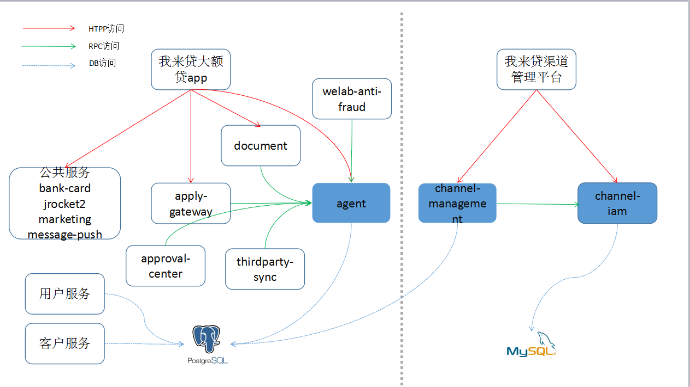
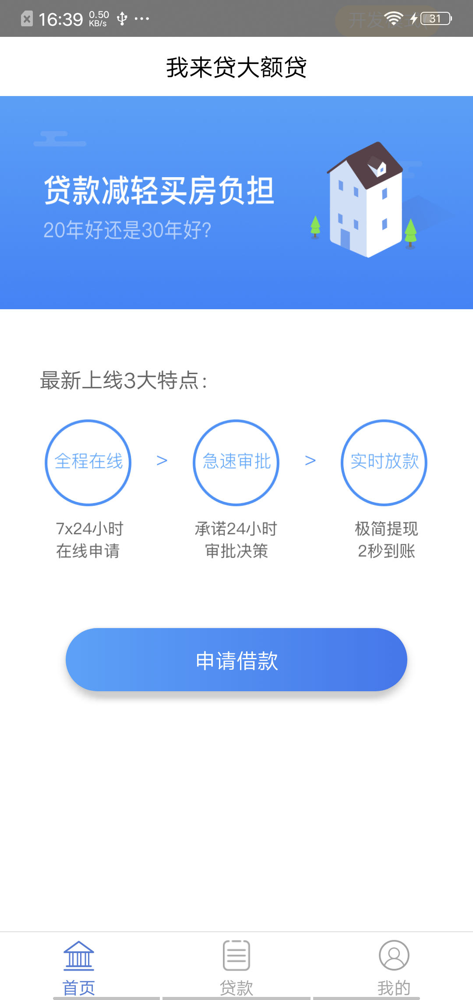
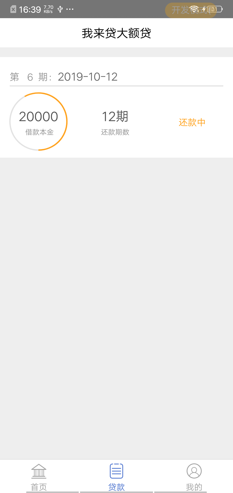
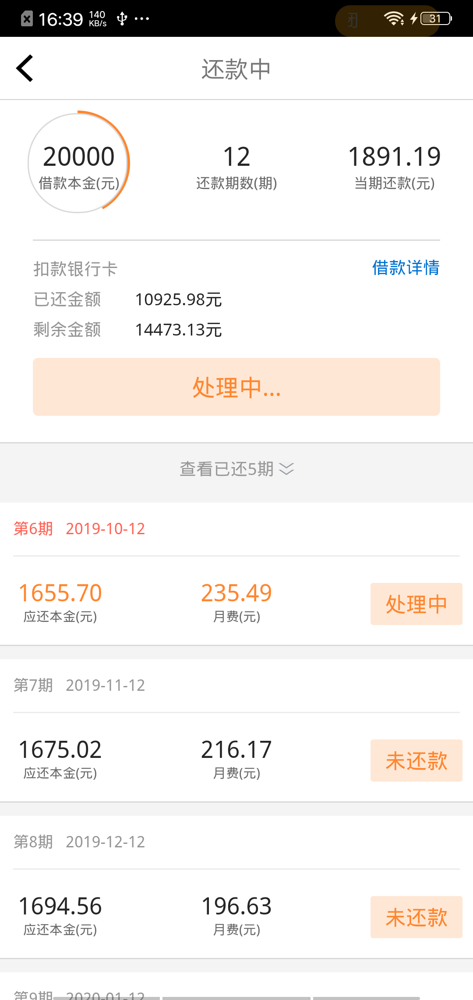
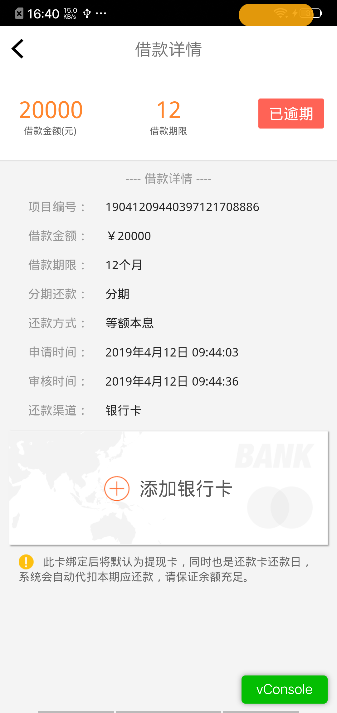
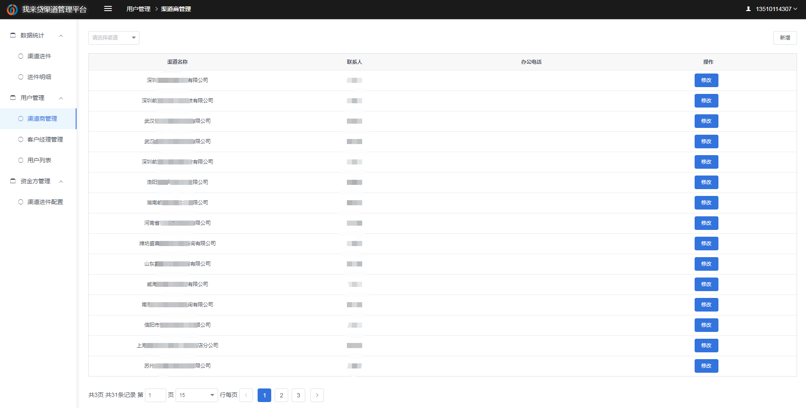
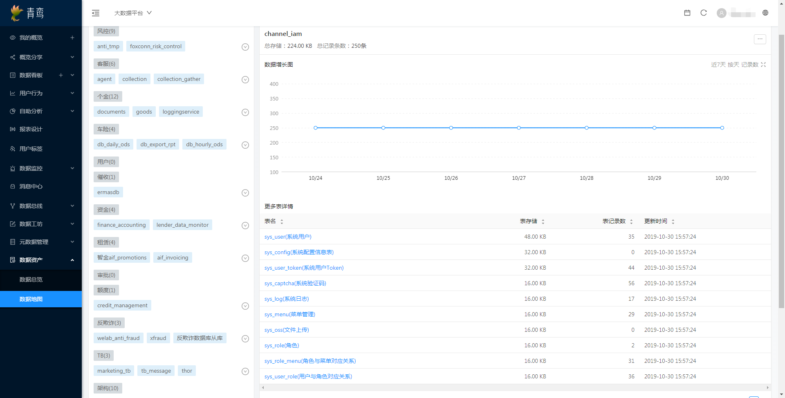
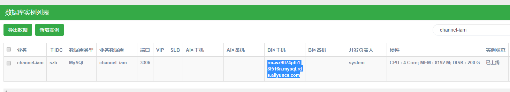
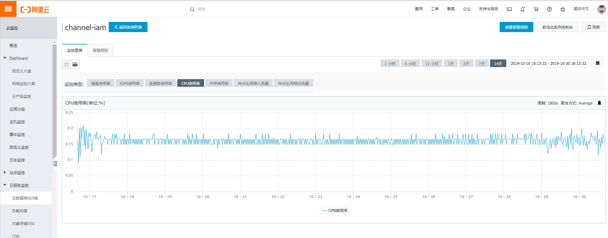

# 小微经营贷架构

### 产品现状

从后台历史数据上看，小微经营贷共发布四款产品，之前与产品人员沟通过目前该产品已经不进件及贷款审批，只保持已放款用户的正常还款功能。
技术中心这边有为这款产品专门开发app、渠道管理系统和后台服务。
这些应用涉及部门比较多，目前至少半年以上未有开发需求，所以目前也没有专门的人来维护。
重新梳理下这些应用现状。

| id  | name |   code    | 
|:-----:|:---:|:---------:|
| 196 | 小微工薪贷A | LOAN-OWNER-HEXINHOUSE-A |
| 197 | 小微工薪贷B | LOAN-OWNER-HEXINHOUSE-B |
| 198 | 小微工薪贷C | LOAN-OWNER-HEXINHOUSE-C |
| 199 | 小微工薪贷D | LOAN-OWNER-HEXINHOUSE-D |

### 架构现状

welab涉及到小微经营贷部分应用的架构图如下：
 

##### APP应用相关
* xinheloanApp(APP)  
git地址：https://git.wolaidai.com/WelabCo/MF/frontend/xinheloanApp

App Tab页面:  
 
 

公共还款页面  
 
 

公共还款页面使用jrocket、loan-application和bank-card应用接口。

**路由文件**：位于https://git.wolaidai.com/WelabCo/MF/frontend/xinheloanApp/blob/staging/communication/Api.js。除了调用后端基础服务外，还在agent、apply-gateway、document应用专门开发相应的接口。

* agent(JAVA应用)  
git地址：https://git.wolaidai.com/WelabCo/MF/backend/agent  
功能介绍：提供客户经理相关数据接口

##### 后端管理系统

* h5-channel-management(H5应用)  
git地址：https://git.wolaidai.com/WelabCo/MF/frontend/h5-channel-management/  
系统页面：https://mf.wolaidai.com/channel-platform/  
 

* channel-management(JAVA应用)
git地址：https://git.wolaidai.com/WelabCo/MF/backend/channel-management  
功能介绍：提供http接口供h5应用(我来贷渠道管理平台)数据查询使用。

* channel-iam(JAVA应用)  
git地址：https://git.wolaidai.com/WelabCo/MF/backend/channel-iam  
功能介绍：  
1 提供http接口给h5应用登陆、角色获取使用  
2 提供rpc接口给channel-management应用做安全权限认证使用  

* channel-iam数据库

从青鸾数据平台查看到该库数据量极少，查看实际数据更新时间至少是两三个月以前。
 

整个mysql实例只提供给该数据库使用，且4C8G配置上存在比较大的资源浪费。
 

查看阿里云监控的近期CPU使用率，的确比较低。
 

### 下线方案

##### APP应用相关

目前fat环境channel-management和channel-iam已注销，测试时APP都能正常使用。
为了保证用户能正常使用app进行还款，agent应用暂时不下线。但对服务进行以下治理。

* agent(JAVA应用)

**上游服务rpc调用**    
&emsp;approval-center、welab-anti-fraud、thirdparty-sync这几个服务是进件期间各环节使用，已跟审批、反欺诈相关人员沟通过，可以删除相关上游调用。

**DB表直接操作**  
&emsp;客户服务、用户服务根据实际需要评估是否更新agent、agent-profile相关表

**自身应用治理**  
&emsp;由于要保证app用户能正常访问，agent保证正常使用，对该应用进行以下治理：   
&emsp;1.迁移至k8s，由于访问量极少，资源会适当降低  
&emsp;2.无调用者的rpc接口将回收，进行rpc治理  
&emsp;3.mq队伍与定时任务可移除，进行mq治理  

##### 后端管理系统

后端管理系统已与产品确认可以下线，所以以下应用近期将做下线  
&emsp;1.h5-channel-management(H5应用)  
&emsp;2.channel-management(JAVA应用)  
&emsp;3.channel-iam(JAVA应用)  
&emsp;4.channel-iam数据库  

### 成本分析

| 月份  | 应用 |   费用金额    | 
|:-----:|:---:|:---------:|
| 2019-08 | agent | 308.00 |
| 2019-08 | channel-iam | 133.00 |
| 2019-08 | channel-management | 133.00 |
| 2019-08 | channel-iam数据库 | 1110.00|
| 2019-08 | agent | 300.39 |
| 2019-08 | channel-iam | 130.29 |
| 2019-08 | channel-management | 130.29 |
| 2019-08 | channel-iam数据库 | 1104.03 |

H5应用已经迁入k8s，无近期费用数据。目前JAVA应用都是单点部署且之前channel-iam和channel-management已进行过降配，所以目前主要资源消耗在DB这块，后续开发人员在申请应用加强与DBA多沟通。