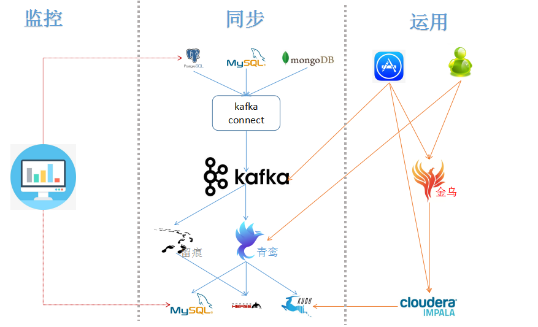

关系型数据库归集至nosql中，类似数据仓库的角色，作为一个OLTP系统，同时兼顾非核心系统的OLAP流量。

 

#### 同步
###### 基本需求
数据从源(业务数据库)至端(kudu)的简单同步
	
* 实时  
从应用写入数据到业务数据库开始，中间经过数据库日志解析写至kafka，多次中间环节处理，再写入到nosql中 ，整个过程是近实时的。
* 一致性  
数据在源数据源和端数据源是存储类型、字段名称、精度要保持一致。
* 高可用  
所有节点都是可集群部署，无单点问题。
* 扩展性  
架构扩展性：从架构上看是水平扩展的，无性能问题。
业务扩展性： 满足大部分的需求场景，尽量不要清表重跑全量数据

###### 扩展需求
* 数据标签化处理
* 血缘分析
* 数据资产
* 不同数据源推送

###### 问题
1. kafka connect同步组件目前是单点问题  
2. 青鸾表同步流程配置需要优化  

#### 运用
###### 用户
1. 通过青鸾平台查询报表
2. 通过金乌代理平台

###### 应用
1、应用 --> kafka
场景：
* 运营平台
旧方案：bi通过squoop同步数据库的增量数据，然后将增量写入kafka中，运营平台就可以实时获取相应表的数据变化
新方案：kafka将作为数据中间件，将提供实时、标准的数据库变化数据，BI和运营平台直接对接kafka即可

优化原因：之前是因为加密，整张表进行更新导致数据库更新日志特别大，监控pg数据变化的组件（c语言开发）就出现性能问题，使用临时方案由BI来推送数据
	
* 黑名单应用
旧方案：users和profiles通过触发器将数据发送至mq，blacklist监听mq消息得到变化数据的主键，再查询数据库得到手机号码，再更新至业务表中
新方案：直接监听kafka的数据变化，替换原有的触发器模式

优化原因：OLTP类型应用不允许使用触发器，且数据库与mq藕合在一起设计也不太合理

2、应用 --> 金乌平台 --> impala --> kudu

* 客服系统
之前部分BI产生的报表重构至客服系统中

旧方案：查询不同业务线表，将来pg重构至mysql中将分在不同实例中
新方案：需要所有关系数据库归集至kudu中，不同业务表的关联统一在kudu中查询

3、应用 --> impala --> kudu

适用场景:BI类型应用，SQL比较复杂，查询数据多 、时间长，且不需要数据解密。

4、应用 --> mysql <-- 青鸾平台

* 催收系统

适用场景：需要及时处理业务表，并推送给外包系统

5、应用 --> 留痕服务 --> hbase

适用场景：历史数据记录异步、自动化记录，不影响线上应用性能  
[https://git.wolaidai.com/WelabCo/Architecture/work-profile/blob/master/middleware/%E7%95%99%E7%97%95%E9%87%8D%E6%9E%84.md](https://git.wolaidai.com/WelabCo/Architecture/work-profile/blob/master/middleware/%E7%95%99%E7%97%95%E9%87%8D%E6%9E%84.md)

#### 监控
###### 数据比对
* 正常情况下，基于性能考虑只做增量数据比对及抽样比对
* 指定表进行全表比对数据

###### 性能监控
* 各个环节tps等应用性能指标
* 各个环节平均处理时间
