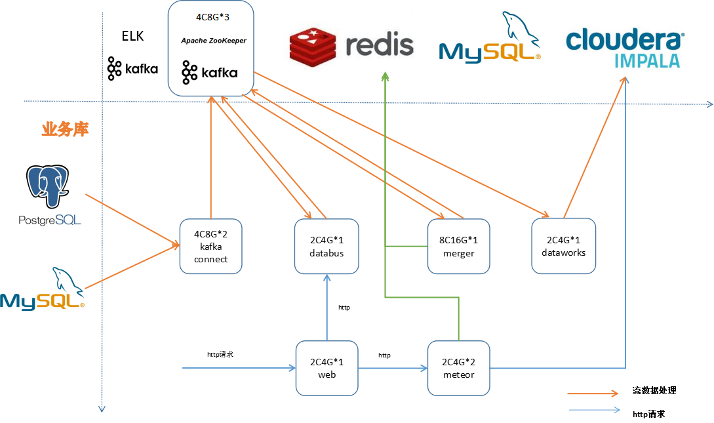

## 青鸾部署文档
#### 系统部署架构图

 

#### 生产环境机器资源列表

**青鸾平台部分**
- kafka connector：2C4G*2
- databus：8C16G*3
- merger：8C16G*2
- dataworks：4C8G*1
- matsu：4C16G*2
- meteor：4C8G*2
- web：2C4G*1

**金乌平台部分**
- poseidon:4C8G*2
- authority:2C4G*2
- sso:2C4G*2

**中间件**
- redis：32G集群版， 目前数据量约15G，5千万条 * 0.1k，过期时间七天
- mysql：2C4G高可用集群,数据量较少，小于5G，多数为配置参数，数据增长不大

#### kafka connector 

1、 zk和kafka集群部署完成  
2、 pg增加decoderbufs插件扩展  
3、 运行docker容器  

```
mkdir -p /data/logs/connect
chmod 777 /data/logs/connect
docker run -d --name connect --net=host -e GROUP_ID=1 -e CONFIG_STORAGE_TOPIC=_connect_configs -e OFFSET_STORAGE_TOPIC=_connect_offsets -e BOOTSTRAP_SERVERS=${kafkahost}:9092 -e HOST_NAME=0.0.0.0 -v /data/logs/connect:/kafka/logs debezium/connect:0.8
```

4、 增加同步任务  

```
#bin/kafka-topics.sh --delete --zookeeper 172.20.80.17:2181 --topic jrocket8.public.users 
bin/kafka-topics.sh --create --zookeeper 172.20.80.17:2181 --partitions 1 --replication-factor 2  --topic jrocket8.public.users 
bin/kafka-topics.sh --zookeeper 172.20.80.17:2181 --describe --topic jrocket8.public.users
curl -X POST -H "Content-Type: application/json" --data '{"name":"connector-pg-jrocket2","config":{"connector.class":"io.debezium.connector.postgresql.PostgresConnector","database.hostname":"10.2.0.13","database.port":"5432","database.user":"postgres","database.password":"postgres","database.dbname":"postgres","database.server.name":"xxx","snapshot.mode":"never"}}' http://localhost:8083/connectors
```

#### tag

1、发布Jar包(api包，不需要部署)  
请从git的[welab-skyscanner-tag](https://git.wolaidai.com/WelabCo/Architecture/welab-skyscanner-tag.git)项目地址，获取production主干代码进行生产环境项目部署

#### databus

1、数据库脚本  
请在部署的生产环境welab_skyeye数据库中执行脚本文件，
> 该脚本文件中除了表创建语句，还包含了一些数据映射的配置和算子帮助SQL，请务必确保已在生产执行。
[welab_skyeye_dbus.sql](sql/welab_skyeye_dbus.sql)

2、apollo参数
- 请在生产的apollo环境配置appId=welab-skyscanner-databus的apollo参数，参考配置文件[databus_server.properties](properties/databus_server.properties)
- 请按实际生产环境参数修改配置文件里的配置项，需变更的项为：

```code
jdbc.url：mysql生产环境welab_skyeye数据库实际地址
jdbc.username：mysql生产环境welab_skyeye数据库用户名
jdbc.password：mysql生产环境welab_skyeye数据库用户密码

zookeeper.url：zookeeper生产环境地址

kafka.source.topic.addr：kafka生产环境地址
kafka.target.topic.addr：kafka生产环境地址

kafka.connect.url：kafka connect组件生产环境地址

redis.address：redis生产地址
redis.password：redis生产密码
```

3、发布应用  
请从git的[welab-skyscanner-databus](https://git.wolaidai.com/WelabCo/Architecture/welab-skyscanner-databus)项目地址，获取production主干代码进行生产环境项目部署

4、项目部署完毕后，此数据库分析平台上线配置内容

```code
1、新建数据库同步组件配置。【初始上线时，需配置全量、增量两个同步配置组件，先开启增量组件任务，确认增量任务正常，并跑了几分钟后，再开启全量组件任务，如此只会造成数据重复而不会丢失，数据重复到kudu时，会保证最终一致性。】
2、新建kudu表结构。【注意主键。】
3、新建topology任务，数据库表则关联新建的kudu表结构，配置算子。
Topology配置注意项：【因组件配置了全量、增量两个组件任务，因此初次部署，需开启两个flink任务，注意此flink任务启动顺序与组件同步任务顺序不同，需先跑完全量flink任务，并确认无误后关闭当前全量任务，再把增量topology任务的topic为全量任务的topic并启动，此操作为两个组件任务的topic数据进行合并】
①. 新建pg、mysql topology模板。
②. 新建日志、前端topology。【需添加当前topology的source_table_name表名，供后续数据互补使用。】
③. 新建业务表topology。【topology的topic不建议手工改动。】
④. 套用模板自动生成算子，维度表需添加merger_table_标识当前表是否为合并表，事实表需添加event_date_time。
⑤. 注意当前表的主键和记录修改时间，此两项需配置人员自己修改。
```

#### merger

1、数据库脚本  
请在部署的生产环境welab_skyeye数据库中执行脚本文件[welab_skyeye_tag.sql](sql/welab_skyeye_tag.sql)

2、apollo参数
- 请在生产的apollo环境配置appId=welab-skyscanner-merger的apollo参数，参考配置文件[merger_server.properties](properties/merger_server.properties)
- 请按实际生产环境参数修改配置文件里的配置项，需变更的项为：

```code
jdbc.url：mysql生产环境welab_skyeye数据库实际地址
jdbc.username：mysql生产环境welab_skyeye数据库用户名
jdbc.password：mysql生产环境welab_skyeye数据库用户密码

zookeeper.url：zookeeper生产环境地址

kafka.zookeeper.url：kafka连接的zookeeper生产环境地址
kafka.dbus.url：kafka生产环境地址

redis.address：redis生产环境地址
redis.password：redis生产环境密码
```

3、发布应用  
请从git的[welab-skyscanner-merger](https://git.wolaidai.com/WelabCo/Architecture/welab-skyscanner-merger.git)项目地址，获取production主干代码进行生产环境项目部署

#### dataworks
CDH版本
```code
序号 组件           版本                                 发行版               CDH版本
1	 Hadoop	     2.6.0+cdh5.14.2+2748	                 1.cdh5.14.2.p0.11	CDH 5.14.2
3	 Hue	     3.9.0+cdh5.14.2+7875	                 1.cdh5.14.2.p0.11	CDH 5.14.2
4	 Impala 	 2.11.0+cdh5.14.2+0	                     1.cdh5.14.2.p0.11	CDH 5.14.2
5	 kudu	     1.6.0+cdh5.14.2+0	                     1.cdh5.14.2.p0.11	CDH 5.14.2
6	 Oozie	     4.1.0+cdh5.14.2+484	                 1.cdh5.14.2.p0.11	CDH 5.14.2
7	 Parquet	 1.5.0+cdh5.14.2+196	                 1.cdh5.14.2.p0.11	CDH 5.14.2
9	 ZooKeeper   3.4.5+cdh5.14.2+142	                 1.cdh5.14.2.p0.11	CDH 5.14.2
10	 Kafka	     3.0.0-1.3.0.0.p0.40（kafka_2.11-0.11.0）		
11	 Flink	     flink-1.6.0-bin-hadoop26-scala_2.11
```

2、apollo参数
- 请在生产的apollo环境配置appId=welab-skyscanner-dataWorks的apollo参数
- 请按实际生产环境参数修改配置文件里的配置项，需变更的项为：

```code
# for impala
impala.url: impala 集群 URL
impala.username: impala 集群用户名
impala.password: impala 集群密码

# for mysql 
mysql.jdbc.url: mysql 生产环境 welab_skyeye 数据库实际地址
mysql.jdbc.username: mysql 生产环境 welab_skyeye 数据库用户名
mysql.jdbc.password: mysql 生产环境 welab_skyeye 数据库用户密码

# for zookeeper
zookeeper.url: ZK 集群节点 URL

```
3、发布应用  
请从git的[welab-skyscanner-dataworks](https://git.wolaidai.com/WelabCo/Architecture/welab-skyscanner-dataworks.git)项目地址，获取production主干代码进行生产环境项目部署


#### meteor

1、数据库脚本  
请在部署的生产环境 welab_skyeye 数据库中执行脚本文件[welab_skyeye_meteor.sql](sql/welab_skyeye_meteor.sql)；

1、apollo 参数
- 请在生产的 apollo 环境配置 appId=welab-skyscanner-meteor 的 apollo 参数，参考配置文件[server.properties](resources/server.properties)
- 请按实际生产环境参数修改配置文件里的配置项，需变更的项为：

```code
#[DefaultConfigService],create time 2018-10-30 09:46:58.
#Tue Oct 30 09:46:58 CST 2018
druid.filters=wall,stat
rollingcuber.job.engine.run=true
impala.poolPreparedStatements=true
impala.password=
impala.username=
impala.testOnBorrow=true
impala.timeBetweenEvictionRunsMillis=60000
impala.removeAbandonedOnMaintenance=true
impala.testWhileIdle=true
async.dao.core_pool_size=20
zookeeper.url=
redis.redisType=
proxy.password=
async.dao.queue_size=500
proxy.username=
redis.address=
impala.removeAbandonedTimeout=180
proxy.port=
impala.url=
impala.maxTotal=200
impala.minEvictableIdleTimeMillis=300000
mysql.jdbc.password=
impala.minIdle=50
impala.removeAbandonedOnBorrow=true
rollingcuber.job.cron=0/5 * * * * ?
druid.connectionProperties=config.decrypt\=false;config.decrypt.key\=MFwwDQYJKoZIhvcNAQEBBQADSwAwSAJBAJv4CwvgYgsoHK+vsDlYfLyY9H6kUYB0UznYxrE4mF4eg8qwjMyG/N0PBhVbOFPlAD20Cg44hBegEeSjlf+DY7sCAwEAAQ\=\=
show.sql=false
mysql.jdbc.username=
redis.expire.day.time=30
user.token.interceptor=true
impala.maxIdle=50
impala.testOnReturn=true
no.login.interceptor.paths=/error,/**/swagger*/**
impala.validationQuery=SELECT 1
mysql.jdbc.url=
impala.heartbeatTimeMillis=3000
table.package=com.welab.skyscanner.meteor.domain;com.welab.skyscanner.tag.domain
async.dao.max_pool_size=200
user.url.interceptor=false
impala.maxWaitMillis=10000
impala.initialSize=50
redis.password=
impala.driverClassName=com.cloudera.impala.jdbc4.Driver
aop.services=execution(* com.welab.skyscanner.*.service.impl.*.*(..))
proxy.openerProxy=false
rollingcuber.query.engine.run=true
impala.maxOpenPreparedStatements=50
```

2、发布应用  
请从 git 的[welab-skyscanner-meteor](https://git.wolaidai.com/WelabCo/Architecture/welab-skyscanner-meteor)项目地址，获取 production 主干代码进行生产环境项目部署

#### web
1、发布应用 
请从 git 的[welab-skyscanner-web](https://git.wolaidai.com/WelabCo/Architecture/welab-skyscanner-web)项目地址，获取 production 主干代码进行生产环境项目部署

2、Web SDK 部署.
web sdk 在web应用`https://{domain}/qingluan/wa.1.0.1.js`, 该sdk地址需要在运维那里配置, 启用起来.
