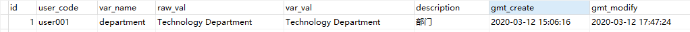
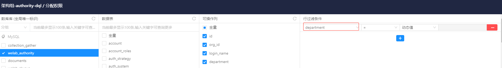

# 金乌动态值过滤说明文档

## 1.  表结构

    CREATE TABLE `user_var` (
      `id` bigint(20) NOT NULL AUTO_INCREMENT COMMENT 'id',
      `user_code` varchar(80) NOT NULL COMMENT '外部机构标识,例如工号',
      `var_name` varchar(80) NOT NULL COMMENT '变量名称',
      `raw_val` varchar(150) DEFAULT NULL COMMENT '原始值',
      `var_val` varchar(150) DEFAULT NULL COMMENT '加工后的值',
      `description` varchar(200) DEFAULT NULL COMMENT '描述',
      `gmt_create` datetime NOT NULL DEFAULT CURRENT_TIMESTAMP COMMENT '创建时间',
      `gmt_modify` datetime NOT NULL DEFAULT CURRENT_TIMESTAMP ON UPDATE CURRENT_TIMESTAMP COMMENT '修改时间',
      PRIMARY KEY (`id`),
      KEY `idx_user_code` (`user_code`),
      KEY `idx_var_name` (`var_name`)
    ) ENGINE=InnoDB DEFAULT CHARSET=utf8mb4 COMMENT='用户信息表';      

## 2.  逻辑

提供动态变量与用户绑定，再通过接口把用户变量值传到各系统使用。

### 2.1.  例子1

user001有动态变量department，值为Technology Department，记录导入到表中。

导入表后，数据角色授权行过滤条件选择department变量，选择获取动态值。

用户user001连到金乌代理客户端，执行以下sql即可过滤，即会过滤出
department="Technology Department"的记录。

    select * from `dep_score`;

## 3.  初始化user\_var表

把用户唯一编号、变量、变量值，导入到表中即可使用列动态过滤功能。
