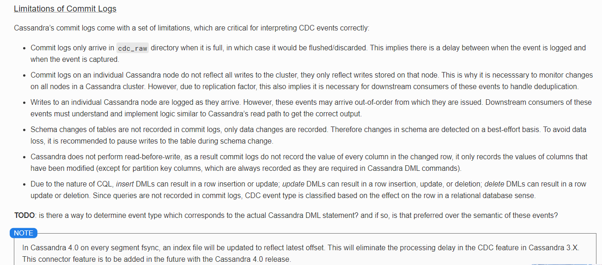

# Debezium cassandra研究

## 1.  部署

### 1.1.  cassandra服务端每个节点cassandra.yaml文件修改，添加下面配置，并重启cassandra节点，生产可滚动重启节点，理论上不会对业务产生影响。
        cdc_enabled: true
        cdc_raw_directory:/data/pangu/cassandra/debezium_cassandra/debezium_cassandra_data
        cdc_free_space_check_interval_ms: 250
        hints_directory: /data/pangu/cassandra/cassandra/data/hints
        

      

### 1.2.  另外创建1个目录，debezium-connector-cassandra项目生成jar，并放到每个cassandra节点

### 1.3.  创建deb_conf.properties并配置。snapshot.mode=ALWAYS/INITIAL，程序启动首次，会对cdc表进行快照+增量，ALWAYS区别是如果遇到意外情况下丢失cdc的offset，会自动快照恢复，snapshot.mode=NEVER表示增量模式

        connector.name=pangu_connector
        commit.log.relocation.dir=/data/pangu/cassandra/debezium_cassandra/debezium_cassandra_data/
        http.port=8000
        
        cassandra.config=/data/pangu/cassandra/cassandra/conf/cassandra.yaml
        cassandra.hosts=10.90.0.4
        cassandra.port=9042
        cassandra.username=wedefend
        cassandra.password=Wolaidai2018

        kafka.producer.bootstrap.servers=10.2.0.15:9092
        kafka.producer.retries=3
        kafka.producer.retry.backoff.ms=1000
        kafka.topic.prefix=cassandra
        key.converter=org.apache.kafka.connect.json.JsonConverter
        value.converter=org.apache.kafka.connect.json.JsonConverter
        key.converter.schemas.enable=true
        value.converter.schemas.enable=true
        internal.key.converter=org.apache.kafka.connect.json.JsonConverter
        internal.value.converter=org.apache.kafka.connect.json.JsonConverter
        
        offset.backing.store.dir=/data/pangu/cassandra/debezium_cassandra/debezium_cassandra_offset/
        snapshot.consistency=ONE
        snapshot.mode=ALWAYS
        \#latest.commit.log.only=true
        commit.log.error.reprocessing.enabled=true
        offset.flush.interval.ms=10000

### 1.4.  启动

        java -jar
        ./debezium-connector-cassandra-1.3.1.Final-jar-with-dependencies.jar
        ./deb_conf.properties

### 1.5.  暴露的http接口

### 1.6.  部署节点

        利用snapshot.mode配置1个节点为快照+增量，其它节点都为增量，避免几个节点都跑快照浪费资源。

### 1.7.  选择表执行命令开启cdc

        ALTER TABLE foo WITH cdc=true;

## 2.  快照增量过程

### 2.1.  快照完，会记录到文件中。重启应用会读取此文件，从而不会再次快照。

问题点(应用于生产需要解决)：

1)第一次快照完，若想再次触发快照，这种场景目前不支持

### 2.2.  增量位点记录文件

## 3.  制约

### 3.1.  只有1个CommitLog日志文件写满，debeziumcassandra进程才会去读，生产kafka消息，意味着可能发现实时同步消息延时，生产写入量大，应该问题不会很突出。

### 3.2.  每个节点都要运行debezium-connector-cassandra-1.3.1.Final-jar-with-dependencies.jar，部署麻烦。

### 3.3.  官网提出的debezium cassandra制约点

### 3.4.  目前debezium cassandra是孵化版本，支持比较弱

## 4.  改动点
### dts
### 4.1.  快照功能，需要提供http接口删除快照标识
### 4.2.  添加应用存活监控
### 4.3.  集成jenkins发布

## 参考：

        https://debezium.io/documentation/reference/1.3/connectors/cassandra.html
