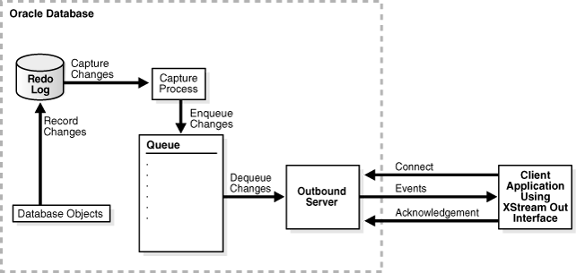

### dbz-oracle使用手册
#### 注意事项：
* 一个有效connector任务对应一个outbound，否则，提交任务会提示错误（e.g:An active session currently attached to XStream server "DBZXOUT26".）
* 创建outbound要使用xstrmadmin用户
* 如下文档经过dbz-oracle 1.0测试
* 11g，可以使用12g的ojdbc连接，所以一个connector镜像应该能处理11g和12g

#### oracle xstream & dbz-connector原理图
 

#### oracle环境搭建
按照 https://github.com/debezium/oracle-vagrant-box 的说明生成docker镜像，oracle 12.2.0.1安装文件可以从oracle官方网站下载

也可以找dba搞定，dev环境10.2.0.23有个oracle环境11.2.0.4版本，sys/top_secret, 1522, orcl

#### 执行oracle脚本
建议每一步单独执行
middleware/oracle/version/*/oracle_dbz_setup.sh

其他相关命令：
```
git clone https://github.com/oracle/docker-images.git
cd docker-images/OracleDatabase/SingleInstance/dockerfiles
cp /vagrant_data/linuxx64_12201_database.zip 12.2.0.1
./buildDockerImage.sh -v 12.2.0.1 -i -e
docker run -d --name oracle -p 1521:1521 -e ORACLE_PWD=top_secret -v /data1/oradata:/opt/oracle/oradata oracle/database:12.2.0.1-ee
#如果脚本在windows下编辑过，转一下
#dos2unix oracle_dbz_setup.sh
 cat oracle_dbz_setup.sh | docker exec -i oracle bash
 
 #观测执行结果，不要有一个报错
```

#### connnector 组件配置相关

一、启动docker容器

```
export IPADDR=$(ifconfig eth0 | grep -oP '\d.+(?=  (Bcast:|netmask))')
docker run -d --name connect1 -p 8083:8083 -e GROUP_ID=1 -e CONFIG_STORAGE_TOPIC=_connect_configs -e OFFSET_STORAGE_TOPIC=_connect_offsets -e BOOTSTRAP_SERVERS=${IPADDR}:9092 -v /data/logs/connect:/kafka/logs debezium/connect:0.9

#10.2.0.13
export IPADDR=$(ifconfig eth0 | grep -oP '\d.+(?=  (Bcast:|netmask))')
docker run -d --name connect094_12g -p 8083:8083 -e GROUP_ID=1 -e CONFIG_STORAGE_TOPIC=_connect094_12g_configs -e OFFSET_STORAGE_TOPIC=_connect094_12g_offsets -e BOOTSTRAP_SERVERS=${IPADDR}:9092 -v /data1/oracle_work/logs/connect094_12g:/kafka/logs debezium/connect:0.9.4.Final


export IPADDR=$(ifconfig eth0 | grep -oP '\d.+(?=  (Bcast:|netmask))')
docker run -d --name connect094_12g_0423 -p 7073:8083 -e GROUP_ID=1 -e CONFIG_STORAGE_TOPIC=_connect094_12g_configs_0423 -e OFFSET_STORAGE_TOPIC=_connect094_12g_offsets_0423 -e BOOTSTRAP_SERVERS=${IPADDR}:9094 -v /data1/oracle_work/logs/connect094_12g_0423:/kafka/logs debezium/connect:0.9.4.Final_12g


docker run -d --net=host --name connect1 -e GROUP_ID=1 -e CONFIG_STORAGE_TOPIC=_connect_configs1 -e OFFSET_STORAGE_TOPIC=_connect_offsets1 -e BOOTSTRAP_SERVERS=10.1.13.80:9092,10.1.13.81:9092,10.1.13.82:9092 -e HOST_NAME=0.0.0.0 -e REST_PORT=7083 219dc1a9c174

export IPADDR=$(ifconfig eth0 | grep -oP '\d.+(?=  (Bcast:|netmask))')
docker run -d --net=host --name connect094_12g  -e GROUP_ID=1 -e CONFIG_STORAGE_TOPIC=_connect094_12g_configs -e OFFSET_STORAGE_TOPIC=_connect094_12g_offsets -e BOOTSTRAP_SERVERS=10.1.13.80:9092,10.1.13.81:9092,10.1.13.82:9092 -e HOST_NAME=0.0.0.0 -e REST_PORT=7083  connect:connect094_12g
```

二、程序文件

* instantclient.tar：basic、sqlplus部分组成
1.下载地址：https://www.oracle.com/technetwork/topics/linuxx86-64soft-092277.html
2.下载到统一目录，直接解压会解压到到一个包里，下面copy到容器会使用
3.可以去oracle官方下载如果要使用sqlplus命令需要配置tnsnames.ora文件
* ojdbc和xstreams：在上面的basic包里有
* libaio:去rpm源下载（https://rpmfind.net/linux/rpm2html/search.php?query=libaio(x86-64)）
* debezium-connector-oracle和debezium-core：github源码编译（看最新版是否支持的完善，支持的话，可以不单独编译）

完成后上述文件准备后拷贝至容器中

```
docker cp ./libaio-0.3.109-13.el7.x86_64.rpm connect1:/kafka
docker cp ./instantclient.tar connect1:/kafka
#docker cp ./ojdbc8-12.1.0.2.jar connect1:/kafka/connect/debezium-connector-oracle
#docker cp ./xstreams-12.1.0.2.jar connect1:/kafka/connect/debezium-connector-oracle
#docker cp ./debezium-connector-oracle-0.9.1.Final.jar connect1:/kafka/connect/debezium-connector-oracle
#docker cp ./debezium-core-0.9.1.Final.jar connect1:/kafka/connect/debezium-connector-oracle
```

三、参数调整

使用root账号进行libaio安装，docker启动脚本修改

```
# 注意，这行代码写在最后一行还不可以
docker exec -it --user root connect /bin/bash
cat >> /docker-entrypoint.sh << \EOF 
export ora_home=/kafka
export PATH=$PATH:$ora_home/instantclient_12_2
export ORACLE_BASE=$ora_home
export ORACLE_HOME=$ORACLE_BASE/instantclient_12_2
export LD_LIBRARY_PATH=$ora_home/instantclient_12_2:$ora_home/instantclient_12_2/libocijdbc12.so
#export TNS_ADMIN=$ORACLE_HOME/network/admin

EOF
rpm -ivh libaio-0.3.109-13.el7.x86_64.rpm
```
使用普通账号进行参数调整

```
docker exec -it connect /bin/bash
tar -xf instantclient.tar

cp instantclient_12_2/xstreams.jar connect/debezium-connector-oracle/
cp instantclient_12_2/ojdbc8.jar connect/debezium-connector-oracle/


## change log4j
sed -i 's/log4j.rootLogger=INFO/log4j.rootLogger=DEBUG/g' /kafka/config/log4j.properties
cat << EOF >> /kafka/config/log4j.properties
log4j.logger.org.apache.kafka=INFO
log4j.logger.io.debezium.connector.base.ChangeEventQueue=INFO
EOF

## change env  该步骤，用于验证sqlplus是否正常
cat >> ~/.bashrc << \EOF 
export ora_home=/kafka
export PATH=$PATH:$ora_home/instantclient_12_2
export ORACLE_BASE=$ora_home
export ORACLE_HOME=$ORACLE_BASE/instantclient_12_2
export LD_LIBRARY_PATH=$ora_home/instantclient_12_2:$ora_home/instantclient_12_2/libocijdbc12.so
#export TNS_ADMIN=$ORACLE_HOME/network/admin
EOF
source ~/.bashrc
```
如上的参数调整是针对官方的原生容器1.0版本。如果是dts(自建的项目集成debezium),则需要打镜像的时候，设置好上面的命令，现在skyscanner-dts已经找运维处理


#### 使用过程中常用命令

##### 创建outbound:
```
    sqlplus xstrmadmin/xsa@//localhost:1522/orcl 

     DECLARE
      tables  DBMS_UTILITY.UNCL_ARRAY;
      schemas DBMS_UTILITY.UNCL_ARRAY;
    BEGIN
        tables(1)  := 'TEST_TABLE_222';
        tables(2)  := NULL;
        schemas(1) := 'XSTRMADMINWHK';
        schemas(2) := NULL;
      DBMS_XSTREAM_ADM.CREATE_OUTBOUND(
        server_name     =>  'dbzxout27',
        source_database =>  NULL,
        capture_user    =>  NULL,
        connect_user    =>  'xstrm',
        table_names     =>  tables,
        schema_names    =>  schemas,
        comment         =>  'dbzxout'
        );
    END;
    /

```
注意：
* 一个有效connector任务对应一个outbound，否则，提交任务会提示错误（e.g:An active session currently attached to XStream server "DBZXOUT26".）
* 这里的参数配置可以参考[oracle官方文档](https://docs.oracle.com/cd/E18283_01/server.112/e16545/xstrm_xstream_adm.htm#CACBHJDD)
* tables、schemas 各项都可以精准指定，不过最后一个元素必须是NULL;如果是outbound和connector是配套精准表，建议这里能写死表，outbound不写死也不会报错。
* server_name 必须唯一

##### 提交connector任务：
```
{
    "name": "thor_test-connector-terry31",
    "config": {
        "connector.class": "io.debezium.connector.oracle.OracleConnector",
        "database.hostname": "10.2.0.23",
        "database.port": "1522",
        "database.user": "xstrm",
        "database.password": "xs",
        "database.dbname": "orcl",
        "database.out.server.name": "dbzxout27",
        "database.server.name": "server-terry31",
        "database.history.kafka.topic": "thor_test-kafka-terry31",
        "database.history.kafka.bootstrap.servers": "10.2.0.15:9098",
        "table.whitelist": "orcl.XSTRMADMINWHK.TEST_TABLE_222",
        "database.tablename.case.insensitive": "false",
        "database.oracle.version": "11"
    }
}
```
注意：
* 如果新增表，outbound匹配到，connector task也匹配到，会导致报错（应该是dbz bug,可以先规避）。table.whitelist 如果使用正则，尽量规避可能会新增表；如果表不到，可以直接写死，逗号分隔 
* 一个有效connector任务对应一个outbound，否则，提交任务会提示错误（e.g:An active session currently attached to XStream server "DBZXOUT26".）
* 这里的参数配置可以参考[dbz-oracle官方文档](https://debezium.io/documentation/reference/0.10/connectors/oracle.html)
* 上图是11g的配置，如果是12g,还有一个参数database.pdb.name（dbname对应cdb,pdb 对应pdb）


#### 其他常用命令
  sqlplus xstrmadmin/xsa@//localhost:1522/orcl 
```  
#删除outboundserver
BEGIN
    DBMS_XSTREAM_ADM.DROP_OUTBOUND(
   server_name  => 'dbzxout10'
   );
  END;
  /

#所有outbound信息
COLUMN SERVER_NAME HEADING 'Outbound|Server|Name' FORMAT A10
  COLUMN CONNECT_USER HEADING 'Connect|User' FORMAT A10
  COLUMN CAPTURE_USER HEADING 'Capture|User' FORMAT A10
  COLUMN CAPTURE_NAME HEADING 'Capture|Process|Name' FORMAT A11
  COLUMN SOURCE_DATABASE HEADING 'Source|Database' FORMAT A11
  COLUMN QUEUE_OWNER HEADING 'Queue|Owner' FORMAT A10
  COLUMN QUEUE_NAME HEADING 'Queue|Name' FORMAT A10
  SELECT SERVER_NAME, 
   CONNECT_USER, 
   CAPTURE_USER, 
   CAPTURE_NAME,
   SOURCE_DATABASE,
   QUEUE_OWNER,
   QUEUE_NAME
   FROM DBA_XSTREAM_OUTBOUND;
   /
  
#统计信息(展示当前正在连接的outbound，以及具体的连接统计信息)
COLUMN SERVER_NAME HEADING 'Outbound|Server|Name' FORMAT A8
COLUMN TOTAL_TRANSACTIONS_SENT HEADING 'Total|Trans|Sent' FORMAT 9999999
COLUMN TOTAL_MESSAGES_SENT HEADING 'Total|LCRs|Sent' FORMAT 9999999999
COLUMN BYTES_SENT HEADING 'Total|MB|Sent' FORMAT 99999999999999
COLUMN ELAPSED_SEND_TIME HEADING 'Time|Sending|LCRs|(in seconds)' FORMAT 99999999
COLUMN LAST_SENT_MESSAGE_NUMBER HEADING 'Last|Sent|Message|Number' FORMAT 99999999
COLUMN LAST_SENT_MESSAGE_CREATE_TIME HEADING 'Last|Sent|Message|Creation|Time' FORMAT A10
SELECT SERVER_NAME,
 TOTAL_TRANSACTIONS_SENT,
 TOTAL_MESSAGES_SENT,
 (BYTES_SENT/1024)/1024 BYTES_SENT,
 (ELAPSED_SEND_TIME/100) ELAPSED_SEND_TIME,
 LAST_SENT_MESSAGE_NUMBER,
 LAST_SENT_MESSAGE_CREATE_TIME
 FROM V$XSTREAM_OUTBOUND_SERVER;
 /


#查看当前所有connector
 curl -i  localhost:7083/connectors
 
#删除指定connector
 curl -i -X DELETE localhost:7083/connectors/xxxx
 
 curl -i -X DELETE localhost:7083/connectors/inventory-connector041906
 
#提交一个oracle connector任务
curl -i -X POST -H "Accept:application/json" -H "Content-Type:application/json" localhost:7083/connectors/ -d '{  "name": "inventory-connector042301",  "config": {    "connector.class": "io.debezium.connector.oracle.OracleConnector",    "tasks.max": "1",    "database.server.name": "server042301",    "database.hostname": "10.1.13.83",    "database.port": "1521",    "database.user": "c##xstrm",    "database.password": "xs",    "database.dbname": "ORCLCDB",    "database.pdb.name": "ORCLPDB1",    "database.out.server.name": "dbzxout042301",    "database.history.kafka.bootstrap.servers": "10.1.13.80:9092,10.1.13.81:9092,10.1.13.82:9092",    "database.history.kafka.topic": "whk-inventory042301"  }}'

11g:
请注意替换属性：name、database.server.name、database.hostname、database.dbname、database.history.kafka.bootstrap.servers、database.history.kafka.topic、table.whitelist(用于监控指定库表，注意变更)
curl -i -X POST -H "Accept:application/json" -H "Content-Type:application/json" localhost:8083/connectors/ -d '{  "name": "inventory-connector36",  "config": {    "connector.class": "io.debezium.connector.oracle.OracleConnector",    "tasks.max": "1",    "database.server.name": "server36",    "database.hostname": "10.2.0.23",    "database.port": "1521",    "database.user": "xstrm",    "database.password": "xs",    "database.dbname": "ORCLCDB",    "database.out.server.name": "dbzxout",    "database.history.kafka.bootstrap.servers": "10.2.0.13:9092",    "database.history.kafka.topic": "whk-inventory36","database.tablename.case.insensitive": "false","database.oracle.version": "11","table.whitelist":"orcl\\.debezium\\.(.*)"  }}'

#kafka 列出所有topic
bin/kafka-topics.sh --zookeeper 10.2.0.15:2188/kafka --list
bin/kafka-topics.sh --zookeeper 10.2.0.15:2188/ --list

#kafka 看是否有消息到达
bin/kafka-console-consumer.sh --bootstrap-server  10.1.13.80:9092  --from-beginning --topic whk-inventory041901
bin/kafka-console-consumer.sh --bootstrap-server 10.2.0.15:9098 --from-beginning --topic thor_test-kafka-terry12
bin/kafka-console-consumer.sh --bootstrap-server 10.2.0.15:9098 --from-beginning --topic thor_test-kafka-terry28
bin/kafka-console-consumer.sh --bootstrap-server 10.2.0.15:9098 --from-beginning --topic server-terry31.XSTRMADMINWHK.TEST_TABLE_222
```


其他
```
2019年11月28日 oracle 11.2.4.0 dbz-oracle 1.0
创建zk
export IPADDR=$(ifconfig eth0 | grep -oP '\d.+(?=  (Bcast:|netmask))')
 docker run -d -it --rm --name zookeeper1p0 -p 2188:2181 -p 2898:2888 -p 3898:3888 debezium/zookeeper:1.0

创建kafka
export IPADDR=$(ifconfig eth0 | grep -oP '\d.+(?=  (Bcast:|netmask))')
docker run -d -it --rm --name kafka1p0 -p 9098:9092 -e ZOOKEEPER_CONNECT=${IPADDR}:2188 debezium/kafka:1.0

创建connect
export IPADDR=$(ifconfig eth0 | grep -oP '\d.+(?=  (Bcast:|netmask))')
docker run -d --name connect1p0 -p 8088:8083 -e GROUP_ID=1 -e CONFIG_STORAGE_TOPIC=_connect_configs_1p0 -e OFFSET_STORAGE_TOPIC=_connect_offsets_1p0 -e BOOTSTRAP_SERVERS=${IPADDR}:9098 -v /data/logs/connect1p0:/kafka/logs debezium/connect:1.0
```

### 其他参考
* https://docs.oracle.com/en/middleware/goldengate/core/18.1/oracle-db/establishing-oracle-goldengate-credentials.html#GUID-14C7E923-82F5-43AD-9535-EE99F979F9EB
* https://www.confluent.io/blog/streaming-data-oracle-using-oracle-goldengate-kafka-connect/
* https://cloud.tencent.com/developer/article/1140667