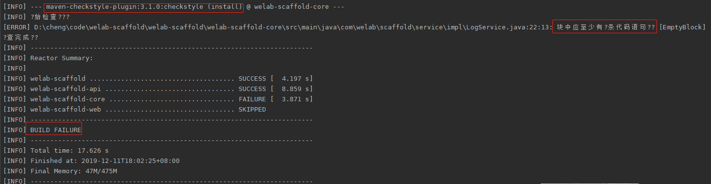
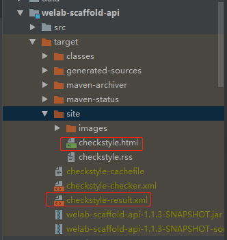
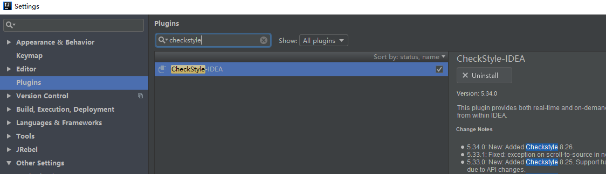
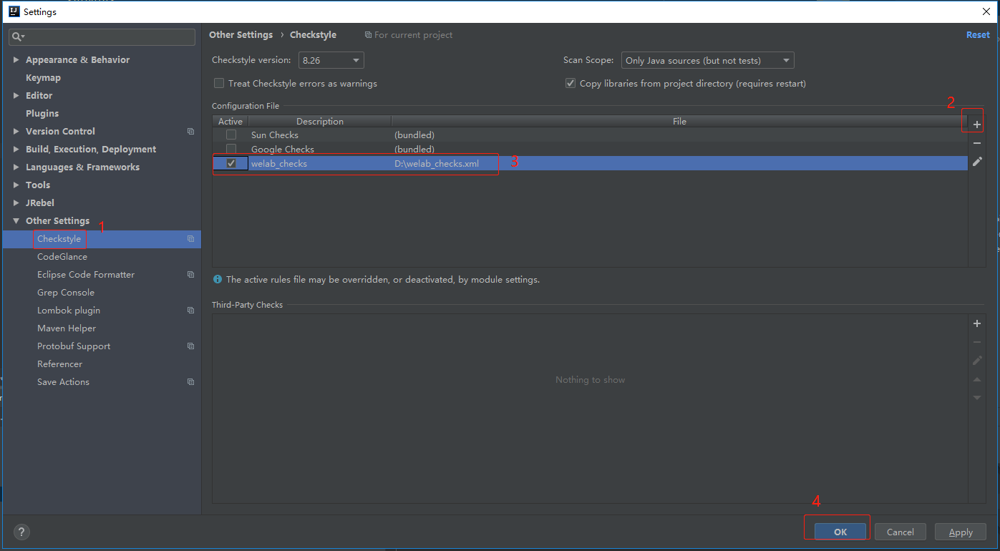
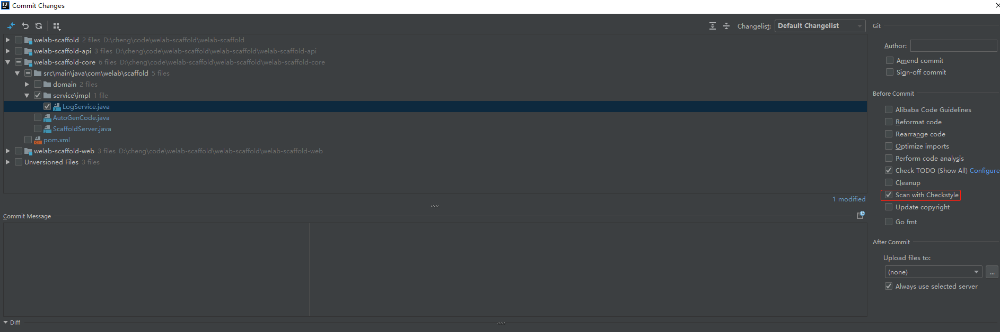
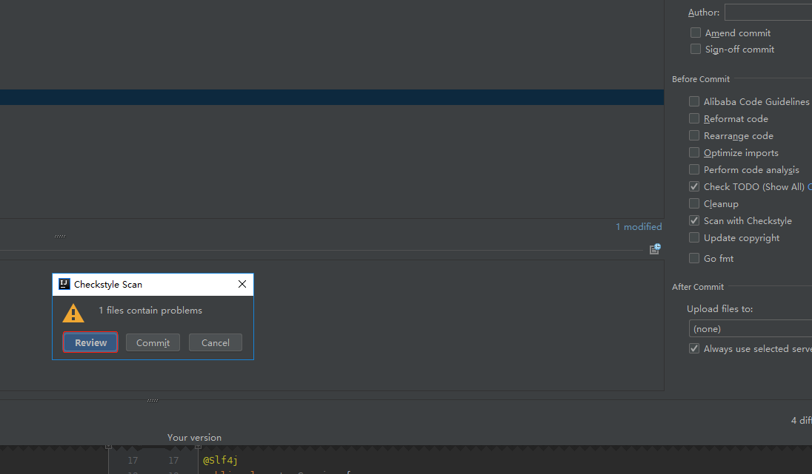
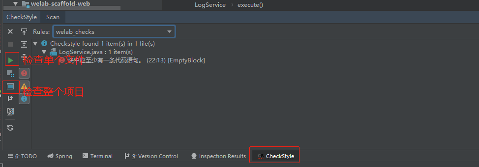

# **代码规范强制检查**

## 1.编程规范的必要性

代码编程规范之所以重要是因为：

-   软件生命周期中的80%时间是软件维护期

-   几乎没有任何软件在其整个生命周期中一直由它的原作者来负责维护

-   代码编程规范能够增加软件的可读性，使得软件工程师更快更准确地理解新代码

-   编程规范能提高软件的封装性

## 2.技术选型

### 2.1.checkstyle

优点：

-   有maven插件支持，且不需要依赖于IDE

-   提交前可设置默认checkstyle检查

-   代码检查工具的配置文件能做版本管理

缺点：

-   提交前可以默认checkstyle检查，如果不符合规范则提示用户，但用户还是可以强制提交。虽然在dev、fat环境maven构建会因为checkstyle不通过而失败，这时候再返回修改代码，显得链路较长。

### 2.2.git hook

优点：

-   可在用户提交前检查代码规范，不通过则不允许提交

-   git支持，且不需要依赖IDE

缺点：

-   代码检查工具的配置文件无法做版本管理

-   不灵活，无法做到不同项目区别对待，对老项目已有代码不友好

___
结合公司实际情况，综合考虑选用checkstyle

## 3.checkstyle集成

### 3.1.添加规范配置文件

在项目添加checkstyle规范配置文件(下面链接查看)，规范兼容公司现有xdao生成的代码
***
[https://git.wolaidai.com/WelabCo/Architecture/work-profile/blob/master/middleware/checkstyle/welab_checks.xml](https://git.wolaidai.com/WelabCo/Architecture/work-profile/blob/master/middleware/checkstyle/welab_checks.xml)
***

### 3.2.添加maven pom配置

在父项目，parent pom里修改，添加checkstyle插件及设置规范配置文件

    <build>
		<pluginManagement>
			<plugins>
				<plugin>
					<groupId>org.apache.maven.plugins</groupId>
					<artifactId>maven-checkstyle-plugin</artifactId>
					<version>3.1.0</version>
					<configuration>
						<linkXRef>false</linkXRef>
						<configLocation>assembly/welab_checks.xml</configLocation>
						<outputFileFormat>xml</outputFileFormat>
						<encoding>UTF-8</encoding>
						<consoleOutput>true</consoleOutput>
						<failsOnError>true</failsOnError>
						<skip>false</skip>
						<violationSeverity>error</violationSeverity>
					</configuration>
					<executions>
						<execution>
							<id>compile</id>
							<phase>compile</phase>
							<goals>
								<goal>checkstyle</goal>
							</goals>
						</execution>
					</executions>
				</plugin>
			</plugins>
		</pluginManagement>
		<!--所有子模块都要执行的plugin-->
		<plugins>
			<plugin>
				<groupId>org.apache.maven.plugins</groupId>
				<artifactId>maven-checkstyle-plugin</artifactId>
			</plugin>
		</plugins>
	</build>
	<reporting>
		<!--所有子模块都要执行的报告-->
		<plugins>
			<plugin>
				<groupId>org.apache.maven.plugins</groupId>
				<artifactId>maven-checkstyle-plugin</artifactId>
			</plugin>
		</plugins>
	</reporting>

## 4.项目开发使用

### 4.1.方法一：使用maven命令行检查

mvn checkstyle:checkstyle

mvn clean install -Dmaven.test.skip=true -U

mvn clean deploy -Dmaven.test.skip=true -U

若检查不通过，install/deploy会构建失败

不规范的代码具体看再target目录查看，推荐直接在方法二插件查看，比较直观

### 4.2.方法二：checkstyle插件

Eclipse

参考：

[[https://blog.csdn.net/qq\_35781732/article/details/80177316]{.underline}](https://blog.csdn.net/qq_35781732/article/details/80177316)

Idea

安装checkstyle-IDEA插件

添加配置文件

设置默认git commit前检查

若检查不通过会告警

检查项目

## 5.例子

可在脚手架welab-scaffold查看

[https://git.wolaidai.com/WelabCo/Architecture/welab-scaffold](https://git.wolaidai.com/WelabCo/Architecture/welab-scaffold)

## 6.常见问题

Windows下cmd执行mvn clean install -Dmaven.test.skip=true -U显示乱码问题\
在cmd下执行chcp 65001切换到utf-8，参考：

[https://www.cnblogs.com/sunylat/p/11308037.html](https://www.cnblogs.com/sunylat/p/11308037.html)

## 7.checkstyle参考

[https://www.cnblogs.com/woshimrf/p/using-checkstyle.html](https://www.cnblogs.com/woshimrf/p/using-checkstyle.html)

[https://segmentfault.com/q/1010000009596102](https://segmentfault.com/q/1010000009596102)
