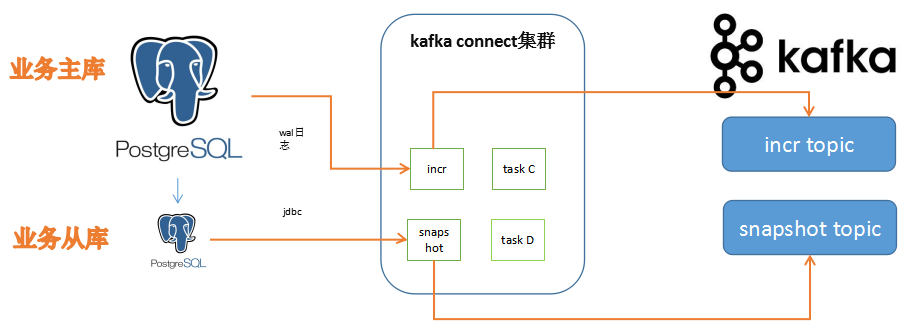

# 发布流程
#### 1、搭建zk和kafka集群  
#### 2、pg增加插件扩展  
postgresql.conf增加以下插件

```
# MODULES
shared_preload_libraries = 'decoderbufs,wal2json' 

# REPLICATION
wal_level = logical             
max_wal_senders = 1             
max_replication_slots = 1       
```

#### 3、运行docker容器  

```
docker run -d --name connect --net=host -e GROUP_ID=1 -e CONFIG_STORAGE_TOPIC=_connect_configs -e OFFSET_STORAGE_TOPIC=_connect_offsets -e BOOTSTRAP_SERVERS=${kafkahost}:9092 -e HOST_NAME=0.0.0.0 -v /data/logs/connect:/kafka/logs debezium/connect:0.8
```

#### 4、增加同步任务  
```
curl -X POST -H "Content-Type: application/json" --data '{"name":"connector-pg-jrocket2","config":{"connector.class":"io.debezium.connector.postgresql.PostgresConnector","database.hostname":"10.2.0.13","database.port":"5432","database.user":"postgres","database.password":"postgres","database.dbname":"postgres","database.server.name":"xxx","snapshot.mode":"never"}}' http://localhost:8083/connectors
```

## pg主库同步细节
#### debezium pg同步

**官方全量拉取**
1. 开启SERIALIZABLE, READ ONLY事务
2. 各表获取SHARE UPDATE EXCLUSIVE MODE锁
3. 记录当前事务wal_lsn和txid，用于后续增量使用
4. 各表分页拉取数据，这步运行比较缓慢
5. 完成后提交事务释放锁  

**官方增量拉取**
从全量拉取的事务id和txid位置开始拉取主库wal日志并解析至kafka

**优点**：尽可能保证数据一致性，比较通用。所以尽可能实现exactly-once语句，异常情况能保证at-least-once语义  
**缺点**：全量增量数据也主库上拉取，占用主库资源

**优化后全量拉取**  
解决问题: 
- 目前表数据量太大，如从主库上拉取，会占用主库出网带宽、CPU资源资源，存在影响正常业务风险;
- 线上应用属于OLTP应用，不管主库从库开启长时间事务会影响磁盘资源;

目前使用简单分页拉取，需要数据库要有主键，注意offset跳过前多少条数据本质还是会扫描磁盘数据页，查询到后面就影响性能，实际过程遇到这个问题。

```
select * from users where id>? limit 10000;
```
其实速度这块还有提升空间，根据主键进行分片可实现多线程拉取数据，这样也可从多个从库同时拉取数据。由于该方案不开启事务，所以拉取的数据本质上不是同一个快照上，如果需要正常的数据，需要先开启增量拉取任务且数据消费需要进行幂等处理。

目前同步架构图：  
 