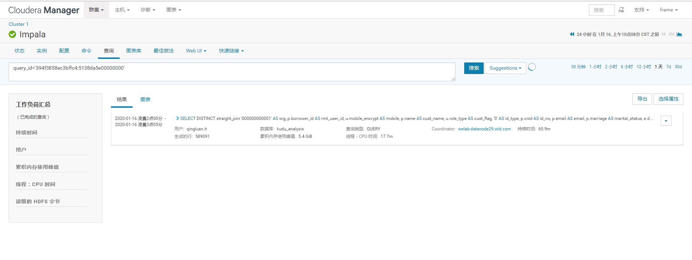

## IMPALA执行计划

以下对执行计划的知识整理不错:  
[一步一步理解Impala query profile（一）](https://my.oschina.net/dabird/blog/3138749)  
[一步一步理解Impala query profile（二）](https://my.oschina.net/dabird/blog/3138768)  
[一步一步理解Impala query profile（三）](https://my.oschina.net/dabird/blog/3138774)  

#### 实际案例
如系统监控反馈394f3858ec3bffc4:5138da5e00000000这条SQL执行过慢，进入CMF控制台 --> impala查询，使用query_id查询：

 

或者直接修改以下http://172.26.230.2:7180/cmf/impala/queryDetails?queryId=394f3858ec3bffc4%3a5138da5e00000000&serviceName=impala
中的查询参数快速查看详细信息(queryId可以不用UrlEncode)。查看到当时SQL执行过程中的详细信息：

 

如上所示，第一行在第9.4分钟获取，而最后一行却在第1.1小时获取，可能客户端查询结果集比较慢。

也可以下载profile文件至本地：
 

其中Profile的执行概要部分可以重点研究下，如分区是否合理、连接类型是否合理等：
 