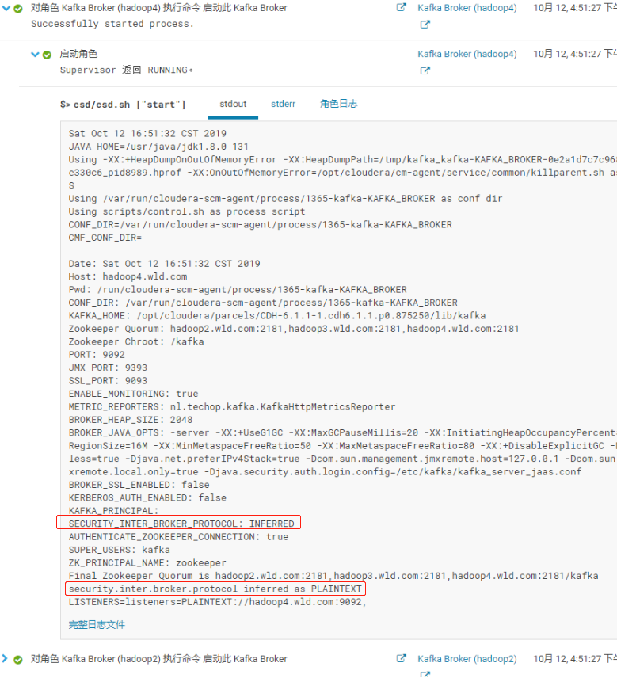

# kafka安全机制说明

## 目录

[1.背景](#1.背景)

[2.安全机制方案调研](#2.安全机制方案调研)

[3.本机Kafka集群配置SCRAM](#3.本机Kafka集群配置SCRAM)

[3.1.搭建kafka集群](#3.1.搭建kafka集群)

[3.2.本地Kafka配置SCRAM安全验证](#3.2.本地Kafka配置SCRAM安全验证)

[3.2.1.服务器端](#3.2.1.服务器端)

[3.2.2.客户端](#3.2.2.客户端)

[4.CDH kafka配置SCRAM安全验证](#4.CDH kafka配置SCRAM安全验证)

[4.1.1.授权](#4.1.1.授权)

[4.1.2.服务器配置](#4.1.2.服务器配置)

[4.1.3.CDH配置](#4.1.3.CDH配置)

[4.1.4.重启](#4.1.4.重启)

[4.2.客户端](#4.2.客户端)

[4.2.1.1.无校验通道](#4.2.1.1.无校验通道)

[4.2.1.2.校验通道](#4.2.1.2.校验通道)

[5.Java客户端配置](#5.Java客户端配置)

[5.1.原生kafka配置](#5.1.原生kafka配置)

[5.2.Spring集成配置](#5.2.Spring集成配置)

[6.Connector服务器端配置](#6.Connector服务器端配置)

[7.Connector服务器端脚本化发布配置](7.Connector服务器端脚本化发布配置)

[8.Connector客户端配置加密模式](8.Connector客户端配置加密模式)

[9.非校验模式过度到校验模式](9.非校验模式过度到校验模式)

[10.Acl常用操作](#10.Acl常用操作)

[11.规范](#11.规范)

[12.原理](#12.原理)

[13.安全性](#13.安全性)

[14.遇到的一些问题](#14.遇到的一些问题)

## 1.背景

目前kafka可以执行所有topic命令，查看消费所有topic消息，一些敏感数据存在安全隐患。

## 2.安全机制方案调研

<table class="MsoNormalTable" border="1" cellspacing="0" style="border-collapse: collapse; width: 383pt; margin-left: -0.6pt; border: none; font-family: 'Times New Roman'; font-size: 10pt;"><tbody><tr style="height:60.5500pt;"><td width="142" valign="center" style="width: 106.5pt; padding: 6pt; border: 1pt solid rgb(0, 0, 0); background-image: initial; background-attachment: initial; background-size: initial; background-origin: initial; background-clip: initial; background-position: initial; background-repeat: initial;"><p class="MsoNormal" style="text-align: justify; margin: 0pt 0pt 0.0001pt; font-family: Calibri; font-size: 10.5pt;"><span style="mso-spacerun:'yes';font-family:微软雅黑;font-size:10.5000pt;mso-font-kerning:1.0000pt;">验证方式</span><span style="font-family:微软雅黑;font-size:10.5000pt;mso-font-kerning:1.0000pt;"><o:p></o:p></span></p></td><td width="94" valign="center" style="width: 71.2pt; padding: 6pt; border-style: solid solid solid none; border-right-width: 1pt; border-right-color: rgb(0, 0, 0); border-top-width: 1pt; border-top-color: rgb(0, 0, 0); border-bottom-width: 1pt; border-bottom-color: rgb(0, 0, 0); background-image: initial; background-attachment: initial; background-size: initial; background-origin: initial; background-clip: initial; background-position: initial; background-repeat: initial;"><p class="MsoNormal" style="text-align: justify; margin: 0pt 0pt 0.0001pt; font-family: Calibri; font-size: 10.5pt;"><span style="mso-spacerun:'yes';font-family:微软雅黑;font-size:10.5000pt;mso-font-kerning:1.0000pt;">Kafka版本</span><span style="font-family:微软雅黑;font-size:10.5000pt;mso-font-kerning:1.0000pt;"><o:p></o:p></span></p></td><td width="273" valign="center" style="width: 205.3pt; padding: 6pt; border-style: solid solid solid none; border-right-width: 1pt; border-right-color: rgb(0, 0, 0); border-top-width: 1pt; border-top-color: rgb(0, 0, 0); border-bottom-width: 1pt; border-bottom-color: rgb(0, 0, 0); background-image: initial; background-attachment: initial; background-size: initial; background-origin: initial; background-clip: initial; background-position: initial; background-repeat: initial;"><p class="MsoNormal" style="text-align: justify; margin: 0pt 0pt 0.0001pt; font-family: Calibri; font-size: 10.5pt;"><span style="mso-spacerun:'yes';font-family:微软雅黑;font-size:10.5000pt;mso-font-kerning:1.0000pt;">特点</span><span style="font-family:微软雅黑;font-size:10.5000pt;mso-font-kerning:1.0000pt;"><o:p></o:p></span></p></td></tr><tr style="height:49.5000pt;"><td width="142" valign="center" style="width: 106.5pt; padding: 6pt; border-left-width: 1pt; border-style: none solid solid; border-left-color: rgb(0, 0, 0); border-right-width: 1pt; border-right-color: rgb(0, 0, 0); border-bottom-width: 1pt; border-bottom-color: rgb(0, 0, 0); background-image: initial; background-attachment: initial; background-size: initial; background-origin: initial; background-clip: initial; background-position: initial; background-repeat: initial;"><p class="MsoNormal" style="text-align: justify; margin: 0pt 0pt 0.0001pt; font-family: Calibri; font-size: 10.5pt;"><span style="mso-spacerun:'yes';font-family:微软雅黑;font-size:10.5000pt;mso-font-kerning:1.0000pt;">SASL/PLAIN</span><span style="font-family:微软雅黑;font-size:10.5000pt;mso-font-kerning:1.0000pt;"><o:p></o:p></span></p></td><td width="94" valign="center" style="width: 71.2pt; padding: 6pt; border-style: none solid solid none; border-right-width: 1pt; border-right-color: rgb(0, 0, 0); border-bottom-width: 1pt; border-bottom-color: rgb(0, 0, 0); background-image: initial; background-attachment: initial; background-size: initial; background-origin: initial; background-clip: initial; background-position: initial; background-repeat: initial;"><p class="MsoNormal" style="text-align: justify; margin: 0pt 0pt 0.0001pt; font-family: Calibri; font-size: 10.5pt;"><span style="mso-spacerun:'yes';font-family:微软雅黑;font-size:10.5000pt;mso-font-kerning:1.0000pt;">0.10.0.0</span><span style="font-family:微软雅黑;font-size:10.5000pt;mso-font-kerning:1.0000pt;"><o:p></o:p></span></p></td><td width="273" valign="center" style="width: 205.3pt; padding: 6pt; border-style: none solid solid none; border-right-width: 1pt; border-right-color: rgb(0, 0, 0); border-bottom-width: 1pt; border-bottom-color: rgb(0, 0, 0); background-image: initial; background-attachment: initial; background-size: initial; background-origin: initial; background-clip: initial; background-position: initial; background-repeat: initial;"><p class="MsoNormal" style="text-align: justify; margin: 0pt 0pt 0.0001pt; font-family: Calibri; font-size: 10.5pt;"><span style="mso-spacerun:'yes';font-family:微软雅黑;font-size:10.5000pt;mso-font-kerning:1.0000pt;">不能动态增加用户</span><span style="font-family:微软雅黑;font-size:10.5000pt;mso-font-kerning:1.0000pt;"><o:p></o:p></span></p></td></tr><tr style="height:49.5000pt;"><td width="142" valign="center" style="width: 106.5pt; padding: 6pt; border-left-width: 1pt; border-style: none solid solid; border-left-color: rgb(0, 0, 0); border-right-width: 1pt; border-right-color: rgb(0, 0, 0); border-bottom-width: 1pt; border-bottom-color: rgb(0, 0, 0); background-image: initial; background-attachment: initial; background-size: initial; background-origin: initial; background-clip: initial; background-position: initial; background-repeat: initial;"><p class="MsoNormal" style="text-align: justify; margin: 0pt 0pt 0.0001pt; font-family: Calibri; font-size: 10.5pt;"><span style="mso-spacerun:'yes';font-family:微软雅黑;font-size:10.5000pt;mso-font-kerning:1.0000pt;">SASL/SCRAM</span><span style="font-family:微软雅黑;font-size:10.5000pt;mso-font-kerning:1.0000pt;"><o:p></o:p></span></p></td><td width="94" valign="center" style="width: 71.2pt; padding: 6pt; border-style: none solid solid none; border-right-width: 1pt; border-right-color: rgb(0, 0, 0); border-bottom-width: 1pt; border-bottom-color: rgb(0, 0, 0); background-image: initial; background-attachment: initial; background-size: initial; background-origin: initial; background-clip: initial; background-position: initial; background-repeat: initial;"><p class="MsoNormal" style="text-align: justify; margin: 0pt 0pt 0.0001pt; font-family: Calibri; font-size: 10.5pt;"><span style="mso-spacerun:'yes';font-family:微软雅黑;font-size:10.5000pt;mso-font-kerning:1.0000pt;">0.10.2.0</span><span style="font-family:微软雅黑;font-size:10.5000pt;mso-font-kerning:1.0000pt;"><o:p></o:p></span></p></td><td width="273" valign="center" style="width: 205.3pt; padding: 6pt; border-style: none solid solid none; border-right-width: 1pt; border-right-color: rgb(0, 0, 0); border-bottom-width: 1pt; border-bottom-color: rgb(0, 0, 0); background-image: initial; background-attachment: initial; background-size: initial; background-origin: initial; background-clip: initial; background-position: initial; background-repeat: initial;"><p class="MsoNormal" style="text-align: justify; margin: 0pt 0pt 0.0001pt; font-family: Calibri; font-size: 10.5pt;"><span style="mso-spacerun:'yes';font-family:微软雅黑;font-size:10.5000pt;mso-font-kerning:1.0000pt;">可以动态增加用户</span><span style="font-family:微软雅黑;font-size:10.5000pt;mso-font-kerning:1.0000pt;"><o:p></o:p></span></p></td></tr><tr style="height:78.5000pt;"><td width="142" valign="center" style="width: 106.5pt; padding: 6pt; border-left-width: 1pt; border-style: none solid solid; border-left-color: rgb(0, 0, 0); border-right-width: 1pt; border-right-color: rgb(0, 0, 0); border-bottom-width: 1pt; border-bottom-color: rgb(0, 0, 0); background-image: initial; background-attachment: initial; background-size: initial; background-origin: initial; background-clip: initial; background-position: initial; background-repeat: initial;"><p class="MsoNormal" style="text-align: justify; margin: 0pt 0pt 0.0001pt; font-family: Calibri; font-size: 10.5pt;"><span style="mso-spacerun:'yes';font-family:微软雅黑;font-size:10.5000pt;mso-font-kerning:1.0000pt;">SASL/Kerberos</span><span style="font-family:微软雅黑;font-size:10.5000pt;mso-font-kerning:1.0000pt;"><o:p></o:p></span></p></td><td width="94" valign="center" style="width: 71.2pt; padding: 6pt; border-style: none solid solid none; border-right-width: 1pt; border-right-color: rgb(0, 0, 0); border-bottom-width: 1pt; border-bottom-color: rgb(0, 0, 0); background-image: initial; background-attachment: initial; background-size: initial; background-origin: initial; background-clip: initial; background-position: initial; background-repeat: initial;"><p class="MsoNormal" style="text-align: justify; margin: 0pt 0pt 0.0001pt; font-family: Calibri; font-size: 10.5pt;"><span style="mso-spacerun:'yes';font-family:微软雅黑;font-size:10.5000pt;mso-font-kerning:1.0000pt;">0.9.0.0</span><span style="font-family:微软雅黑;font-size:10.5000pt;mso-font-kerning:1.0000pt;"><o:p></o:p></span></p></td><td width="273" valign="center" style="width: 205.3pt; padding: 6pt; border-style: none solid solid none; border-right-width: 1pt; border-right-color: rgb(0, 0, 0); border-bottom-width: 1pt; border-bottom-color: rgb(0, 0, 0); background-image: initial; background-attachment: initial; background-size: initial; background-origin: initial; background-clip: initial; background-position: initial; background-repeat: initial;"><p class="MsoNormal" style="text-align: justify; margin: 0pt 0pt 0.0001pt; font-family: Calibri; font-size: 10.5pt;"><span style="mso-spacerun:'yes';font-family:微软雅黑;font-size:10.5000pt;mso-font-kerning:1.0000pt;">自建kafka</span><span style="mso-spacerun:'yes';font-family:微软雅黑;font-size:10.5000pt;mso-font-kerning:1.0000pt;">需要独立部署验证服务</span><span style="mso-spacerun:'yes';font-family:微软雅黑;font-size:10.5000pt;mso-font-kerning:1.0000pt;">。CDH虽然自带了kerberos，但如果开启kerberos会影响到其它组件</span><span style="font-family:微软雅黑;font-size:10.5000pt;mso-font-kerning:1.0000pt;"><o:p></o:p></span></p></td></tr><tr style="height:63.9000pt;"><td width="142" valign="center" style="width: 106.5pt; padding: 6pt; border-left-width: 1pt; border-style: none solid solid; border-left-color: rgb(0, 0, 0); border-right-width: 1pt; border-right-color: rgb(0, 0, 0); border-bottom-width: 1pt; border-bottom-color: rgb(0, 0, 0); background-image: initial; background-attachment: initial; background-size: initial; background-origin: initial; background-clip: initial; background-position: initial; background-repeat: initial;"><p class="MsoNormal" style="text-align: justify; margin: 0pt 0pt 0.0001pt; font-family: Calibri; font-size: 10.5pt;"><span style="mso-spacerun:'yes';font-family:微软雅黑;font-size:10.5000pt;mso-font-kerning:1.0000pt;">SASL/OAUTHBEARER</span><span style="font-family:微软雅黑;font-size:10.5000pt;mso-font-kerning:1.0000pt;"><o:p></o:p></span></p></td><td width="94" valign="center" style="width: 71.2pt; padding: 6pt; border-style: none solid solid none; border-right-width: 1pt; border-right-color: rgb(0, 0, 0); border-bottom-width: 1pt; border-bottom-color: rgb(0, 0, 0); background-image: initial; background-attachment: initial; background-size: initial; background-origin: initial; background-clip: initial; background-position: initial; background-repeat: initial;"><p class="MsoNormal" style="text-align: justify; margin: 0pt 0pt 0.0001pt; font-family: Calibri; font-size: 10.5pt;"><span style="mso-spacerun:'yes';font-family:微软雅黑;font-size:10.5000pt;mso-font-kerning:1.0000pt;">2.0.0</span><span style="font-family:微软雅黑;font-size:10.5000pt;mso-font-kerning:1.0000pt;"><o:p></o:p></span></p></td><td width="273" valign="center" style="width: 205.3pt; padding: 6pt; border-style: none solid solid none; border-right-width: 1pt; border-right-color: rgb(0, 0, 0); border-bottom-width: 1pt; border-bottom-color: rgb(0, 0, 0); background-image: initial; background-attachment: initial; background-size: initial; background-origin: initial; background-clip: initial; background-position: initial; background-repeat: initial;"><p class="MsoNormal" style="text-align: justify; margin: 0pt 0pt 0.0001pt; font-family: Calibri; font-size: 10.5pt;"><span style="mso-spacerun:'yes';font-family:微软雅黑;font-size:10.5000pt;mso-font-kerning:1.0000pt;">需自己实现接口实现token的创建和验证，需要额外Oauth服务</span><span style="font-family:微软雅黑;font-size:10.5000pt;mso-font-kerning:1.0000pt;"><o:p></o:p></span></p></td></tr></tbody></table>

# 3.本机Kafka集群配置SCRAM

## 3.1.搭建kafka集群

Zookeeper:略

Kafka1:

docker run -d \--name kafka1 -p 9092:9092 -p 9094:9094 -v
/etc/localtime:/etc/localtime -e KAFKA\_BROKER\_ID=62 -e
KAFKA\_ZOOKEEPER\_CONNECT=192.168.19.129:2181 -e
KAFKA\_ADVERTISED\_HOST\_NAME=192.168.19.129 -t
wurstmeister/kafka:2.11-2.0.0

Kafka2:

docker run -d \--name kafka2 -p 19092:9092 -p 9084:9084 -v
/etc/localtime:/etc/localtime -e KAFKA\_BROKER\_ID=63 -e
KAFKA\_ZOOKEEPER\_CONNECT=192.168.19.129:2181 -e
KAFKA\_ADVERTISED\_HOST\_NAME=192.168.19.129 -t
wurstmeister/kafka:2.11-2.0.0


## 3.2.本地Kafka配置SCRAM安全验证

### 3.2.1.服务器端

执行bin/kafka-configs.sh脚本添加用户及查看


给ANONYMOUS用户赋权，9092端口非校验的时候，需要ANONYMOUS权限


如下图，进入kafka1容器，并新增kafka\_server\_jaas.conf文件设置服务器端账户


修改server.properties文件，添加内容如下


修改bin/kafka-server-start.sh文件，如下


Kafka2节点与kafka1节点配置类似，略过

### 3.2.2.客户端

#### 3.2.2.1.无认证端口

9092端口生产者无校验通道通过，运行正常


9092端口消费者无校验通道通过，运行正常


#### 3.2.2.2.认证通道

配置kafka客户端账号文件


9094端口生产者校验通道通过，运行正常


9094端口消费者校验通道通过，运行正常


# 4.CDH kafka配置SCRAM安全验证

## 4.1. 服务器端

### 4.1.1. 授权

执行bin/kafka-configs.sh脚本添加kafka用户


### 4.1.2  服务器配置

10.2.0.212,10.2.0.213,10.2.0.214，在每个broker主机上，添加/etc/kafka/kafka\_server\_jaas.conf


### 4.1.3.CDH配置


### 4.1.4. 重启


## 4.2 客户端

### 4.2.1.无校验通道

9092端口生产者无校验通道，运行正常


9092端口消费者无校验通道，运行正常


### 4.2.2.校验通道

配置kafka客户端账号文件


9096端口生产者校验通道，运行正常


9096端口消费者校验通道，运行正常


# 5.Java客户端配置

## 5.1原生kafka配置


 方法1：引入配置用户信息文件:                                          
          
	System.setProperty("java.security.auth.login.config", "D:/tmp/kafka_client_jaas_welab_skyeye.conf");
	
	Properties props = new Properties();
	props.put("bootstrap.servers", "hadoop2:9096,hadoop3:9096,hadoop4:9096");
	props.put("enable.auto.commit", "true");
	props.put("auto.commit.interval.ms", "1000");
	props.put("group.id", "welab-skyeye-group");
	props.put("session.timeout.ms", "6000");
	props.put("key.deserializer", "org.apache.kafka.common.serialization.StringDeserializer");
	props.put("value.deserializer", "org.apache.kafka.common.serialization.StringDeserializer");
	props.put(CommonClientConfigs.SECURITY_PROTOCOL_CONFIG, SecurityProtocol.SASL_PLAINTEXT.name);
	props.put(SaslConfigs.SASL_MECHANISM, "SCRAM-SHA-256");
                                                                       
 方法2：设置用户信息属性（推荐）                                       
                    
	Properties props = new Properties();
	props.put("bootstrap.servers", "hadoop2:9096,hadoop3:9096,hadoop4:9096");
	props.put("enable.auto.commit", "true");
	props.put("auto.commit.interval.ms", "1000");
	props.put("group.id", "welab-skyeye-group");
	props.put("session.timeout.ms", "6000");
	props.put("key.deserializer", "org.apache.kafka.common.serialization.StringDeserializer");
	props.put("value.deserializer", "org.apache.kafka.common.serialization.StringDeserializer");
	
	props.put(SaslConfigs.SASL_JAAS_CONFIG, "org.apache.kafka.common.security.scram.ScramLoginModule required username=\"welab-skyeye\" password=\"welab-skyeye\";");
	props.put(CommonClientConfigs.SECURITY_PROTOCOL_CONFIG, SecurityProtocol.SASL_PLAINTEXT.name);
	props.put(SaslConfigs.SASL_MECHANISM, "SCRAM-SHA-256");

## 5.2Spring集成配置

    spring.kafka.bootstrap-servers=hadoop2:9096,hadoop3:9096,hadoop4:9096
    spring.kafka.properties.sasl.mechanism=SCRAM-SHA-256
    spring.kafka.properties.security.protocol=SASL_PLAINTEXT
    spring.kafka.properties.sasl.jaas.config=org.apache.kafka.common.security.scram.ScramLoginModule required username=\"welab-skyeye\" password=\"welab-skyeye\";


# 6.Connector服务器端配置

    修改/kafka/config/connect-distributed.properties文件
    

    bootstrap.servers=192.168.19.129:9096
    
    sasl.mechanism=SCRAM-SHA-256
    security.protocol=SASL_PLAINTEXT
    sasl.jaas.config=org.apache.kafka.common.security.scram.ScramLoginModule required \
      username="kafka" \
      password="z1Wd!qk6";
    
    producer.bootstrap.servers=192.168.19.129:9096
    producer.sasl.mechanism=SCRAM-SHA-256
    producer.security.protocol=SASL_PLAINTEXT
    producer.sasl.jaas.config=org.apache.kafka.common.security.scram.ScramLoginModule required \
      username="kafka" \
      password="z1Wd!qk6";
    
    consumer.bootstrap.servers=192.168.19.129:9096
    consumer.sasl.mechanism=SCRAM-SHA-256
    consumer.security.protocol=SASL_PLAINTEXT
    consumer.sasl.jaas.config=org.apache.kafka.common.security.scram.ScramLoginModule required \
      username="kafka" \
      password="z1Wd!qk6";

# 7.Connector服务器端脚本化发布配置

    docker run -d --name connect -p 8083:8083 --net=host -e GROUP_ID=snapshot -e CONFIG_STORAGE_TOPIC=_snapshot_connect_configs -e OFFSET_STORAGE_TOPIC=_snapshot_connect_offsets -e BOOTSTRAP_SERVERS=172.26.230.40:9096,172.26.230.41:9096,172.26.230.42:9096 -e HOST_NAME=0.0.0.0 -v /data/logs/connect:/kafka/logs debezium/connect:0.8
    
    docker exec -i connect /bin/bash << DOCKER
    cat >> /kafka/config/connect-distributed.properties << EOF
    sasl.mechanism=SCRAM-SHA-256
    security.protocol=SASL_PLAINTEXT
    sasl.jaas.config=org.apache.kafka.common.security.scram.ScramLoginModule required \
      username="welab-skyeye-connector" \
      password="password";
    
    producer.bootstrap.servers=172.26.230.40:9096,172.26.230.41:9096,172.26.230.42:9096
    producer.sasl.mechanism=SCRAM-SHA-256
    producer.security.protocol=SASL_PLAINTEXT
    producer.sasl.jaas.config=org.apache.kafka.common.security.scram.ScramLoginModule required \
      username="welab-skyeye-connector" \
      password="password";
    
    consumer.bootstrap.servers=172.26.230.40:9096,172.26.230.41:9096,172.26.230.42:9096
    consumer.sasl.mechanism=SCRAM-SHA-256
    consumer.security.protocol=SASL_PLAINTEXT
    consumer.sasl.jaas.config=org.apache.kafka.common.security.scram.ScramLoginModule required \
      username="welab-skyeye-connector" \
      password="password";
    
    producer.compression.type=snappy
    producer.max.request.size=5242880
    EOF
    DOCKER
    
    #由于有些jar更改过，所以重建connector还需要替换jar
    docker cp log4j.properties connect:/kafka/config/log4j.properties
    docker cp debezium-connector-mysql-0.8.3.Final.jar connect:/kafka/connect/debezium-connector-mysql/debezium-connector-mysql-0.8.3.Final.jar
    docker cp debezium-core-0.8.3.Final.jar connect:/kafka/connect/debezium-connector-mysql/debezium-core-0.8.3.Final.jar
    docker cp debezium-core-0.8.3.Final.jar connect:/kafka/connect/debezium-connector-postgres/debezium-core-0.8.3.Final.jar
    docker cp debezium-connector-postgres-0.8.3.Final.jar connect:/kafka/connect/debezium-connector-postgres/debezium-connector-postgres-0.8.3.Final.jar
    
    docker restart connect

# 8.Connector客户端配置加密模式

	curl -i -X POST -H "Accept:application/json" -H "Content-Type:application/json" 192.168.19.129:8083/connectors/ -d '
	{
	"name": "mysql-connector-document",
	"config": {
		"connector.class": "io.debezium.connector.mysql.MySqlConnector",
		"snapshot.locking.mode": "none",
		"database.user": "debezium2",
		"database.server.id": "1908121",
		"database.history.producer.bootstrap.servers":"192.168.19.129:9096",
		"database.history.producer.sasl.mechanism": "SCRAM-SHA-256",
		"database.history.producer.security.protocol": "SASL_PLAINTEXT",
		"database.history.producer.sasl.jaas.config": "org.apache.kafka.common.security.scram.ScramLoginModule required \nusername=\"kafka\" \npassword=\"z1Wd!qk6\";",
		"database.history.consumer.bootstrap.servers":"192.168.19.129:9096",
		"database.history.consumer.sasl.mechanism": "SCRAM-SHA-256",
		"database.history.consumer.security.protocol": "SASL_PLAINTEXT",
		"database.history.consumer.sasl.jaas.config": "org.apache.kafka.common.security.scram.ScramLoginModule required \nusername=\"kafka\" \npassword=\"z1Wd!qk6\";",
		"database.history.kafka.bootstrap.servers":"192.168.19.129:9096",
		"database.history.kafka.topic": "__mysql_connect_documents_190814_0",
		"database.server.name": "documents.incr",
		"database.port": "3306", "table.whitelist":"documents.documents0,documents.documents1,documents.documents2,documents.documents3,documents.documents4,documents.documents5,documents.documents6,documents.documents7,documents.documents8,documents.documents9,documents.documents10,documents.documents11,documents.documents12,documents.documents13,documents.documents14,documents.documents15,documents.documents16,documents.documents17,documents.documents18,documents.documents19,documents.partner_documents0,documents.partner_documents1,documents.partner_documents2,documents.partner_documents3,documents.partner_documents4,documents.partner_documents5,documents.partner_documents6,documents.partner_documents7,documents.partner_documents8,documents.partner_documents9",
	"decimal.handling.mode": "string",
	"database.hostname": "10.1.0.120", 
	"database.password": "TVx5V%joS",
	"name": "mysql-connector-document",
	"database.whitelist": "documents",
	"snapshot.mode": "schema_only",
	"transforms":"dropPrefix",
	"transforms.dropPrefix.type":"org.apache.kafka.connect.transforms.RegexRouter",
	"transforms.dropPrefix.regex":"^documents\\.incr\\.documents\\.([a-zA-Z\\_]*)[\\d]*$",
	"transforms.dropPrefix.replacement":"documents.incr.documents.$1"
	}
	}
	'


# 9.非校验模式过度到校验模式

1) 同时开启9092（非校验端口），9096（校验端口）

2) 配置ANONYMOUS 权限最大化，可操作所有topic

3) 应用从9092过度到9096端口

4) 直到所有应用过度到9096端口，关闭ANONYMOUS权限，去掉监听9092端口

# 10.Acl常用操作

Operation类型具体可查看kafka源码：org.apache.kafka.common.acl.AclOperation

参考

[[https://docs.confluent.io/current/kafka/authorization.html]{.underline}](https://docs.confluent.io/current/kafka/authorization.html)

[[https://blog.csdn.net/weixin\_43865381/article/details/97760754]{.underline}](https://blog.csdn.net/weixin_43865381/article/details/97760754)

[[https://www.orchome.com/185]{.underline}](https://www.orchome.com/185)

# 11.规范

Topic创建规范：

名称以应用名为前缀，方便根据前缀授权

# 12.原理


# 13.安全性

密码存放


权限存放


# 14.遇到的一些问题

## 14.1.消费者在无权限通道消费报错


解决：

添加ANONYMOUS用户的访问权限

```sbtshell
./kafka-acls.sh --authorizer kafka.security.auth.SimpleAclAuthorizer --authorizer-properties zookeeper.connect=192.168.19.129:2181 --add --allow-principal User:ANONYMOUS --operation All --topic '*' --group '*'
```

## 14.2.CDH配置security.inter.broker.protocol属性问题

security.inter.broker.protocol设置为INFERRED（推断），但CDH推断为PLAINTEXT



security.inter.broker.protocol设置为SASL\_PLAINTEXT，但CDH脚本启动kafka报错


原因：CDH官方推荐使用KERBEROS


解决方法：

在高级配置代码段添加，替换CDH的属性值


## 14.3.消费者消费报错Marking the coordinator hadoop4.wld.com:9092 (id:2147483594 rack: null) dead for group

原因：客户端从kafka元数据获取zk地址去查权限，因服务器配置的zk地址是hadoop4.wld.com，但客户端识别不了hadoop4.wld.com，所以报错


解决：

经沟通，因目前服务器配置zk地址已在cm库中，若改服务器zk配置，可能集群要重新部署，所以客户端加上host映射解决。

参考：

[[https://www.jianshu.com/p/011567554f0f]{.underline}](https://www.jianshu.com/p/011567554f0f)

[[https://www.jianshu.com/p/d01376714162]{.underline}](https://www.jianshu.com/p/d01376714162)

[[https://github.com/cloudera/cm\_csds/blob/master/KAFKA/src/scripts/control.sh]{.underline}](https://github.com/cloudera/cm_csds/blob/master/KAFKA/src/scripts/control.sh)

[[https://docs.cloudera.com/documentation/kafka/latest/topics/kafka\_security.html]{.underline}](https://docs.cloudera.com/documentation/kafka/latest/topics/kafka_security.html)

[[https://blog.csdn.net/Suubyy/article/details/89672709]{.underline}](https://blog.csdn.net/Suubyy/article/details/89672709)
