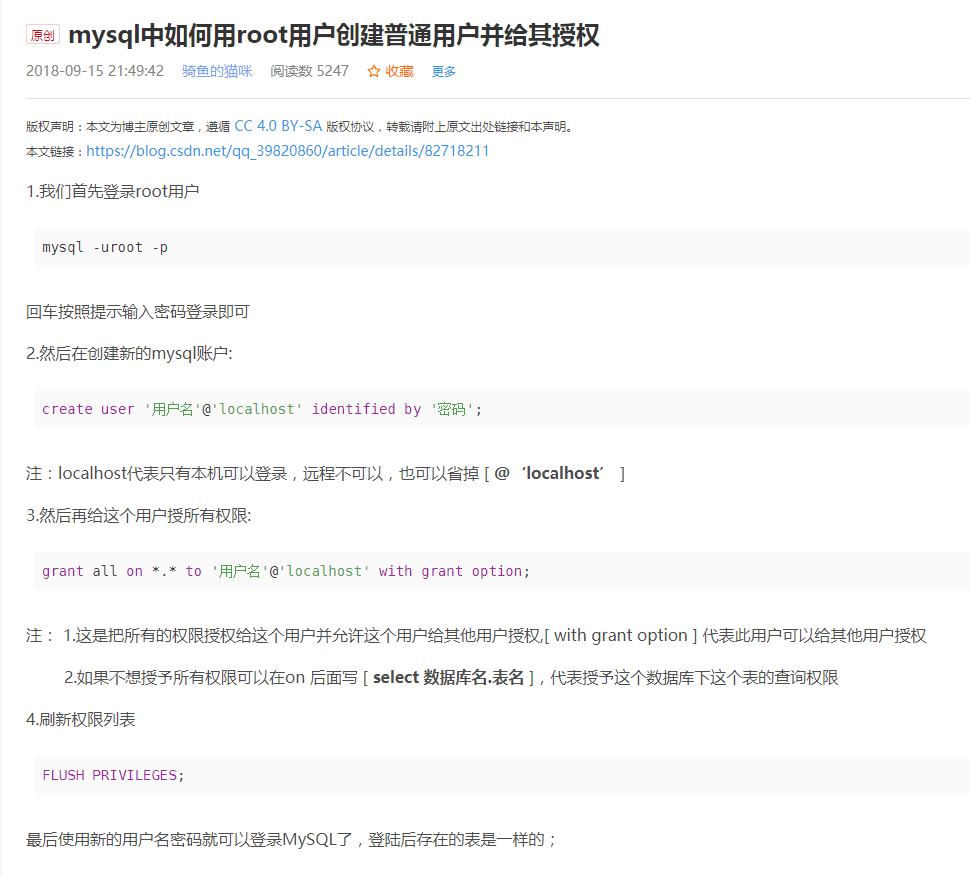

### 1.mysql创建非root用户并授权
 
[参考链接](https://blog.csdn.net/qq_39820860/article/details/82718211)

### 2.mysql调整可以远程访问,不限定localhost
[参考链接](https://blog.51cto.com/meiling/2156110)

### 3.涉及企业微信通知、privacy地址的，需要进行替换(ip:port自己调整)
* 企业微信通知
```
sa.url=https://sa.wolaidai.com/api  替换为  http://127.0.0.1:7007/welab-stub/sa
```
* privacy地址
```
    对应替换
    http://127.0.0.1:7007/welab-stub/privacy/api/v2/config-info
    http://127.0.0.1:7007/welab-stub/privacy/api/simple/column-configs    
```
* 其他的简单的成功响应
```
 http://127.0.0.1:7007/welab-stub/success 
 ```

### 4.oracle同步相关报没有快照的：``no snapshot found based on specified time``
解决方案：可以通过授权刷新last_ddl时间

可以单张表，也是批量，单张表可以：e.g: grant select on XSTRMADMIN.XXX_TABLE to XSTRMADMIN;
``
XSTRMADMIN:用户空间 XXX_TABLE：表名
``

如果批量：
```
> sqlplus 连接进去
>spool whk.txt
>SELECT 'grant select on XSTRMADMIN.'||OBJECT_NAME||' to XSTRMADMIN;' AS  theContent FROM all_objects WHERE owner='XSTRMADMIN' ; 
>spool off
>exit

>vi  whk.txt
>sed -i 's/THECONTENT//g' whk.txt
>sed -i 's/-//g' whk.txt
> 剔除开头的sql和结尾的结果个数

>sqlplus连接进去
>@ whk.txt

done
```