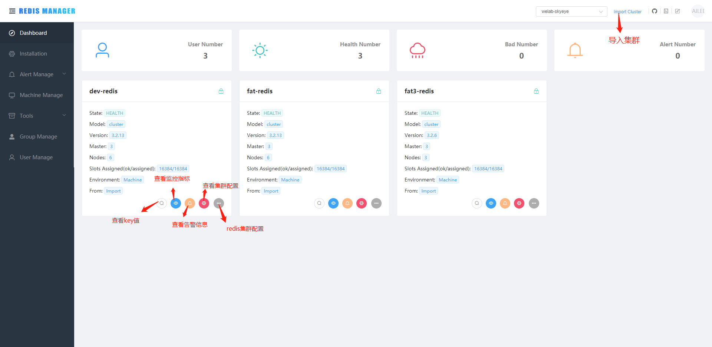

redis-manager产品简介
=====================

测试环境地址: *http://10.2.0.13:8182/* 测试普通用户帐号/密码:
test/123456

权限介绍
--------

1、普通用户权限

1&gt;查看redis集群各个监控指标图和key值

2&gt;个人信息查看和修改

2、管理员权限（只可查看自己所在用户组内的权限）

1&gt; 查看redis集群各个监控指标图和key值

2&gt; 个人信息查看和修改

3&gt; 可尽量redis数据操作界面，进行简单的数据操作

4&gt; 对redis集群可导入，编辑和删除

5&gt; 可查看redis集群各个节点的配置信息，可修改或新增reids配置。

6&gt;
可对单个redis节点进行开启，停止，重启和删除操作。（该操作根据你导入集群用户密码权限限制）

7&gt; 可新增，编辑和删除普通用户和管理员

8&gt; 查看告警消息和管理告警规则及渠道

3、超级管理员（拥有平台所有用户组的所有权限）

2、产品主要功能介绍
-------------------

**Redis Manager** 是 Redis
一站式管理平台，支持集群的监控、安装、管理、告警以及基本的数据操作功能

**集群监控**：支持监控 Memory、Clients 等 Redis 重要指标；可实时查看
Redis Info、Redis Config 和 Slow Log

**集群创建**：支持 Docker、Machine、Humpback方式

**集群管理**：支持节点Forget、Replicate Of、Failover、Move
Slot、Start、Stop、Restart、Delete、修改配置等功能

**集群告警**：支持 Memory、Clients
等指标(同监控指标)，支持邮件、企业微信APP、企业微信Webhook、钉钉告警

**工具箱**：支持 Query、Scan 以及基本的数据操作

**Dashboard**
-------------

> 展示当前用户组监控的所有集群

**集群导入**
------------

> 导入已存在集群

**集群监控**
------------

> 监控 Memory、Clients 等 Redis 重要指标; 查询 Slow Log

**集群管理**
------------

> 支持节点Forget、Replicate Of、Failover、Move
> Slot、Start、Stop、Restart、Delete、修改配置等功能

> 修改配置文件

**集群告警**
------------

> 支持邮件、企业微信APP、企业微信Webhook、钉钉告警

**数据操作**
------------

> 支持简单的数据操作

**数据查询**
------------

> 支持根据key查询对应的redis值和key值扫描

-------------------------------------------------------------------------------------------

**创建集群**
------------

> 目前支持 Redis Cluster、Standalone 模式的创建，包括机器安装、Docker
> 安装和 Humpback 安装方式

**用户组管理**
--------------

**用户管理**
------------

