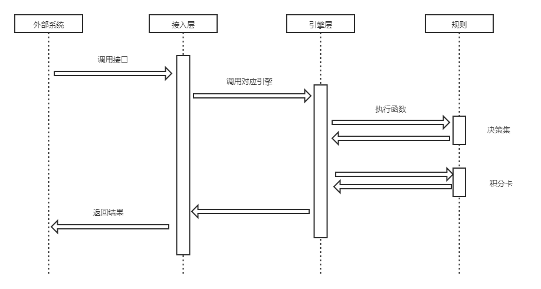
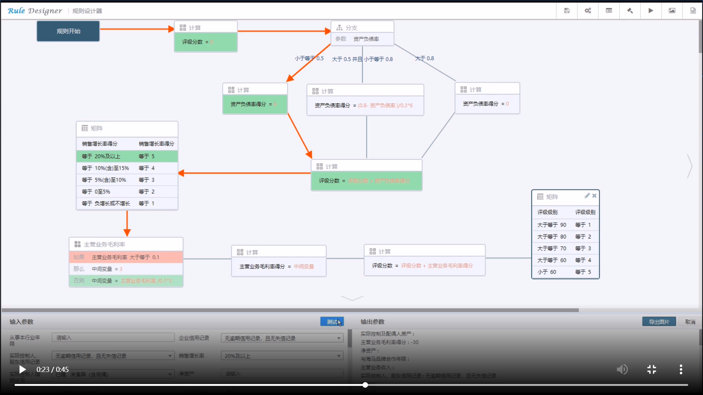

## 规则引擎 

名词介绍：

1. 执行引擎：底层实际工作的脚本引擎，如QLExpress、Groovy、Drools等。
2. 规则流：类似于工作流，对已有的规则集、决策树、决策表、评分卡或其它规则节点的执行顺序进行编排，以清晰直观的实现一个大的复杂的业务规则。

### 1.1 时序图
 

#### 1.1.1 外部系统

如目前weflow、催收等系统会调用规则引擎Restful接口。接口主要有以下两部分：

1. 请求参数：主要分成两部分，规则流名称指调用哪个规则流，业务数据指用于决策的各项数据
2. 返回结果：目前业务上主要是用原因代码用表示

#### 1.1.2 接入层

实现权限校验、数据校验、执行引擎路由调度等功能。

#### 1.1.3 引擎层

在启动时执行引擎预先加载各个规则流（配置翻译成引擎中对应的脚本），实际执行就是执行各个决策流对应的脚本。
为了保证接口的性能，每个规则流会翻译成对应的脚本。如下所示：

```
## 0.定义参数
List result = new ArrayList();

## 1.执行规则节点a
functionA(item);
## 2.执行规则节点b--
functionA(item);

## n.返回结果
return result;
```

#### 1.1.4 规则节点

规则是实际执行业务判断的最小单位，包含三部分：属性部分、条件部分和结果部分。
1. 属性部分：如规则优化级、是否生效，用于控制规则的执行。
2. 条件部分：简单条件由三个部分组成，分别是字段、比较操作符以及比较值，多个简单条件可以通过 AND 或 OR 组合成新条件。
3. 结果部分：用于处理满足条件之后的业务逻辑，目前主要是原因代码。

样例如下，属性部分在QLExpress引擎中不体现在脚本中，用于生成决策流脚本时。
部分条件是item.alipay_realname() == 0.0(字段 比较操作符 值)。
结果部分是return "D112-2"(原因代码)。
```
if ((item.alipay_realname == 0.0)) {
  return "D112-2";
}
```

每个节点会根据节点的参数配置生成相应的函数。可以根据业务需要后续再扩展。
以下概念从原理上是一样的，只是业务配置方式不一致，适用于不同的场景。

1 规则集

2 决策树

3 决策表

4 评分卡

#### 1.1.5 参考

 