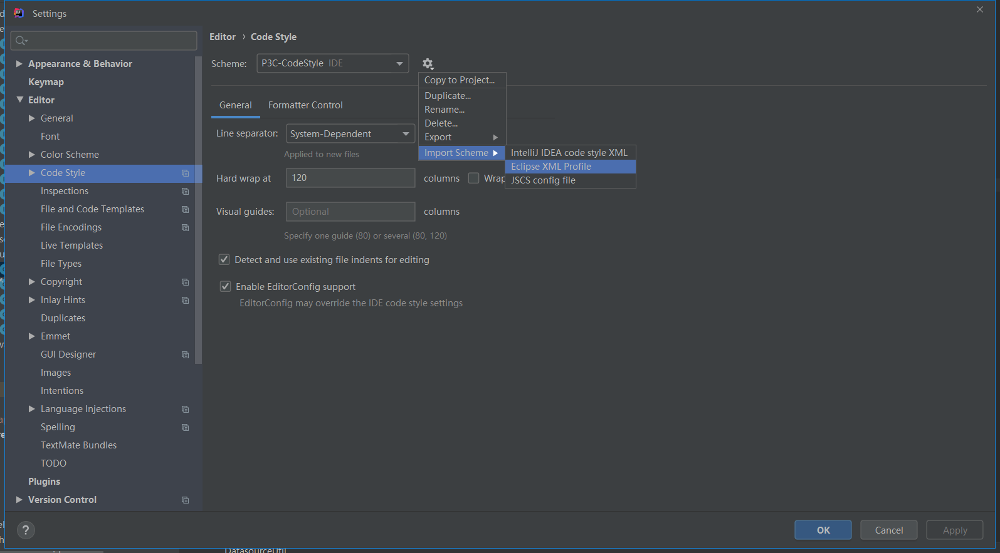
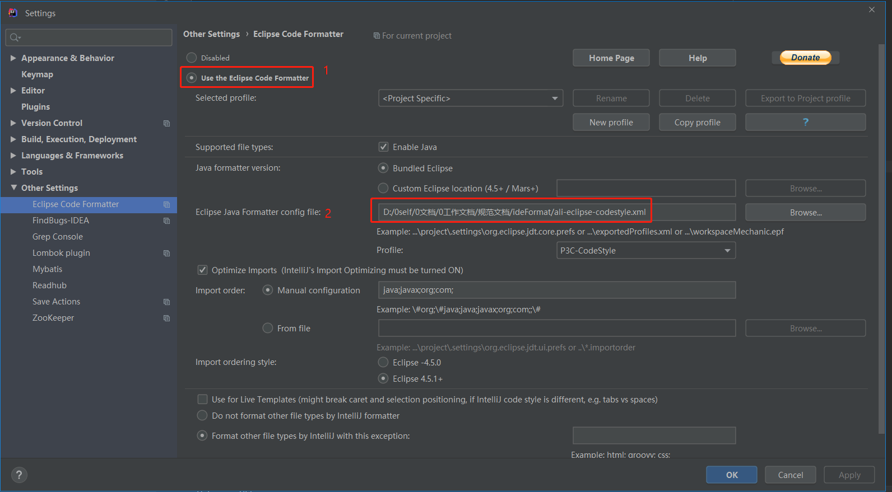
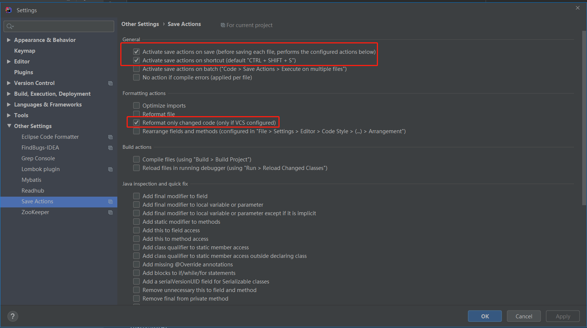
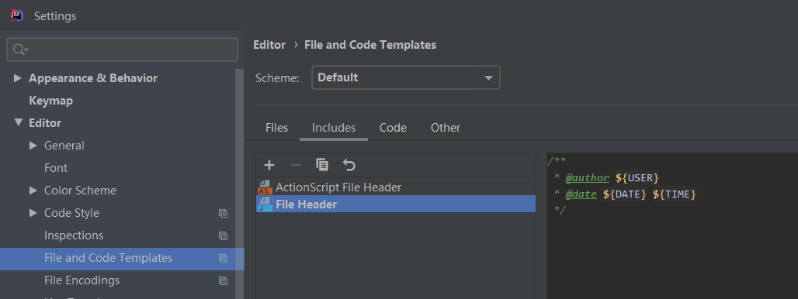

### 编码规范：
* 安装插件Alibaba Java Coding Guidelines
* 安装插件findbug


做两次检查

### codeStyle约定:
参考[阿里P3C](https://github.com/alibaba/p3c/tree/master/p3c-formatter)

#### 一、前置
先禁用已有格式化的软件，比如google format等其他自己安装的工具。

#### 二、ide设置
eclipse
* 1.导入p3c文件：ali-eclipse-codestyle.xml、ali-eclipse-codetemplate.xml（从github上clone下来的文件）
* 2.可以安装类似idea saveAction插件，在保存时，格式化变化的内容或者全量格式化

Idea
* 1.File-Setttings-Editor-Code Style，导入ali-eclipse-codestyle.xml


* 2.File-Settings-Plugins安装插件Eclipse Code Formatter、Save Actions
* 3.配置Eclipse Code Formatter


* 4.配置Save Actions


* 5.设置java文件头
```
/**
 * @author ${USER}
 * @date ${DATE} ${TIME}
 */
```

