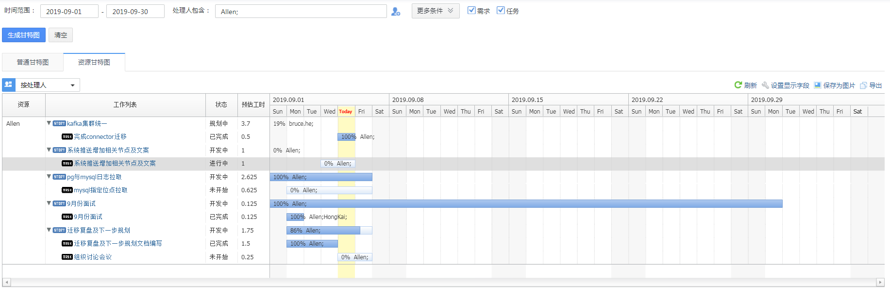

## tapd And 团队助手编写规范

#### 需求规范
关于需求规范这块，这块要持续完善。可以参考下toc组需求(如近期toc的需求[https://www.tapd.cn/20800451/prong/stories/view/1120800451001037272](https://www.tapd.cn/20800451/prong/stories/view/1120800451001037272))，可能他们有专门产品人员分工明确比较规范，但是基本要素如需求背景、问题日志、截图，开发过程中性能指标、方案说明，这些后续都有参考价值，需要完善在需求中。如以下例子：

**问题跟踪**：	[https://www.tapd.cn/20800451/prong/stories/view/1120800451001025780](https://www.tapd.cn/20800451/prong/stories/view/1120800451001025780)  

**主要关注点**：问题现象(日志、监控截图等)、排查过程、结论，即使找不到问题原因也需记录。

**跨部门需求**：	[https://www.tapd.cn/20800451/prong/stories/view/1120800451001028497](https://www.tapd.cn/20800451/prong/stories/view/1120800451001028497)

**主要关注点**：需求背景、内容、计划周期等

#### 任务拆分 
单个任务拆分时长为[0.1,3]人日，太长不利于工作统计，太细也会占用个人过多精力。因为每个开发人员除了需求分析、方案设计、代码编写、单元测试、联调、上线，也会参加各种会议讨论，协助其他团队排查问题、文档编写等。任务拆分的核心目标是评估各项需求的人力投入，需要真实，口径一致的数据才有指导价值。不要太关注数据是否好看，也不要求一天中每个小时都要记录，如实反馈最重要，也不会以此为唯一依据评估绩效，应该以目标为导向，效率为先。

**个人工作**

需求分析、方案设计、代码编写、单元测试、上线这些环节都可以拆分，当然也不要为拆分而拆分，有些简单的需求如一天以内，合起来也可以接受。

**团队工作**

* 人员招聘：比如关注团队招聘一个人要面试多少人，花费多长时间
* 其他待定项

* 从个人维度看：可以追溯到每天的主要工作内容，能经得起别人的提问
* 从团队维度看：可以衡量每周团队在各个方面的人力投入，能经得起其他团队的提问