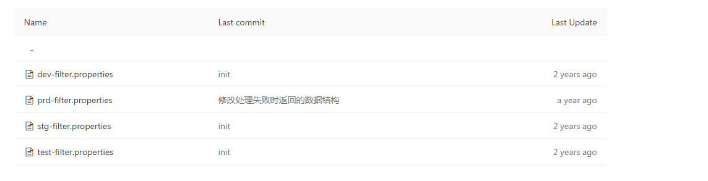
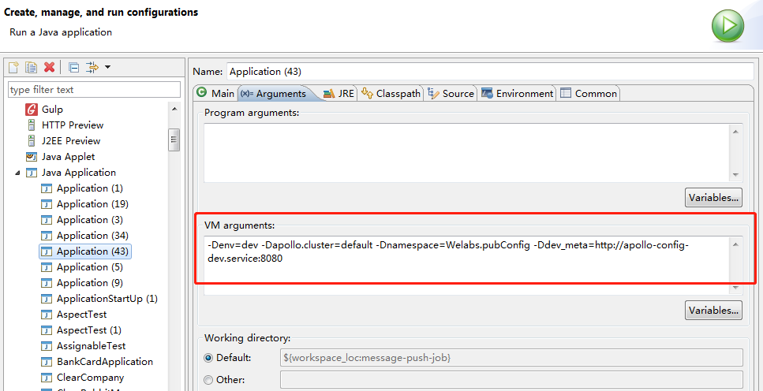

## 历史多环境加载版本

#### maven profile版本 

以[partner-service项目](https://git.wolaidai.com/WelabCo/TC/partner-service)为例，通常在src/filter下面配置多个环境filter文件：

	

使用maven的profile机制实现，项目会继承以下pom。

```
    <groupId>com.welab</groupId>
    <artifactId>welab-springboot-parent</artifactId>
    <version>1.3.0-SNAPSHOT</version>
```

如[样例pom.xml](http://10.0.0.3:8081/nexus/content/repositories/snapshots/com/welab/welab-springboot-parent/1.3.0-SNAPSHOT/welab-springboot-parent-1.3.0-20170629.063649-6.pom)所示配置dev、utest、itest、test、stg、prd、perf各个profile参数，在maven资源文件编译阶段会默认替换resources下面的配置文件，在ide环境开发时profile默认为dev，所以会用dev-filter.properties中的参数。

**特点**

1. 实现简单，无须依赖apollo组件
2. 在编译阶段就实现参数替换，不会出现后续提到参数加载顺序问题
3. 功能简单，修改参数不方便，线上调整参数都要提交代码
4. 生产参数权限不易管理，如数据库密码对开发人员暴露  

**所以，**目前只有少部分旧项目使用该方案，新项目禁止使用该方案，统一参考最新的[welab-scaffold](https://git.wolaidai.com/WelabCo/Architecture/welab-scaffold)

#### 官方apollo 1.0版本

在上述的pom.xml再配置名为remote的profile，目前部分项目的编译脚本中[assembly\scripts\install.sh](https://git.wolaidai.com/WelabCo/TC/partner-service/blob/master/assembly/scripts/install.sh)指定profile为remote， 如下所示：

```
mvn clean compile install spring-boot:repackage -Dmaven.test.skip=true -Premote -U
```

主要有以下功能: 
1. 过滤掉application.yml文件，通常application.yml中为测试环境参数，若使用配置中心(如生产环境)就无须使用该文件
2. 通过write-text-files-maven-plugin生成META-INF/app.properties文件，apollo-client默认会读取该文件获取appId，再配合环境变量中的其他apollo参数获取对应应用的参数，文件内容如下：

```
app.id=${project.artifactId}
```

应用使用@EnableApolloConfig注解开启配置中心加载功能，具体原理见[http://www.iocoder.cn/Apollo/client-config-spring-2/](http://www.iocoder.cn/Apollo/client-config-spring-2/)。

**特点**

1. 已使用配置中心，优点就不具体展开
2. 由于使用profile不一样，ide开发环境与测试环境、生产环境存在细微差异，ide中使用application.yml加载，测试环境直连apollo配置中心，两者初始化的时间点有细微差别。相当部分开发人员未关注此细节，可能造成本地能正常运行的但在测试环境就不能
3. 与springboot集成存在问题，如@ConditionalOnProperty可能不生效

#### welab-common<=1.4.4 版本

具体使用可见[配置中心开发指南](https://wiki.wolaidai.com/2017/09/18/%E9%85%8D%E7%BD%AE%E4%B8%AD%E5%BF%83%E5%BC%80%E5%8F%91%E6%8C%87%E5%8D%97/)，其中关键配置如下：

引入客户端配置到pom中：

```
<dependency>
   <groupId>com.welab</groupId>
   <artifactId>welab-common</artifactId>
   <version>${version}</version>
</dependency>
```
将配置与配置中心整合：

```
<!-- 自定义配置文件 appId:应用的名称,fileName:配置文件的名称 -->
<bean id="defaultConfig" class="com.welab.common.config.DefaultConfigService">
   <property name="appId" value="welab-scaffold" />
   <property name="fileNames" value="server.properties;app.yml" />
</bean>
```

**特点**

1. 不使用maven profile实现ide环境、测试环境和生产环境的参数管理，统一由DefaultConfigService来加载参数，可以保证各环境参数加载顺序一致
2. 与springboot集成存在问题，如@ConditionalOnProperty可能不生效

#### welab-common>=1.4.5 版本

部分项目在集成mq时发现apollo参数，排查发现参数加载顺序存在问题，后续参考springboot框架对application.yml的加载，在DefaultConfigService类增加继承ApplicationContextInitializer，详见[commit](https://git.wolaidai.com/WelabCo/Architecture/welab-common/commit/0d8fb8e9c8bb353ad36de74b7937949e0c18a304)，同时保持对旧有实现的兼容。最近研究apollo官方文档时，发现官方也有类似的实现类ApolloApplicationContextInitializer，但我们一开始使用apollo框架时还未有该功能。详见[apollo spring集成3](http://www.iocoder.cn/Apollo/client-config-spring-3/)

**特点**
1. 解决参数加载问题，保证在spring初始化容器开始阶段就就加载参数

**所以，**该方案是目前标准连接配置中心方案

## 存在问题

总结多环境配置加载的各个历史版本，整理以下几点要求：  
1. 使用配置中心统一管理使用开发、测试、生产环境的参数，同时兼顾ide环境开发方便允许读本地文件，理想情况是不同环境都是同一份代码，编译出同样的jar包，连到哪个环境配置中心就是该环境应用
2. java应用内只能读取一个环境的参数，类似server.properties打包至生产环境但不使用是可接受的，但application.yml打包至生产环境就不太合理了，application.yml默认会被加载的，虽然现在apollo参数的优先级设置比较高实现覆盖，正常情况下是不会出现参数问题的
3. 应用启动时优先完成参数的加载（配置中心或本地），然后加载各类bean，从根本上杜决参数加载顺序问题

## 标准方案配置中心使用
在类根路径创建/META-INF/app.properties，指定appId和本地文件名称，内容如下：

```
# 标识唯一的应用名称
appId=welab-scaffold
# 本地配置文件名称，用于ide环境开发方便，支持properties和yml格式
fileNames=server.properties
```

[样例 app.properties](https://git.wolaidai.com/WelabCo/Architecture/welab-scaffold/blob/master/welab-scaffold-core/src/main/resources/META-INF/app.properties)

## 兼容性方案--针对lender项目组
由于之前比较多项目使用welab-springboot-web-parent(1.3.0-SNAPSHOT)版本，建议升级至1.4.0-SNAPSHOT版本，并且在编译脚本时开启remote profile(-Premote)。

* application.yml不需要打到可springboot可执行jar中，这些环境是连接apollo配置中心
* mvc filter过滤机制可以不需要

#### 测试环境及生产环境
java应用能获取apollo参数即连接配置中心加载参数，如测试环境在启动jar指定以下环境变量：

```
-Denv=dev -Dapollo.cluster=default -Dnamespace=Welabs.pubConfig -Ddev_meta=http://apollo-config-dev.service.dev.welab.co:8080
```
有兴趣的同学找个测试环境容器中使用ps -efww | grep java测试下

#### 本地启动，常用于ide环境
java应用不能获取apollo参数即从本地配置文件中加载参数

开发过程中若遇到特殊问题需要连接测试配置中心测试时，可以在启动时增加环境变量即可实现，如下：
	

## 后记
系统研究下官方apollo的文档，其实官方已经提供了本地参数加载和springboot环境如何保证顺序，主要是目前参数加载是演化而来的，如果从0开始可能会使用官方的版本。  
现阶段尽量能统一下各项目对配置中心的使用，这样也方便后续人员维护和迭代，有些历史方案现在运行平稳但后续增加参数就可能存在问题，改动也存在风险，尽量平衡下。
