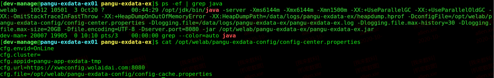
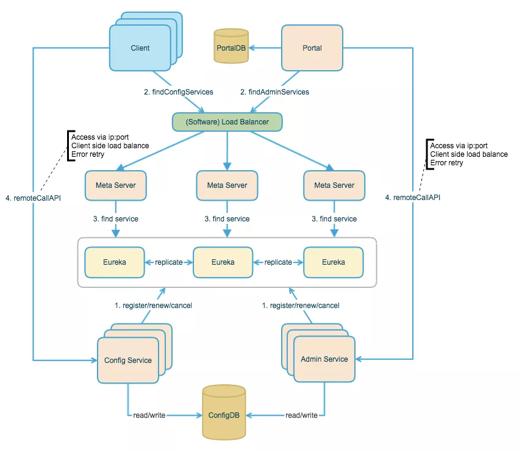
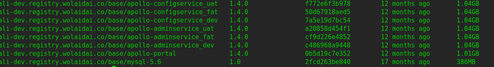

## 配置中心

基本要求：
1. 管理不同环境参数
2. 参数发布管理
3. 实时生效

其他要求
1. 权限管理、历史版本变更审核
2. 敏感参数加密
3. 部署简单
4. 发布灰度
5. 跨平台支持

### 技术选型

#### weconfig

https://git.wolaidai.com/WelabX/pangu/blob/master/pangu-app/pangu-app-exdata/src/main/java/com/wolaidai/pangu/app/exdata/listener/AppListener.java  
https://git.wolaidai.com/WelabX/pangu/blob/master/pangu-common/src/main/java/com/wolaidai/pangu/common/configuration/Config.java 
	
 
```
// 参数加载见AppListener，AppListener实现ApplicationListener<ApplicationEnvironmentPreparedEvent>接口，处理时机没问题
private void initCenterConfig() {
    // 初始化配置中心连接信息
    ConfigurationManager.getConfig();
    Class[] appendClasses = new Class[]{Config.class};
    ConfigService.appendClass(appendClasses);
    try {
        ConfigService.init();
    } catch (Exception e) {
        e.printStackTrace();
    }
}

// 参数使用见Config
@ConfigClass
public class Config {
    @ConfigField(keyName = "app.environment.prod", defaultValue = "true")
    public static Boolean IS_PROD_ENV;
    @ConfigField(keyName = "app.env.test", defaultValue = "false")
    public static boolean isTestEnv;
}

```
参考apollo造的轮子，使用mongodb存储，实现配置参数管理及自动刷新功能。从功能上来看，基本满足简单要求，相当于0.1版本。

#### welab-common

https://git.wolaidai.com/WelabCo/Architecture/welab-common/blob/master/src/main/java/com/welab/common/config/DefaultConfigService.java  
```
@Slf4j
public class DefaultConfigService implements ApplicationContextInitializer<ConfigurableApplicationContext> {

	private static final String APP_PROPERTIES_CLASSPATH = "/META-INF/app.properties";

	/**
	 * spring容器初始化<br/>
	 * 参数springboot对applicaion.yml文件的加载，在扫描@Configuration注解前就完成参数初始化<br/>
	 * 旧版本使用apollo框架提供的@EnableApolloConfig注解，但实际上没解决与springboot兼容问题
	 */
	@Override
	public void initialize(ConfigurableApplicationContext applicationContext) {
		ConfigurableEnvironment environment = applicationContext.getEnvironment();
		if (environment.getPropertySources().contains(APOLLO_PROPERTY_SOURCE_NAME)) {
			// already initialized
			return;
		}
		loadParameter();
		OrderSafeProperties properties = getInit();
		PropertiesPropertySource pps = new PropertiesPropertySource(APOLLO_PROPERTY_SOURCE_NAME, properties);
		environment.getPropertySources().addFirst(pps);
	}
}
```

```
[root@message-platform-79d8944f56-7wxzw /]# ps -efww | grep java
welab       47     1  6 Oct11 ?        14:42:57 /usr/bin/java -server -Djsse.enableSNIExtension=false -Dfile.encoding=UTF-8 -Xms1792m -Xmx1792m -Xmn597m -XX:SurvivorRatio=8 -XX:GCTimeRatio=19 -XX:P
arallelGCThreads=2 -XX:+DisableExplicitGC -XX:+UseFastAccessorMethods -Xnoclassgc -XX:+ParallelRefProcEnabled -XX:+UseConcMarkSweepGC -XX:+UseParNewGC -XX:+CMSParallelRemarkEnabled -XX:+UseCMSIniti
atingOccupancyOnly -XX:CMSInitiatingOccupancyFraction=70 -XX:+CMSClassUnloadingEnabled -XX:SoftRefLRUPolicyMSPerMB=0 -XX:+PrintGC -XX:+UseGCLogFileRotation -XX:NumberOfGCLogFiles=5 -XX:GCLogFileSiz
e=256M -XX:+PrintGCDetails -XX:+PrintGCTimeStamps -XX:+PrintHeapAtGC -XX:+UnlockExperimentalVMOptions -XX:+UseCGroupMemoryLimitForHeap -Xloggc:/data/logs/message-platform/gc.log -Denv=fat -Dapollo.
cluster=default -Dnamespace=Welabs.pubConfig -Dfat_meta=http://apollo-config-fat.ops.wolaidai.co:8080 -jar /opt/welab/message-platform/message-platform.jar
```

#### apollo
github地址： https://github.com/ctripcorp/apollo  
例子： http://www.iocoder.cn/Spring-Cloud/Apollo  

apollo官方架构图  
	

测试环境部署架构  
	

源码分析 apollo-client-1.5.1.jar!\META-INF\spring.factories
```
org.springframework.boot.autoconfigure.EnableAutoConfiguration=\
com.ctrip.framework.apollo.spring.boot.ApolloAutoConfiguration
org.springframework.context.ApplicationContextInitializer=\
com.ctrip.framework.apollo.spring.boot.ApolloApplicationContextInitializer
org.springframework.boot.env.EnvironmentPostProcessor=\
com.ctrip.framework.apollo.spring.boot.ApolloApplicationContextInitializer
```

#### nacos
github地址： https://github.com/alibaba/nacos
例子： http://www.iocoder.cn/Spring-Boot/config-nacos  

既可以当注册中心又可以当配置中心使用，作为Spring-Cloud-Alibaba的核心子项目，有很大发展前景，但作为配置中心体验上还不成熟。

### 原理与思考

如何加载  
如何使用  
如何与spring兼容  