# 数据库自治服务
阿里云－－数据库自治服务是特别强大数据库运维工具，不仅仅可以方便DBA高效管理数据库，更方便广大应用开发人员解决数据库常见问题，基础版还免费，功能已经足够强大优秀。
去年在PG迁移上云过程中开始使用此服务，特别推荐给广大后端核心开发人员使用下，建议使用该功能定期巡查各核心应用数据库。

## 性能监控

可以查看到MySQL、Redis、MongoDB、PostgreSQL各类数据库的监控列表

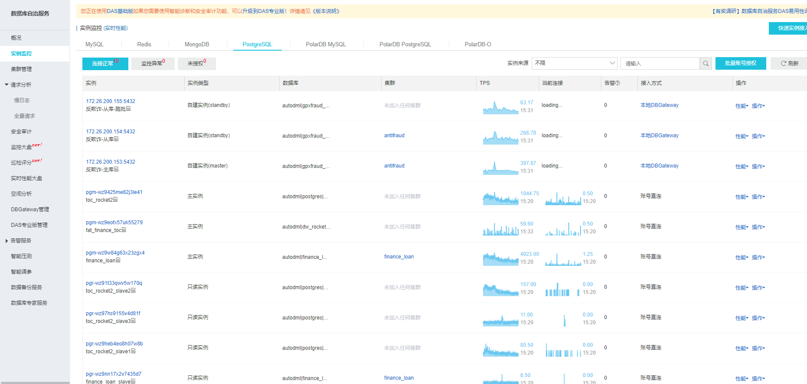 

以toc_rocket2库为例，查看连接数/每秒事务数/CPU利用率/内存使用量等关键指标，如下图可以看到推广时连接数的上升

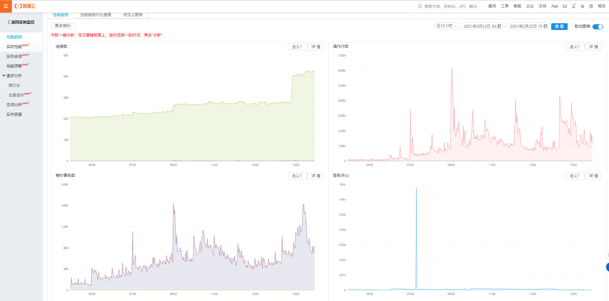 

## 实例会话

查看到当前会话的统计信息，当追查数据库的上游应用时比较有用

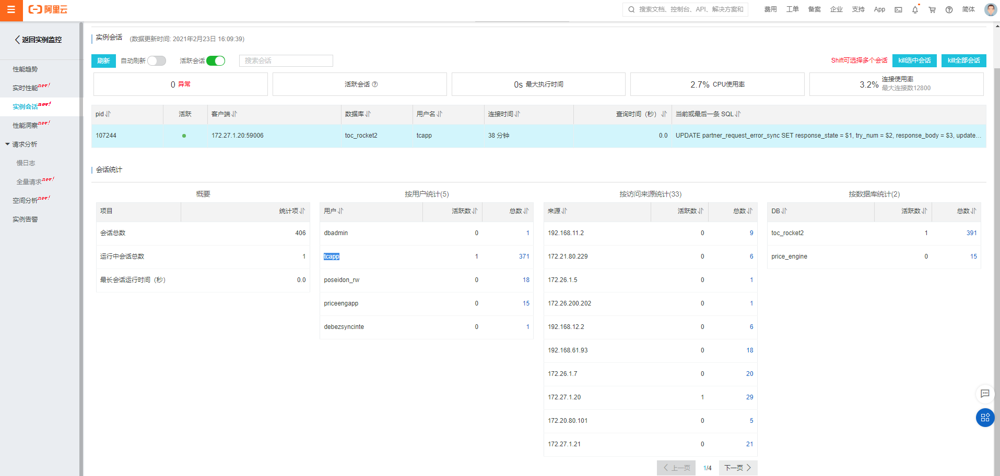 

## 空间分析

可以查看每个数据库和单个表的空间使用情况，此项功能可以查看到比较多潜在的风险

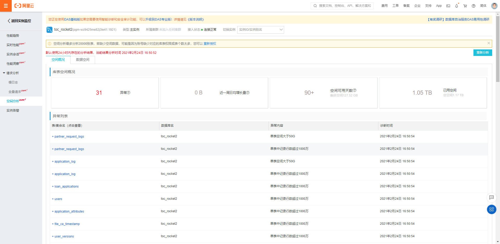 

以下特地挑几个目前常见的风险点：

#### 单表过大

如partner_request_logs表空间使用达到374.07G，数据库总共才879.18G，正常情况普通SSD成本是1元/G/月，目前该库是一主三从配置，
每年存储成本374.07 * 4 * 12=17955.36元(暂时不论阿里云折扣)，这张表是值得去优化的。

同时也可以看到索引的使用情况，索引也存在缺点，不仅会增加存储成本，也会降低TPS，所以要合理地使用。
如partner_request_logs表idx_createdat_appid_source索引实际中未访问。

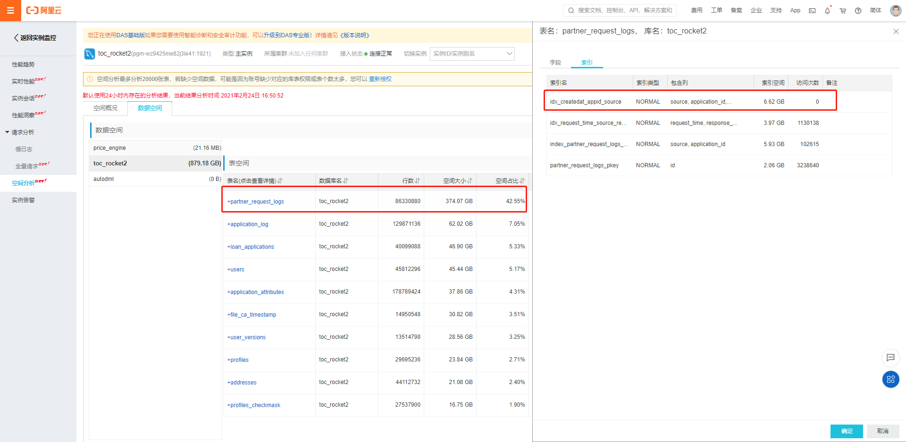 

#### 索引过多
如users表索引创建了13个，一半的索引实际是未用到。

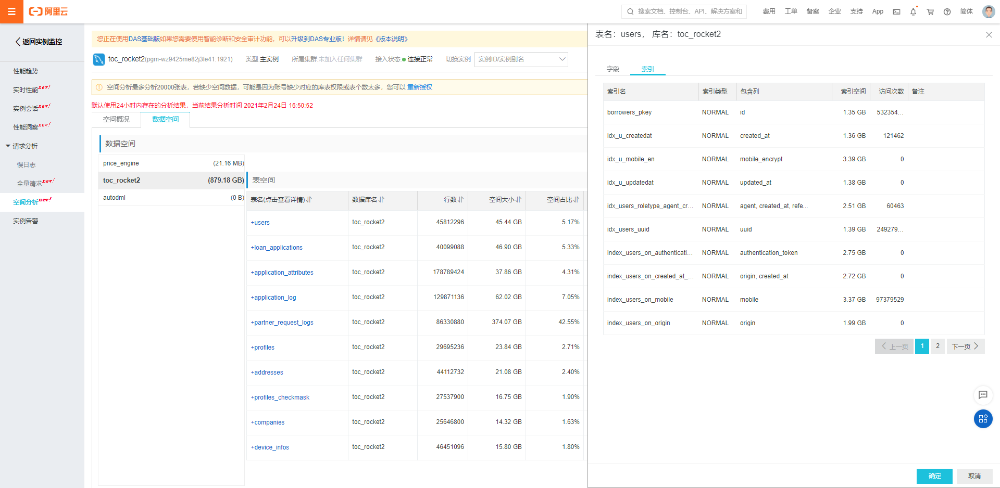 

#### 未创建索引
按全表扫描次数倒序排列，如表partner_request_error_sync表就是个典型例子，表空间1.23GB大小适中，全表扫描次数达到105333244，
查看表结构发现只有主键索引，那实际使用中很可能通过其他条件来检索导致全面扫描。

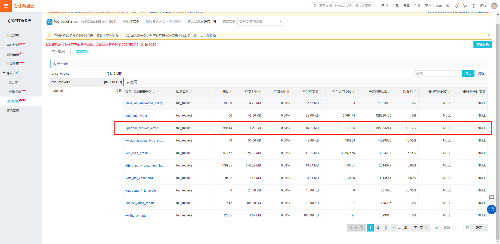 

#### 单表记录数过多

message-sms(rm-wz93kh1662f5v8qsc:3306) 实例好多张表单表数据上亿条

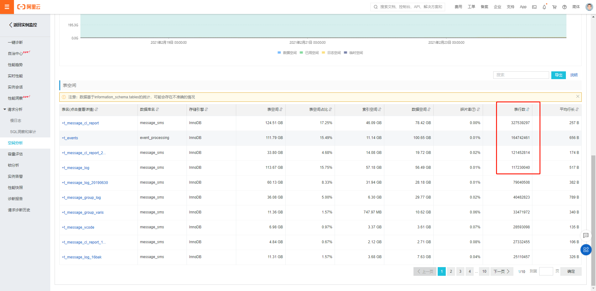 

#### 归档备份
welab_creditline中access_log_2020表单表600.73G，这类表如果应用未访问，尽量归档备份至oss，避免占用数据库存储。

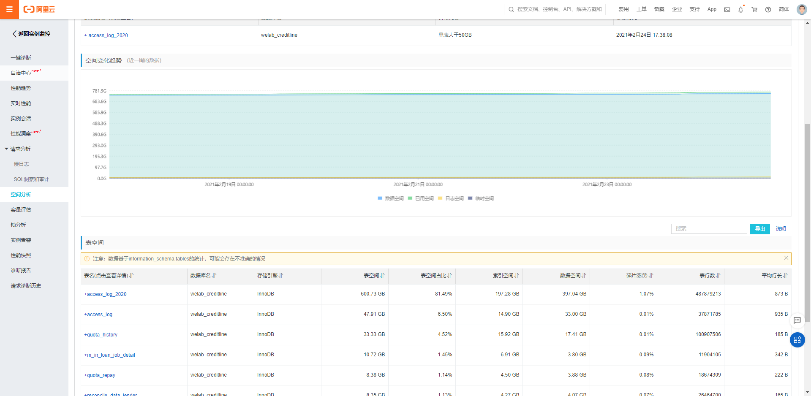 

## 慢查询

目前看慢查询较少，大致正常

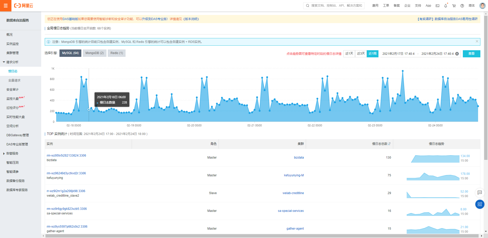 

## redis

目前比较普遍是redis内存使用率偏低

#### 内存使用低
如阿里云集群 message-sms (r-wz946278fd223cb4:6379)实际，内存使用率平均5%偏低。
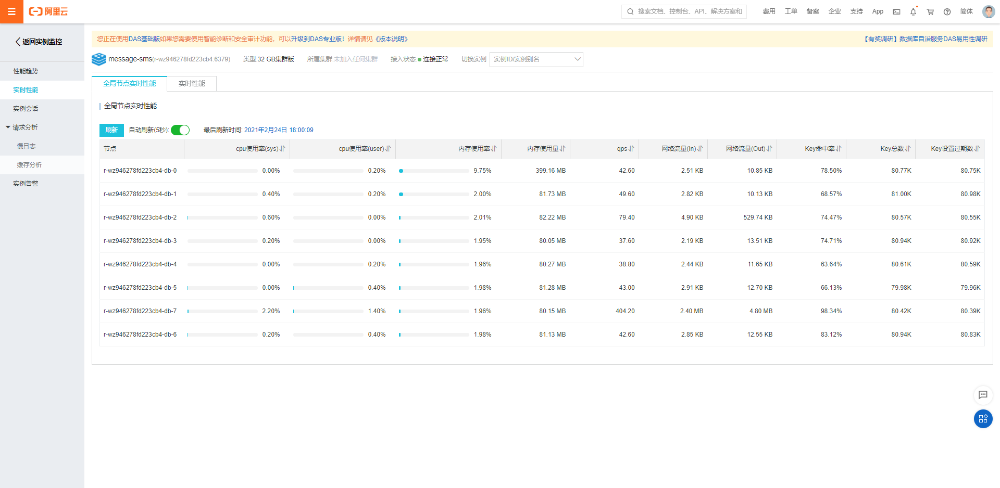 

自建集群redis-lender-repay总共使用不到30M，占用6个实例
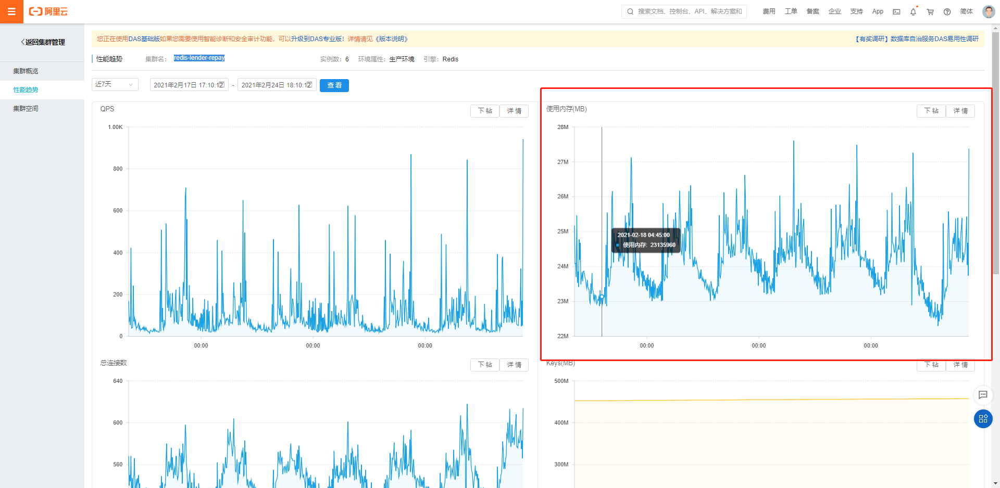 

## 官方文档
https://help.aliyun.com/product/63907.html?spm=a2c4g.11186623.6.540.2b236ad5YQaAkz