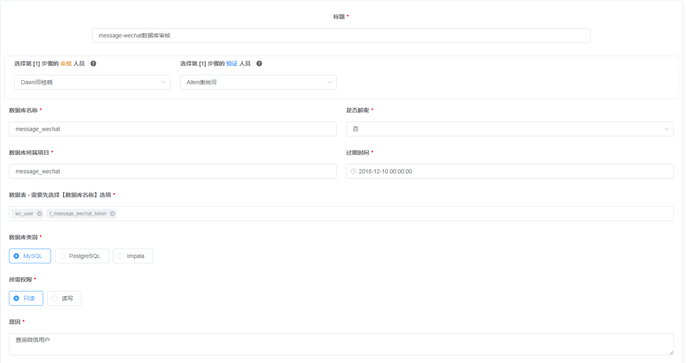
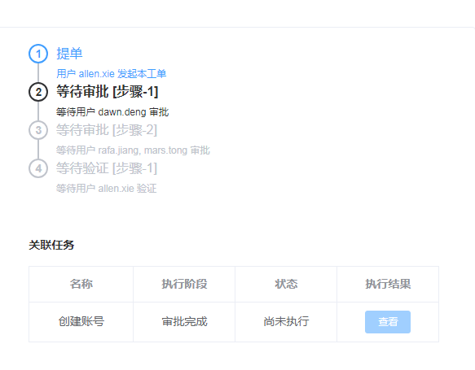
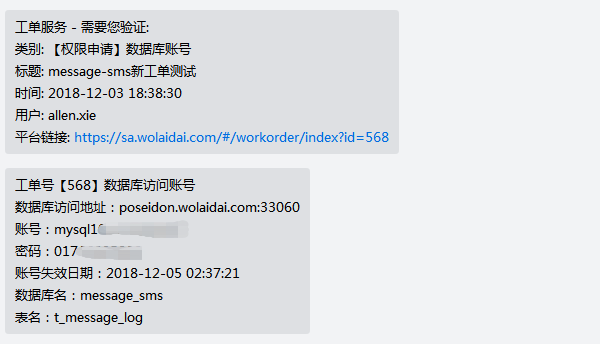
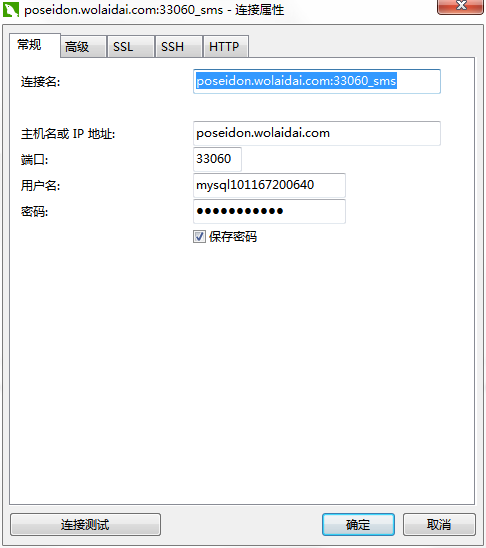
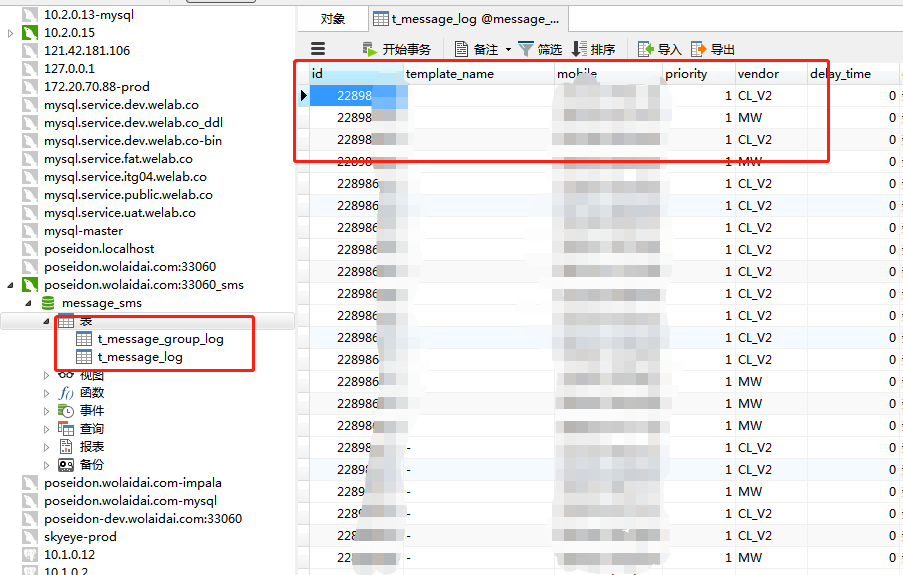

## 如何在新工单系统中申请数据库账号

##### 1、在[我来贷安全运维平台](https://sa.wolaidai.com)中“工单批处”下提个工单类型为“【权限申请】数据库账号”
 

**申请遵循最小权限原则，重要栏位说明**:  
1. 审批人员：目前各项目默认各项目组的leader审批
2. 是否解密：如果选择解密将看到表的明文字段，这个选项要慎重点
3. 过期时间：工单申请的账号最好是临时账号，有效时间不宜超过7天
4. 数据库和表：选择本次操作需要使用的业务库及相应的表

##### 2、根据流程发完指定人审批，目前流程由项目负责人--> DBA二级审批  
 
##### 3、工单审批完成后将自动创建账号发至企业微信  
 
#### 4、直接通过mysql客户端就可以查看数据，pg和impala类型也使用mysql协议
目前安全平台支持以下版本client:  
* navicat：11.x   sqlyog：11.x  heidisql:9.5.x
* mysql原生命令行：5.7及以下（windows&linux）
* dbeaver5.3.0

以下演示使用navicat客户端，配置数据源参数：  
 
 
查看相应数据：  
 

** 账号申请**
* 临时账号：用于发版验证，支持解密，账号有效期暂为七天
* 业务账号：常用于开发人员解决生产问题，不支持解密，账号有效期暂为三个月
* 系统账号：常用于BI、内部管理系统等应用程序使用，账号有效期暂为一年  

对于第二三两类账号，后续自动重置有效期

