## 架构规划

#### 关系型数据库
###### mysql
**使用情况**：7月份共使用52个实例合计73718.39元。

但目前主要存在以下不合理地方：  
1、实例过多，但资源使用率普通不高 
   
*我来贷--flacon监控*  
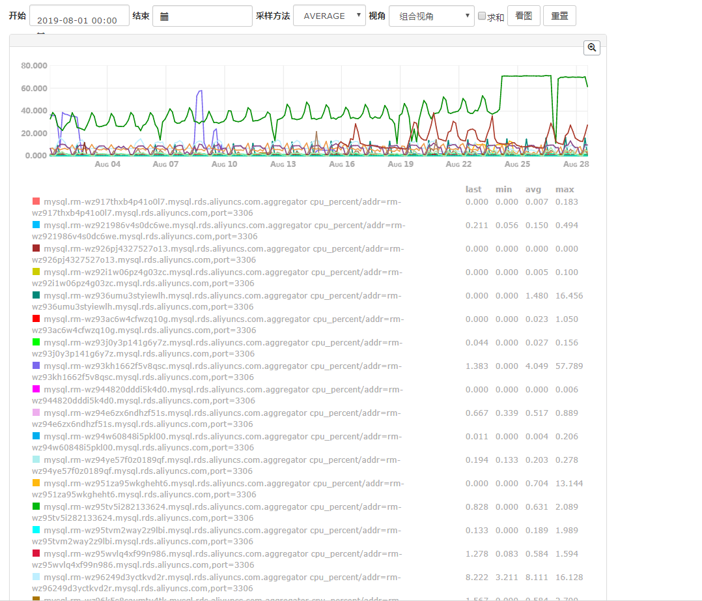  
   
*阿里云--云监控*    
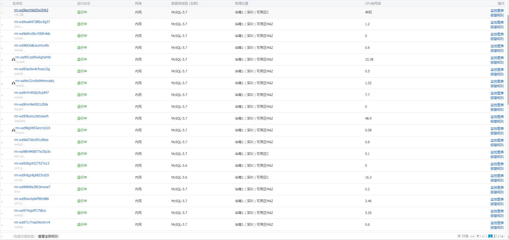 

2、读写分离  
目前大部分应用未采用读写分离，有些实例虽也申请从库，但主要应用于BI数据同步、金乌代理查询等场景。针对我们线上应用大部分场景是读取写少，合理搭建主从引入读写分离能大大降低数据库层面压力。

###### pg  
**使用情况**：7月份共使用76735.06元其中核心pg库(一主十七从)共70286.00元。目前核心库主库资源使用比较合理，但从库使用率普通较低。

问题：一主十七从很不合理，不管从架构上还是成本上。架构设计上如直接从主库同步会影响主库带宽资源，如采用级联复制就会增加同步延时。成本上SSD云盘1TB1年要9830.4元(0.8\*1024\*12=9830.4)，那复制18份需要176947.2元，正常情况下一主五从已能满足需求。

*我来贷--flacon监控*  
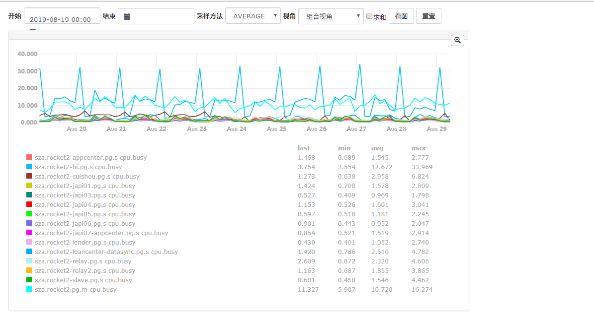  
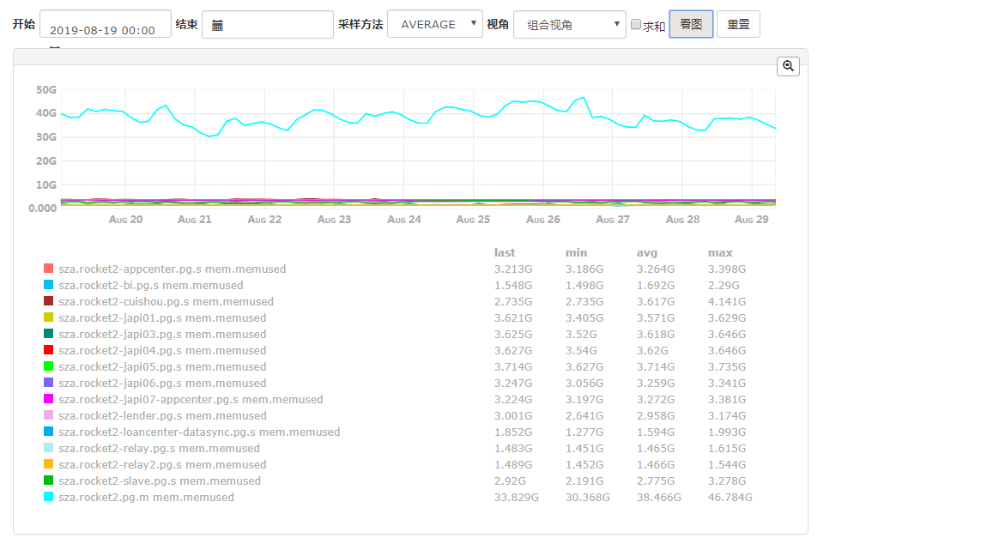  

**现阶段优化方向**  
1、表结构优化
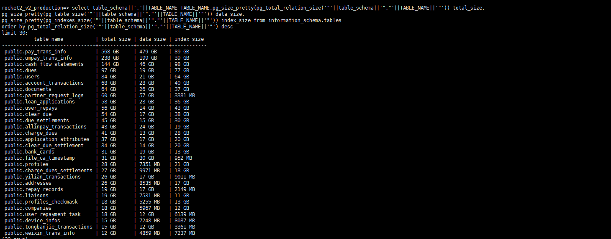  
[相关ddl文本](https://git.wolaidai.com/WelabCo/Architecture/work-profile/tree/master/middleware/prop/user-due-ddl.txt)  
* 索引创建不合理  
看上图所示有些表索引比表都大，特别是users和dues表，查看表ddl发现目前维护太多索引，需确认下应用中是否使用。如documents服务经整理后只保留主键索引和(documentable\_id, doc\_type)普通索引就可满足正常需求。  	
* 触发器与存储过程  
数据库层禁止进行复杂的逻辑计算，因为应用的水平扩展远比db方便，业务逻辑放在应用层处理。触发器不仅仅会降低数据库性能，还对应用也不透明，大部分开发人员很容易忽略触发器的存在。

2、服务治理  
之前ruby-->java重构时，核心库还是使用单一pg库，从当时是可以提高开发的效率，但是随着应用规模的增长，特别是需求迭代过程中重构成本就变大了，已经不符合当前的开发要求。如关键loan_applications表目前有36个应用在直接访问，这对表结构变更、数据库迁移等都带来难度。虽然目前应用间的数据边界已经做了大致梳理，但是历史的遗留代码还未治理。

3、数据迁移  
表结构优化与微服务拆分合理后，数据迁移是比较简单的。目前已完成迁移整套基础组件的开发，采用全量加增量的同步方式可以迁移大数据量表。如pg-->mysql业务程序主要关注下语法的差异，大部分nosql数据都兼容mysql语法，将来有需要往其他数据迁移都很方便。

4、规范与规划  
业务团队：目前数据库还存在比较多不合理的设计：触发器、字段命名、索引设计、时区设计等  
基础团队：针对目前资源使用情况，一个库占用一个实例会造成资源使用率偏低，特别是微服务设计下每个应用都会使用单独的库；但所有应用使用单一的数据库又造成数据库资源瓶颈、水平扩展麻烦。建议要按业务重要程序、数据访问量、使用部门等规划实例的分配，同时也要做下容量规划，做下两至三年内的预案。    

5、OLAP  
目前BI部门等OLAP型应用有部分报表对实时性有要求需要直连线上数据库从库，但随着数据中台的建设，通过解析关系型数据库日志近实时同步至数据仓库中，数据仓库专注于数据分析场景，同时OLAP型应用将不用直连关系型数据库，这样线上应用也更加稳定可靠。

**未来方向**  
随着分布式数据库的成熟，特别是云厂商的跟入，未来将会有更多的选择，主要有以下两个方向：  
**Shared Everything方向**  
分布式数据库：TiDB、Google Spanner  
**Shared Nothing方向**  
云原生数据库：亚马逊--Aurora、阿里云--PolarDB、腾讯云--CynosDB  

*阿里云PolarDB产品介绍*  
POLARDB采用存储和计算分离的架构，所有计算节点共享一份数据，提供分钟级的配置升降级、秒级的故障恢复、全局数据一致性和免费的数据备份容灾服务。POLARDB既融合了商业数据库稳定可靠、高性能、可扩展的特征，又具有开源云数据库简单开放、自我迭代的优势，例如POLARDB for MySQL性能最高可以提升至MySQL的6倍，而成本只有商用数据库的1/10。
虽然阿里云在2017年已推出这款产品，但目前采用的公司还是比较少，特别是互金行业的公司，还是担心风险。

#### 存储
目前公司主要文件存储是使用阿里云oss存储服务，
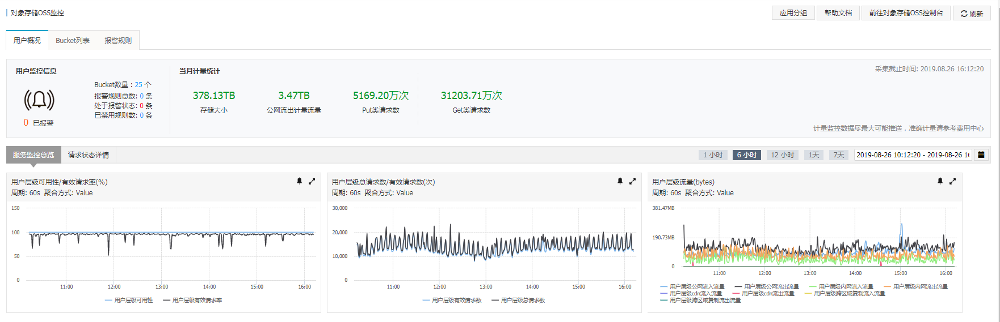 

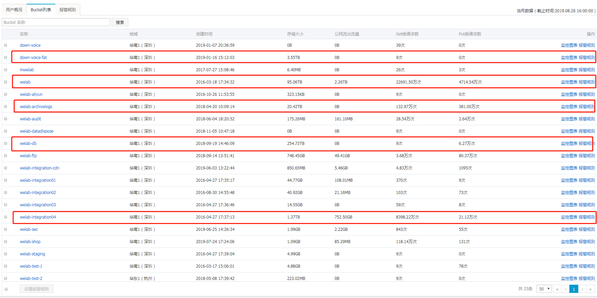 

优化方向 
1、存储的技术方案(磁盘文件、cdh自建、oss存储及其他)
技术实现、性能、成本 

2、目前我们公司使用场景

3、数据分析方案，如目前日志场景

3.1、 Data Lake Analytics + OSS 

介绍
DLA内置了处理各类数据文件的Serialize/Deserilize（简称SerDe，用于序列化和反序列化）
，您无需编写程序，直接选用一款或多款SerDe来匹配OSS上的数据文件格式。通过SerDe，DLA可以对OSS上的多种格式的文件进行查询分析，
包括纯文本文件(CSV、TSV等)、ORC、PARQUET、JSON、RCFILE以及AVRO格式的文件。
在DLA中创建OSS文件表时，您需要通过STORED A指定OSS上的数据文件格式。

服务开通
OSS服务：开通OSS服务
DataLakeAnalytics服务：开通DataLakeAnalytics服务

步骤：
1、存储数据到OSS（.csv、.log）等文件

2、创建shema和table（通过定义正则表达式等）

3、执行sql查询

关于日志的查询参考：
https://help.aliyun.com/document_detail/110380.html?spm=a2c4g.11186623.6.616.7ec93548VL1sE8 
注意事项
通过DLA读取日志数据时，日志文件需满足以下条件：
日志文件的格式是纯文本格式，每行可以映射为表中的一条记录。
每行的内容有固定的模式，可以用一个正则表达式去匹配。

正则表达式

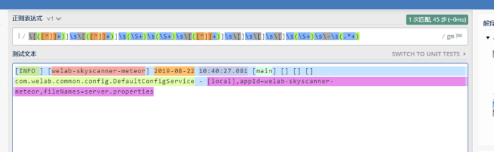 

建表

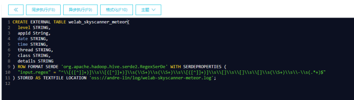 

查询

 

总结特点：简单、易用、依赖服务少

3.2、 MaxCompute + OSS

步骤:

开通OSS服务，详情请参见开通OSS服务。
创建OSS Bucket，详情请参见创建Bucket 。
开通MaxCompute服务，详情请参见开通MaxCompute。
创建MaxCompute Project，详情请参见创建MaxCompute Project。
授权MaxCompute访问OSS。
MaxCompute需要直接访问OSS的数据，因此需要将OSS的数据相关权限赋给MaxCompute的访问账号。您可以在直接登录阿里云账号后，单击此处完成一键授权。
将数据上传到OSS。

参考：

https://help.aliyun.com/document_detail/87392.html?spm=a2c4g.11186623.6.1379.48e122bai8M70c

OSS外部表查询功能：

MaxCompute重磅推出了一项重要特性：OSS外表查询功能。该功能可以帮助您直接对OSS中的海量文件进行查询，而不必将数据加载到MaxCompute表中，既节约了数据搬迁的时间和人力，也节省了多地存储的成本。
使用MaxCompute+OSS的方案，您可以获得以下优势：

MaxCompute是一个无服务器的分布式计算架构，无需用户对服务器基础设施进行额外的维护和管理，能够根据OSS用户的需求方便及时地提供临时查询服务，帮助企业大幅节省成本。
OSS为海量的对象存储服务。用户将数据统一存储在OSS，可以做到计算和存储分离，多种计算应用和业务都可以访问使用OSS的数据，数据只需要存储一份。
支持处理OSS上开源格式的结构化文件，包括：Avro、CSV、ORC、Parquet、RCFile、RegexSerDe、SequenceFile和TextFile，同时支持gzip压缩格式。

应用场景:

互联网金融应用每天都需要将大量的金融数据交换文件存放在OSS上，并需要进行超大文本文件的结构化分析。通过MaxCompute的OSS外部表查询功能，用户可以直接用外部表的方式将OSS上的大文件加载到MaxCompute进行分析，从而大幅提升整个链路的效率。

步骤：

OSS的STS模式授权
https://help.aliyun.com/document_detail/72777.html?spm=a2c4g.11186623.6.765.760155c4cfZyW6

访问OSS非结构化数据
https://help.aliyun.com/document_detail/45389.html?spm=a2c4g.11186623.2.9.65446d03BhDDNh

自定义Extractor访问OSS：

当OSS中的数据格式比较复杂，内置的Extractor无法满足需求时，需要自定义Extractor来读取OSS文件中的数据。

例如有一个TXT数据文件，并不是CSV格式，记录之间的列通过|分隔。

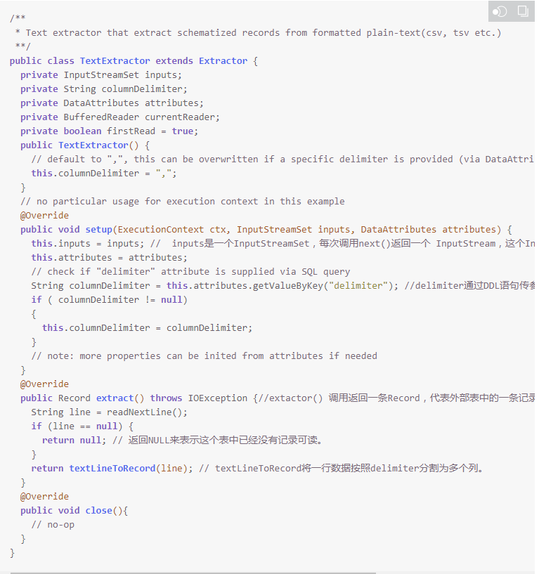 

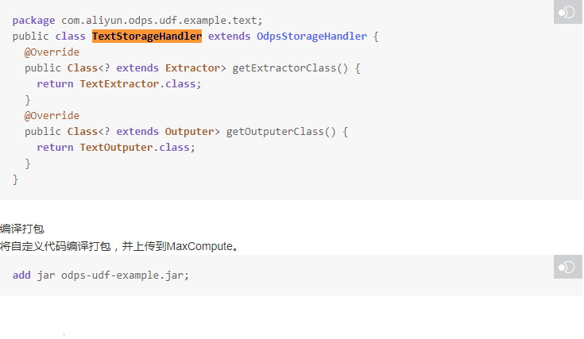 

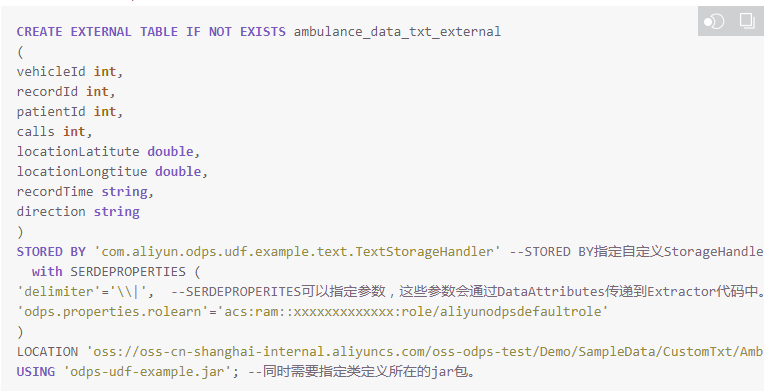 

总结：

DLA直接通过正则表达式建表，只要能满足正则表达式的数据都能提取分析，无需开发代码，简单易用，维护成本低

MaxCompute对于权限和功能更加完整，支持更多的数据格式，可以进行代码开发自定义自定义Extractor访问OSS，支持的数据格式更加复杂多样化，维护成本更高

推荐：
基于目前分析log的需求点出发，推荐使用正则表达式方式DLA进行日志分析提取

#### redis

目前使用情况
测试环境 12个实例共20个节点
阿里云 4个集群版、6个标准版

之前制定个规范还未在内部推行

#### 微服务

dubbo升级及未来服务调用的规划

#### rabbitmq

旧框架的改造、消息格式的统一、使用规范培训

#### kafka

#### 调用链平台

#### 代码规范

git流程
编码规范
脚手架：springboot+mybatis-plus
