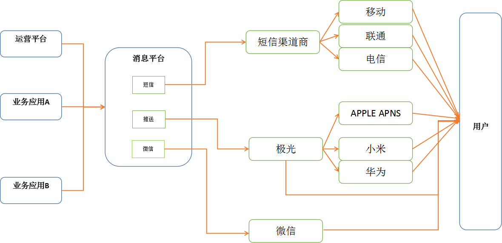

以下这些问题其实在微服务场景都需要考虑到的，只是在流量大的场景下出现的概率会大点
 

**特点:**突发量大，但总体不高 ;不需要考虑顺序、事务  

#### 异步
1、 同步调用

```
|-------------|                 |-------------|                 |-------------|                  
|             |================>|             |================>|-------------|                     			
|   运营平台    |                |    消息平台   |                 |     运营商   |                    
|             |<================|             |<================|-------------|                   
|-------------|                 |-------------|                 |-------------|                    

```

**特点：**简单，实时返回，适用及能快速返回结果场景

2、 异步调用

```
|-------------|                 |-------------|                 |-------------|                  
|             |================>|             |---------------->|-------------|                     			
|   运营平台    |                |    消息平台   |                 |     运营商   |                    
|             |<================|             |<----------------|-------------|                   
|-------------|                 |-------------|                 |-------------|                    

```
**特点：**适合大批量发送等长时间任务场景

>> 接收 --> 校验报文内容 --> 返回成功  
>> 后台线程启动批量任务，多机器如何分片，多个节点如果调用同一条消息会不会导致数据重复  

3、 mq解藕  
使用rabbitmq、kafka消息中间件解藕，削峰填谷，应付大流量  
 

**特点：**需要引入中间件，架构变复杂，适合突发流量场景，同时上下游解藕，应用短时间停用也不用担心数据丢失

#### 消息语义

至多一次（At most once）：如果在超时或者返回错误的时候不重试发送消息，那么消息有可能没有发送成功，但是为了避免重复处理的可能性，我们接受有些消息可能被遗漏处理。

至少一次（At least once）：如果在超时或者返回错误时重新发送消息，直到发送成功或明确失败为止，保证用户可收到消息，但可能会收到重复消息。

精确一次（Exactly once）：即使重试发送消息，也能保证用户只收到一条消息。精确一次语义是最令人满意的保证，但也是最难理解的。因为它需要消息系统本身和生产消息的应用程序还有消费消息的应用程序一起合作。

**消息平台要求：**如何达到精确一次语义，需要考虑哪些因素？提供的运营平台的接口要怎么设计，第三方的接口要考虑哪些因素？

[极光推送接口](https://docs.jiguang.cn/jpush/server/push/rest_api_v3_push/)
[微信推送接口](https://mp.weixin.qq.com/wiki?t=resource/res_main&id=mp1433751277)

#### 流量控制

如何设计个通用的流量控制组件：

- 集群共用：数据考虑存放到rds、db还是zookeeper中
- 时间窗口：可能是500条/秒，也可能是1万条/分钟
