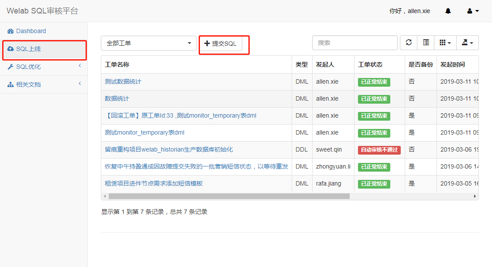
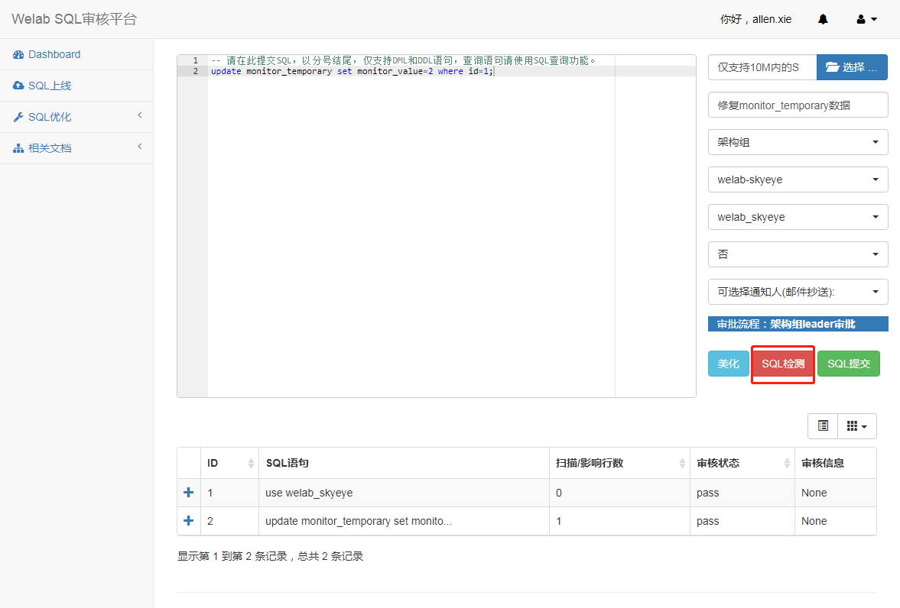
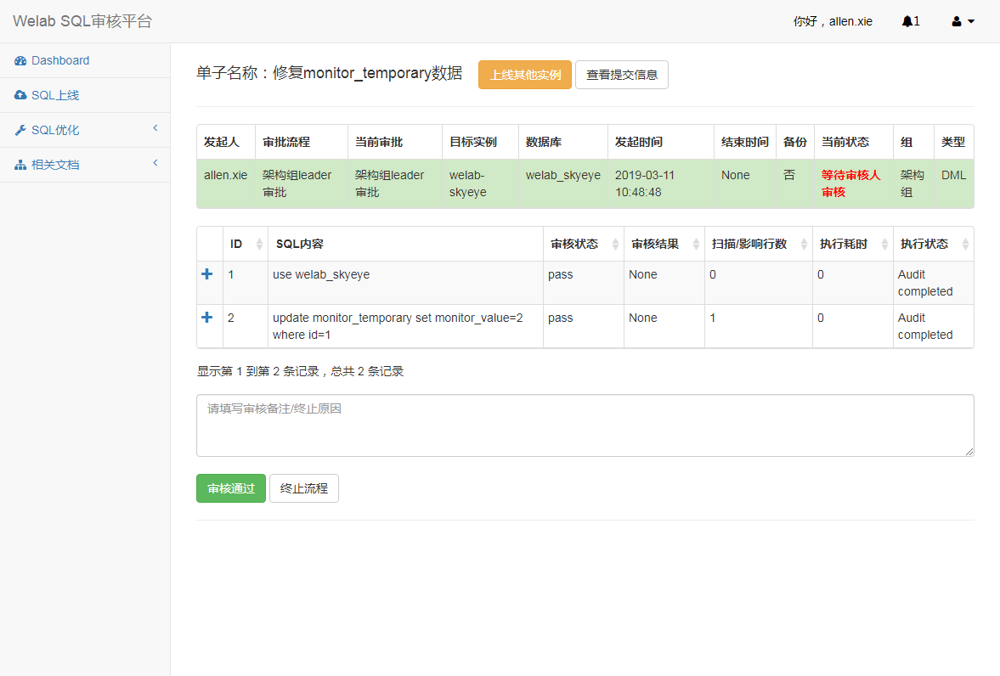
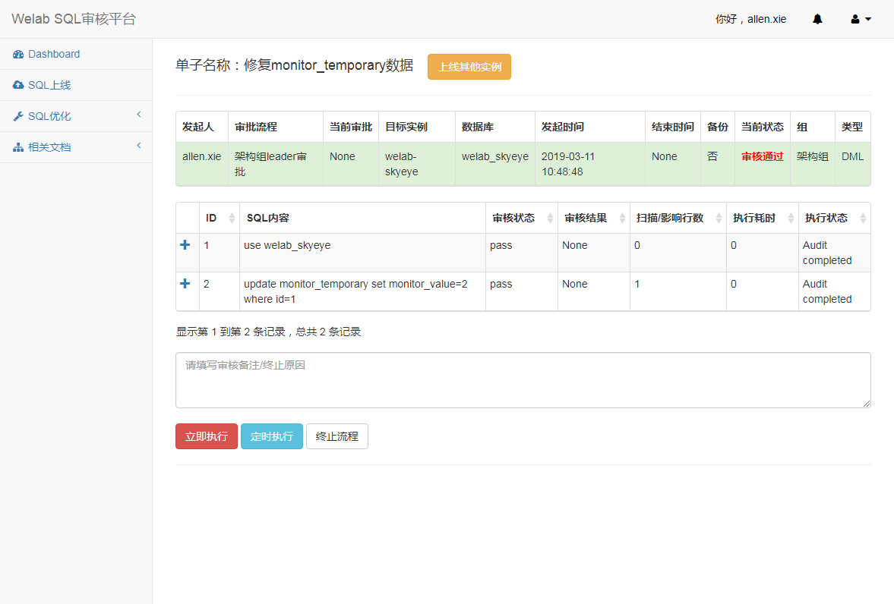
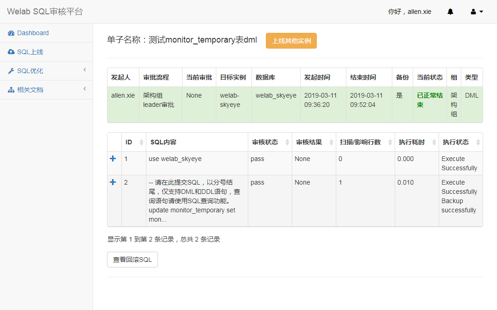

为了满足SQL可跟踪、可审计、可回溯和自动化要求，线上表数据和结构修改统一使用该系统。

#### 一、系统登陆 
使用gitlab账号登陆Welab SQL审核平台，生产地址[http://db.wolaidai.com](http://db.wolaidai.com)  
 

#### 二、工单提交--开发角色

选择菜单 [SQL上线] --> [提交工单]进入工单表单填写页面  

根据页面提示完成工单数据填写，
* 备份：用于自动生成回滚语句，最近选择开启  

提交前先"SQL检测"下语法、更新行数与预期是否一致

提交成功后系统会自动邮件和企业微信给审批人  

#### 三、工单审批--审批角色
进入工单明细页面，审批通过后会进入执行页面。  
  
根据实际情况选择相应操作，成功后完成工单的整个流程。  
 