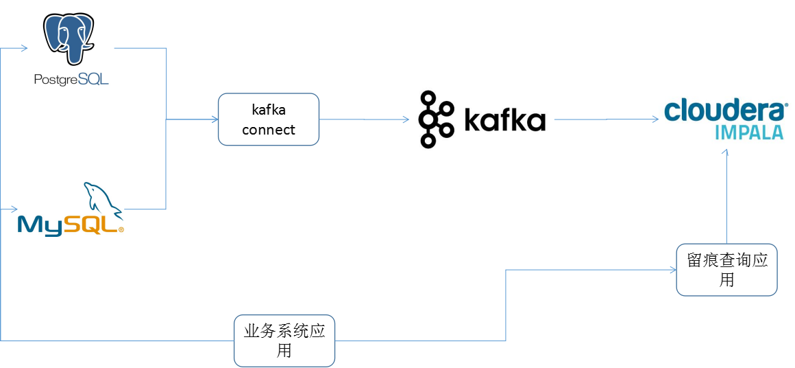
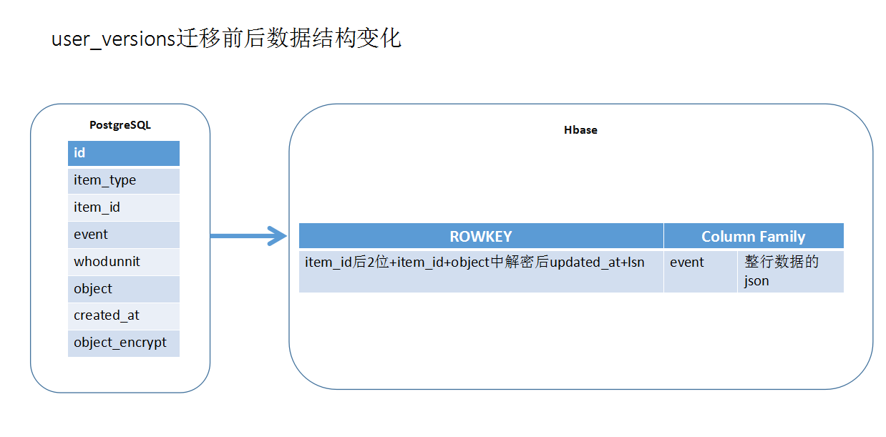
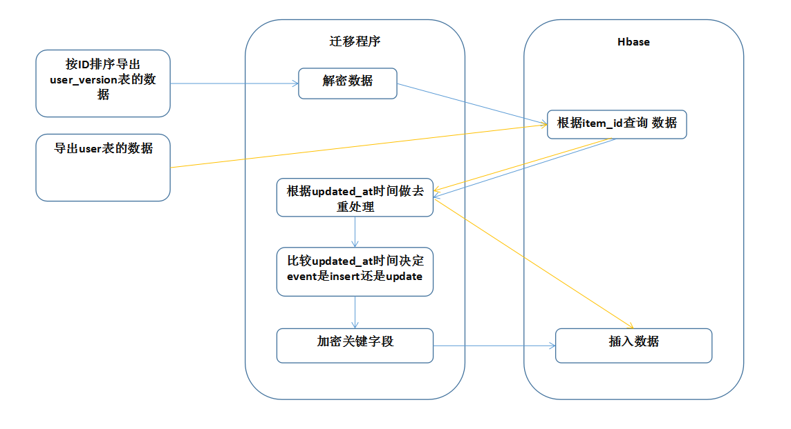
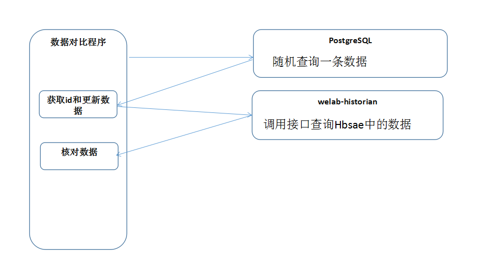

# 留痕重构

##目录

[0、相关概念](#0相关概念)

[1、现状](#1现状)

[2、方案](#2方案)

[3、优缺点](#3优缺点)

[4、历史数据迁移](#4历史数据迁移)

[5、数据核对](#5数据核对)

[6、旧的留痕下线方案](#6旧的留痕下线方案)

#### 0、相关概念
数据留痕：目前大量存在系统中，用于保存数据记录，目前dds也支持数据留意，如user_version、versions表，主要有下面两个功能：  
1. 用于审批、风险系统使用，如需要关注用户资料信息历史记录
2. 类似日志记录功能，如异常情况下人工核对使用

各数据类型表  
1. 全量表：每天的所有的最新状态的数据
2. 增量表：每天的新增数据，增量数据是上次导出之后的新数据
3. 拉链表：维护历史状态，以及最新状态数据的一种表，拉链表根据拉链粒度的不同，实际上相当于快照，只不过做了优化，去除了一部分不变的记录而已,通过拉链表可以很方便的还原出拉链时点的客户记录
4. 流水表： 对于表的每一个修改都会记录，可以用于反映实际记录的变更 

拉链表场景：进件历史状态、物流信息跟踪

#### 1、现状
目前posgresql主库上有1.2T数据，大概500G为留痕数据，该部分数据具有以下特点：  
- append类型，数据插入后就不会更新
- 写多读少 
- 大部分情况下最终一致性即满足要求

#### 2、方案

 

#### 3、优缺点
###### 优点
1. 性能  
留痕数据不存放在pg主库上，减少数据库压力。之前频繁出现数据库性能问题，如推广时qps大于20万/s时可能导致数据库连接池占满问题  
   **写**：业务程序直接写入主表，由其他系统解析关系数据库日志再同步至大数据平台  
   **读**：调用rpc接口查询数据  
留痕数据会异步写入，减少事务占用时间，同时读不从数据库查询，总体减少请求响应时间，提供系统qps量
2. 开发  
不再使用业务系统开发人员处理留痕数据，查询时直接调用rpc或http接口
3. 成本  
pg数据库直接使用ssd磁盘存储，修改成普通磁盘存储成本会降低，同时之后数据库备份、迁移、重构更方便

###### 缺点
1. 延迟  
比数据库主从复制相比链路更长，所以将有更大的延时，对实时性要求特别高的业务不能使用
2. 重构  
现在代码需要重构，留痕数据保存这块直接删除即可，查询需要修改成rpc或http接口

#### 4、历史数据迁移
以user_versions表为列，数据迁移前后的数据结构变化
 
问题点
1. PostgreSQL中存储的是before的数据，而kafka中是after的数据。迁移的时候需要转换。
2. 如何避免迁移时数据重复或者丢失？

项目上线成功后再进行数据迁移
 
#### 5、数据核对
 
1. 随机查询PG库中user_versions的一条数据
2. 获取id和更新时间后调用接口查询welab-historian
3. 核对数据
4. 

#### 6、旧的留痕下线方案

#### 目前现状：完成了17个表的留痕和数据迁移，部分没有新增数据的表没有做留痕。如果需要新增请及时沟通。

#### 已经完成留痕重构的表：
accounts、
account_transactions、
dues、
due_settlements、
addresses、
companies、
educations、
liaisons、
profiles、
user_attributes、
admins、
documents、
partner_documents、
risk_pricing_infos、
users、
loans、
loan_applications

#### 旧的留痕下线步骤

1. 进行数据比对，出具比对报告。（责任人sweet覃哲）

2. DBA演练备份旧的留痕数据表，确保备份的数据能够还原。（责任人Rafa江海）：
account_versions、
account_traces、
user_info_traces、
versions、
user_versions、
loan_versions

3. 确认java和Ruby的项目没有查询以上留痕表。（责任人Allen谢尚河、Jesse王小龙）

4. 提供给业务方新的留痕数据查询接口。（责任人sweet覃哲）

5. 增加Hbase的监控告警。（责任人sweet覃哲）

6. DBA实操备份旧的留痕数据表（责任人Rafa江海）：

7. truncate备份过的表，操作时确保不影响业务。（责任人Rafa江海）

8. 业务部门修改代码，列如：@DataTrail(objectTableName = "users", tableName = "user_versions")注解的删除掉。（责任人Jesse王小龙）

9. 观察旧的留痕表中数据，一个月内没有新增数据的即可备份数据然后删除表结构，如仍有新增数据继续修改代码。（责任人sweet覃哲、Jesse王小龙、Rafa江海）
