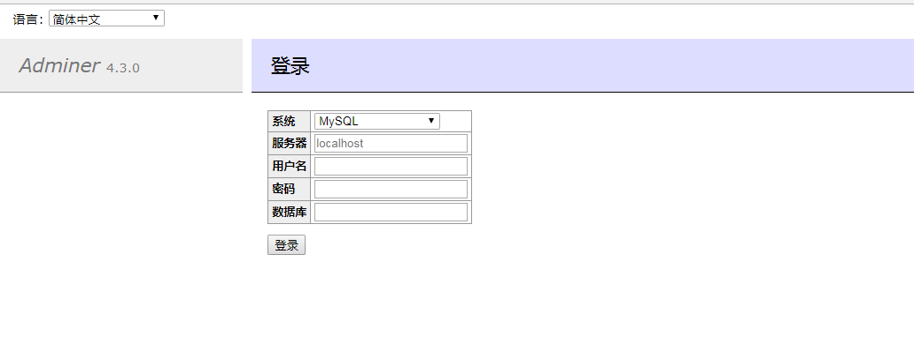

## 项目标准化建设

#### 一、welab-common升级  
升级步骤详见 [welab-common升级](https://git.wolaidai.com/WelabCo/Architecture/work-profile/blob/master/bug/welab-common%E5%8D%87%E7%BA%A7.md)  
#### 二、健康检查  
测试环境：[statistics.html](http://gitbook.service.ops.welab.co:4000/02_repos/statistics.html)  
生产环境以下项目还需要加上健康检查功能

**战略合作**
* csp-tb             \\已完成
* judex              \\已完成
* thor-credit        \\已完成
* management-iam     \\已完成 
* thor-operation     \\已完成
* thor-channel       \\已完成
* captain            \\已完成
* dust-sub           \\已完成
* judex              \\已完成
* wall               \\已完成
* boss               \\已完成
* large-amount-bank  \\已完成
* tb-iam             \\已完成
 
**个人金融**
* wolaidai-vehicle   \\暂不添加标准端口 代码为合作方编写，架构差别很大
* jrocket2           \\暂不添加标准端口 改造人力成本大，明年6月底之前完成Jrocket2重构
* user-center        \\已完成

**架构组**
* message-push-job-tb              \\应用已下线
* message-manage-tb                \\应用已下线
* message-push-tb                  \\应用已下线
* message-app-tb                   \\不用调整，年后迁移下线
* message-push-job-tc              \\已完成
* message-platform                 \\已完成
* welab-skyscanner-meteor          \\已完成
* welab-skyscanner-dataworks       \\已完成
* welab-skyscanner-merger          \\已完成
* welab-skyscanner-databus         \\已完成
* sky-kafka-connector              \\connect不用修改，这是个数据同步中间件
* welab-authority-kefu             \\已完成
* welab-bizlog                     \\已完成
* welab-ca                         \\已完成
* meta-space                       \\已完成
* welab-message-antiha             \\目前在测试环境测试，预计下周上线生产
* logging-service				   \\应用已下线
* event-processing                 \\李重远熟悉代码年后上线，测试环境目前未上线
* wedefend-gateway                 \\林远安熟悉代码年后上线，测试环境目前未上线
* security                         \\王虹凯熟悉代码年后上线，测试环境目前未上线

**投资平台**
* anxin-investment                \\已完成
* jinmeixin-investment            \\已完成
* hengqin-renting-investment      \\已完成
* yunshangtong-channel            \\已完成
* finance-bank-card               \\已完成
* finance-payment                 \\已完成
* jincheng-investment             \\已完成
* jincheng-insurance-investment   \\已完成
* hengqin-renting-investment      \\已完成
* ppmoney-investment              \\已完成
* fenghuang-investment            \\已完成 
* alipay-renting-investment       \\已完成
* yntrust-investment              \\已完成 
* tongbanjie-investment           \\已完成
* dingdong-investment             \\已完成 
* zhenrongbao-investment          \\已完成
* fcsgroup-investment             \\已完成 
* misc-service                    \\已完成
* batch-jobs                      \\已完成
* payment-order-sync              \\已完成
* payment-schedule                \\已完成
* facebank-investment             \\已完成
* feidee-investment               \\已完成
* jintou-investment               \\已完成
* kaola-investment                \\已完成
* zhongan-insurance-investment    \\已完成
* repay-server                    \\暂不添加标准端口 改造人力成本大，明年重构完成
* pay-platform                    \\暂不添加标准端口 改造人力成本大，明年重构完成
* umpay                           \\暂不添加标准端口 改造人力成本大，明年重构完成
* jlender                         \\暂不添加标准端口 改造人力成本大，明年重构完成
* frs                             \\暂不添加标准端口 改造人力成本大，明年重构完成

  
**智能金融**
* aif-express               \\已完成
* aif-promotions-management \\已完成
* aif-push-service          \\已完成
* aif-promotions            \\已完成
* goods                     \\已完成
* lease                     \\已完成
* phone-lease               \\已完成
* channel-management        \\已完成
* agent                     \\已完成
* channel-iam               \\暂不添加标准端口 框架太新，改造人力成本大

**支持组**
* welab-privacy            \\已完成
* welab-access             \\已完成
  
**审批组**

* approval-center           \\已完成
* approval-push             \\2019年0125号前完成
* approval-report           \\已完成
* approval-search           \\架构组插件不支持springbook2
* approval-search-sync      \\架构组插件不支持springbook2

**催收组**
* ermas-batch               \\暂不添加标准端口 代码为合作方编写，架构差别很大
* ermas-impl                \\暂不添加标准端口 代码为合作方编写，架构差别很大
* ermas-sms                 \\暂不添加标准端口 代码为合作方编写，架构差别很大
* ermas-web                 \\暂不添加标准端口 代码为合作方编写，架构差别很大
* gather-agent              \\暂不添加标准端口 框架太久，改造人力成本大
* gather-agent-job          \\暂不添加标准端口 框架太久，改造人力成本大
* gather-agent-job-other    \\暂不添加标准端口 框架太久，改造人力成本大

**大数据 ** 
* anti-fraud                \\大数据项目不做改造

**客服组**
* csp                       \\暂不添加标准端口 框架太久，改造人力成本大

#### 三、业务线生产数据库权限收回
之前是直接通过adminer界面查询相关生产数据库，存在数据安全隐患。

 

以后将逐步收回权限，直接通过工单申请临时账号再用navicat、sqlyog或heidisql查询相关数据。该平台实现mysql协议兼容、账号自动创建、SQL审核、解密等功能。

详见[数据库账号申请流程](https://git.wolaidai.com/WelabCo/Architecture/work-profile/blob/master/middleware/%E6%95%B0%E6%8D%AE%E5%BA%93%E8%B4%A6%E5%8F%B7%E7%94%B3%E8%AF%B7%E6%B5%81%E7%A8%8B.md)

