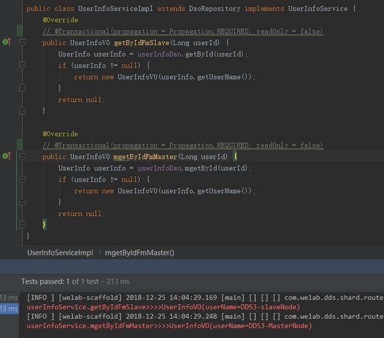
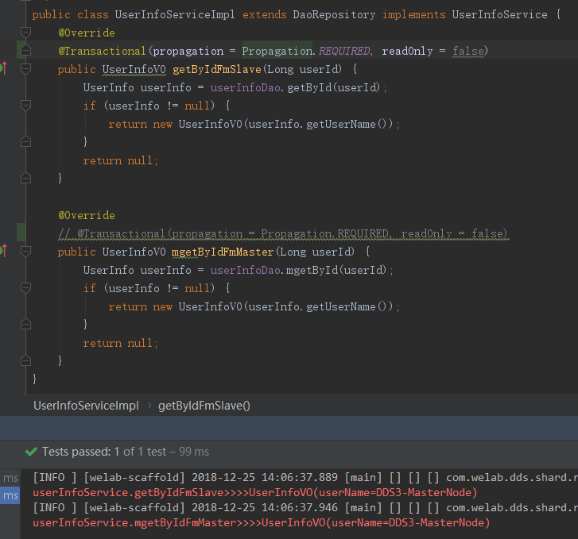

# dds中的读写分离
###### dds读写分离，现在默认走mysql驱动层支持，不做自实现。该支持很早就有了，有过线上实践。

### 需要做的变更：

* 驱动变更：
````
dbc.driver.master=com.mysql.jdbc.ReplicationDriver
````


* 链接url变更
````
jdbc:mysql:replication://mastHost:mastPort,slave1Host:slave1Port,slave2Host:slave2Port/databaseName
````
> 示例：
````
jdbc.url.master=jdbc:mysql:replication://127.0.0.1:3306,10.2.0.15:3333/db_0000?characterEncoding=UTF-8&rewriteBatchedStatements=true&serverTimezone=GMT%2B8&useSSL=false

note:示例中的链接参数为使用dds时，推荐的参数：
* characterEncoding 编码格式
* rewriteBatchedStatements 针对批量操作，允许脚本改变（建议配置为true）
* serverTimezone 指定时区（按需指定）
* useSSL 指定是否使用ssl（在高版本mysql会提示指定这个属性）
* 其他参数，请自行判断是否符合当前项目使用
````


### 使用时需注意的地方：
* 1.驱动层支持读写分离是依赖connection的readonly属性
* 2.开发过程中，事务的使用要合理

### 常见的问题：
* 1.程序中个别业务场景对主从延迟敏感
>* 假如使用的是注解式事务，只需要针对敏感的事务开始的地方，设置readOnly属性为false（spring-tx默认值）
>* 假如使用的是声明式事务，因为声明式事务是根据方法前缀来匹配定义好的规则，所以，需要在方法命名时想好要走的规则
>* 假如注解式事务和声明式事务同时使用，在控制好两者的顺序后，让前面的事务生效就可以了。

* 2.注解式事务和声明式事务同时使用
>* 需要控制好顺序，建议注解式事务在前，声明式事务在后。换句话说，默认声明式事务配置的规则生效来管理事务，
在个别需要特别指定事务行为的方法中，使用注解式事务进行干预（比如上面的主从延迟敏感场景。）

### 使用示例：
#### 只有声明式事务
````
    <context:component-scan base-package="com.welab">
		<context:exclude-filter type="annotation" expression="org.springframework.stereotype.Controller" />
	</context:component-scan>

    <!-- 弱XA事务 Best Efforts 1PC,不需要配置数据源 -->
	<!-- 完全支持非跨库事务. 例如:不分表分库及仅分表或分库但是路由的结果在单库中 -->
	<!-- 完全支持因逻辑异常导致的跨库事务. 例如:同一事务中,跨两个库更新;更新完毕后,抛出空指针,则两个库的内容都能回滚 -->
	<!-- 不支持因网络、硬件异常导致的跨库事务. 例如:同一事务中,跨两个库更新,更新完毕后;第一个提交成功,第二个宕机则第一个无法回滚 -->
	<bean id="chainedTransactionManager" class="com.welab.dds.transaction.ChainedTransactionManager" />

	<!-- 定义事务通知 -->
	<tx:advice id="txAdvice" transaction-manager="chainedTransactionManager">
		<!-- 定义方法的过滤规则 -->
		<tx:attributes>
			<!-- 所有方法都使用事务 -->
            <tx:method name="save*" propagation="REQUIRED" read-only="false"/>
            <tx:method name="add*" propagation="REQUIRED" read-only="false"/>
            <tx:method name="update*" propagation="REQUIRED" read-only="false"/>
            <tx:method name="delete*" propagation="REQUIRED" read-only="false"/>
            <!-- 定义所有find开头的方法都是只读的 -->
            <tx:method name="find*" read-only="true" />
            <tx:method name="get*" read-only="true" />
            <tx:method name="query*" read-only="true" />
            <tx:method name="load*" read-only="true" />
            <!-- 未定义到的方法匹配规则都走主库 -->
            <tx:method name="*" propagation="REQUIRED" read-only="false" />
		</tx:attributes>
	</tx:advice>

	<!-- 定义AOP配置 -->
	<aop:config>
		<!-- 定义一个切入点 -->
		<aop:pointcut id="services" expression="${aop.services}" />
		<!-- 对切入点和事务的通知,进行适配 -->
		<aop:advisor advice-ref="txAdvice" pointcut-ref="services"/>
	</aop:config>
````
如上定义后，在业务service层，会自动开启事务，进行事务管理，并按照方法名前缀进行匹配，走主从路由规则

#### 只有注解式事务
````
<context:component-scan base-package="com.welab">
		<context:exclude-filter type="annotation" expression="org.springframework.stereotype.Controller" />
	</context:component-scan>

<tx:annotation-driven  transaction-manager="chainedTransactionManager" proxy-target-class="true" mode="proxy"/>
````
如上定以后，在业务层service，使用注解Transcational就可以进行事务控制


#### 声明式事务+注解式事务并存
````
    <context:component-scan base-package="com.welab">
		<context:exclude-filter type="annotation" expression="org.springframework.stereotype.Controller" />
	</context:component-scan>
	
<!-- 弱XA事务 Best Efforts 1PC,不需要配置数据源 -->
	<!-- 完全支持非跨库事务. 例如:不分表分库及仅分表或分库但是路由的结果在单库中 -->
	<!-- 完全支持因逻辑异常导致的跨库事务. 例如:同一事务中,跨两个库更新;更新完毕后,抛出空指针,则两个库的内容都能回滚 -->
	<!-- 不支持因网络、硬件异常导致的跨库事务. 例如:同一事务中,跨两个库更新,更新完毕后;第一个提交成功,第二个宕机则第一个无法回滚 -->
	<bean id="chainedTransactionManager" class="com.welab.dds.transaction.ChainedTransactionManager" />

	<!-- 定义事务通知 -->
	<tx:advice id="txAdvice" transaction-manager="chainedTransactionManager">
		<!-- 定义方法的过滤规则 -->
		<tx:attributes>
			<!-- 所有方法都使用事务 -->
			<tx:method name="save*" propagation="REQUIRED" read-only="false"/>
			<tx:method name="add*" propagation="REQUIRED" read-only="false"/>
			<tx:method name="update*" propagation="REQUIRED" read-only="false"/>
			<tx:method name="delete*" propagation="REQUIRED" read-only="false"/>
			<!-- 定义所有find开头的方法都是只读的 -->
			<tx:method name="find*" read-only="true" />
			<tx:method name="get*" read-only="true" />
			<tx:method name="query*" read-only="true" />
			<tx:method name="load*" read-only="true" />
			<!-- 未定义到的方法匹配规则都走主库 -->
			<tx:method name="*" propagation="REQUIRED" read-only="false" />
		</tx:attributes>
	</tx:advice>

	<!-- 定义AOP配置 -->
	<aop:config>
		<!-- 定义一个切入点 -->
		<aop:pointcut id="services" expression="${aop.services}" />
		<!-- 对切入点和事务的通知,进行适配 -->
		<aop:advisor advice-ref="txAdvice" pointcut-ref="services"  order="2"/>
	</aop:config>

	<tx:annotation-driven order="1"  transaction-manager="chainedTransactionManager" proxy-target-class="true" mode="proxy"/>
````

如上代码所示，控制好order顺序，这里推荐注解式事务优先，这样不满足声明式事务的业务场景，可以进行注解式事务干预。
如果顺序反过来，那注解式事务将没有执行的机会。

#### 两者并存的使用配图：



没有使用注解式事务的注解-声明式事务生效-根据方法前缀进行主从路由





上面方法按照声明式事务应该走从-这里假设数据及时性要求较高-使用注解式事务干预-强制走主


### 资料参考：
[connector-j-master-slave-replication-connection](https://dev.mysql.com/doc/connector-j/5.1/en/connector-j-master-slave-replication-connection.html)

