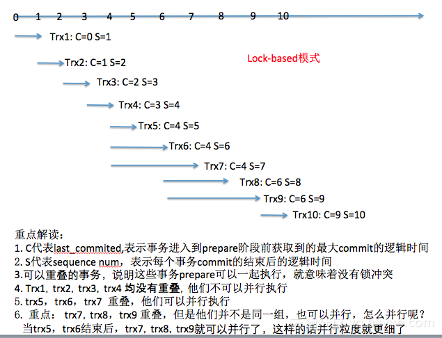
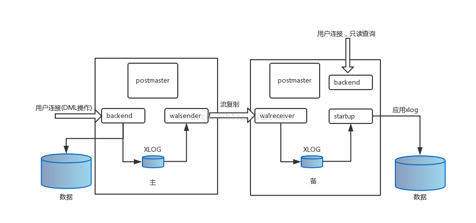

# mysql与pg主从复制原理

## 一、对比
目前生产版本对比
* mysql:5.7	自建或阿里云
* postgresql:9.4.15	自建

[mysql8vspg10英文版](https://blog.dumper.io/showdown-mysql-8-vs-postgresql-10/)  
[mysql8vspg10中文版](http://database.51cto.com/art/201806/575977.htm?utm_source=tuicool&utm_medium=referral)

## 二、mysql
#### 1、架构图  
常用架构类型  
  
内部架构图  


#### 2、主从复制特性
* 异步复制
mysql复制默认是异步复制，Master将事件写入binlog，提交事务，自身并不知道slave是否接收是否处理；
缺点：不能保证所有事务都被所有slave接收。
* 半同步复制
当Master上开启半同步复制功能时，至少有一个slave开启其功能。当Master向slave提交事务，且事务已写入relay-log中并刷新到磁盘上，slave才会告知Master已收到；
* 同步复制
Master提交事务，直到事务在所有slave都已提交，才会返回客户端事务执行完毕信息；
缺点：完成一个事务可能造成延迟。

参考[阿里rds](https://help.aliyun.com/document_detail/51701.html?spm=a2c4g.11186623.2.16.4788e0894Cyaqz#concept-yqy-zvw-5db)

1、GTID(global transaction identifier)

GTID格式 = server\_uuid:transaction\_id  
如果查看server_uuid
* auto.cnf文件
  
server_uuid通常在启动时写入auto.cnf文件中

```
root@937b8a62d8d0:/# cat /var/lib/mysql/auto.cnf
[auto]
server-uuid=d6104cab-76de-11e9-bc04-0242ac110004
```

* mysql环境变量

命令行中执行以下命令	

```
mysql> show global variables like 'server_uuid';
+---------------+--------------------------------------+
| Variable_name | Value                                |
+---------------+--------------------------------------+
| server_uuid   | d6104cab-76de-11e9-bc04-0242ac110004 |
+---------------+--------------------------------------+
1 row in set
mysql> 
```
transaction\_id：同一个server\_uuid下的transaction\_id一般是递增的，set gtid_next可以指定下一个事务的GTID，不熟悉谨慎点。

[其他GTID知识也可以参考官网](https://dev.mysql.com/doc/refman/5.6/en/replication-gtids-concepts.html)

2、组提交  
官方描述：An InnoDB optimization that performs some low-level I/O operations (log write) once for a set of commit operations, rather than flushing and syncing separately for each commit

常用两个参数控制，与kafka生产者很类似吧：  
* binlog\_group\_commit\_sync\_delay=N 在等待N微秒后，进行binlog刷盘操作  
* binlog\_group\_commit\_sync\_no\_delay\_count=N 达到最大事务等待数量，开始binlog刷盘  

实际上bin日志内容：

```
root@937b8a62d8d0:/var/lib/mysql# mysqlbinlog mysql-bin.000002 |grep last_committed
#190516  6:46:52 server id 100  end_log_pos 259 CRC32 0xad97279a 	GTID	last_committed=0	sequence_number=1	rbr_only=yes
#190516  6:46:52 server id 100  end_log_pos 525 CRC32 0x282a3620 	GTID	last_committed=1	sequence_number=2	rbr_only=yes
#190516  6:46:52 server id 100  end_log_pos 791 CRC32 0x4a000dda 	GTID	last_committed=2	sequence_number=3	rbr_only=yes
#190516  6:46:52 server id 100  end_log_pos 1057 CRC32 0xb5991a28 	GTID	last_committed=3	sequence_number=4	rbr_only=yes
#190516  6:46:52 server id 100  end_log_pos 1323 CRC32 0x95c3e6ec 	GTID	last_committed=4	sequence_number=5	rbr_only=yes
#190516  6:46:52 server id 100  end_log_pos 1589 CRC32 0x7d823614 	GTID	last_committed=5	sequence_number=6	rbr_only=yes
```

举个例子：

```	
last_committed=0 sequence_number=1
last_committed=1 sequence_number=2
last_committed=2 sequence_number=3
last_committed=3 sequence_number=4
last_committed=4 sequence_number=5
last_committed=4 sequence_number=6
last_committed=4 sequence_number=7
last_committed=6 sequence_number=8
last_committed=6 sequence_number=9
last_committed=9 sequence_number=10
```


3、并行复制  
mysql5.6开始支持基于schema级别并行复制；  
mysql5.7基于组提交的并行复制，简单来说可以实现slave服务器的回放与主机是一致的，即master服务器上是怎么并行执行的slave上就怎样进行并行回放

	
## 三、pg
内部架构图   


1、LSN  
LSN即日志序列号Log Sequence Number。表示XLOG record记录写入到事务日志中位置。LSN的值为无符号64位整型（uint64）。在事务日志中，LSN单调递增且唯一。
LSN由3部分组成，分别是逻辑文件ID，物理文件ID和文件内偏移。如LSN：1/4288E228，其中1为逻辑文件ID，42为物理文件ID，88E228为WAL segment file文件内偏移（注：3Bytes的寻找空间为16MB）。

```
docker exec -i postgres /bin/bash << DOCKER
psql -h 127.0.0.1 -p 5432 -U postgres  << EOF
SELECT * FROM pg_replication_slots;
EOF
DOCKER
```
2、txid(数据库的事务ID)

```
test=# SELECT txid_current();
+--------------+
| txid_current |
+--------------+
|          620 |
+--------------+
1 row in set
```

3、synchronous_commit同步参数

* on:必须要等事务日志刷新到本地磁盘,并且还要等远程备库也提交到磁盘才能返回客户端已经提交.
* remote_write:当事务提交时,不仅要把wal刷新到磁盘,还需要等wal日志发送到备库操作系统(但不用等备库刷新到磁盘),因此如果备库此时发生实例中断不会有数据丢失,因为数据还在操作系统上,而如果操作系统故障,则此部分wal日志还没有来得及写入磁盘就会丢失,备库启动后还需要想主库索取wal日志。
* local:当事务提交时,仅写入本地磁盘即可返回客户端事务提交成功,而不管是否有同步备库
* off:写到缓存中就会向客户端返回提交成功，但也不是一直不刷到磁盘，延迟写入磁盘,延迟的时间为最大3倍的wal\_writer\_delay参数的(默认200ms)的时间,所有如果即使关闭synchronous_commit,也只会造成最多600ms的事务丢失,此事务甚至包括已经提交的事务（会丢数据）,但数据库确可以安全启动,不会发生块折断,只是丢失了部分数据,但对高并发的小事务系统来说,性能来说提升较大。


## 四、代码与数据

git地址：[https://git.wolaidai.com/WelabCo/Architecture/middleware/debezium-simple](https://git.wolaidai.com/WelabCo/Architecture/middleware/debezium-simple)

* io.debezium.connector.mysql.MysqlBinlogConnector： java解析mysql bin日志
* io.debezium.connector.postgresql.SimpleTask： java解析pg日志


## 五、后续的使用升级

* CDC(change data capture)事件捕获
* 全量补跑
* 数据异构 

参考文章

```
https://mp.weixin.qq.com/s?__biz=MjM5MjIxNDA4NA==&mid=205236417&idx=1&sn=15281c834348911cea106478aa819175&scene=23&srcid=0525zwrE6gRYCIPgKxoq40iN#rd
https://yq.aliyun.com/articles/621197
http://blog.itpub.net/133735/viewspace-2295410/
```