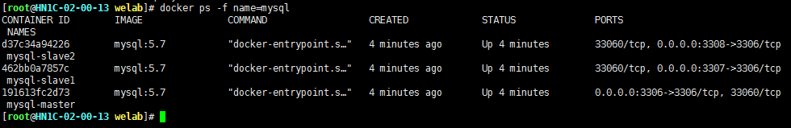
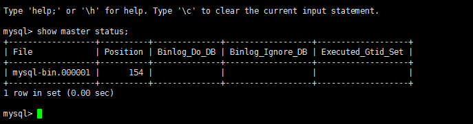
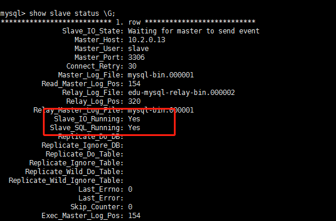

# mysql主从搭建

## 一、下载mysql docker镜像

    docker pull mysql:5.7

## 二、运行容器


依次创建一主两从容器：

    docker run --name mysql-master -p 3306:3306 -e MYSQL_ROOT_PASSWORD=Middleware2019 -d mysql:5.7
    docker run --name mysql-slave1 -p 3307:3306 -e MYSQL_ROOT_PASSWORD=Middleware2019 -d mysql:5.7
    docker run --name mysql-slave2 -p 3308:3306 -e MYSQL_ROOT_PASSWORD=Middleware2019 -d mysql:5.7


完成后docker ps可以看到三个运行中的容器，可以使用pg客户端访问宿主机的3306、3307、3308分别对应主节点和从节点  


## 三、主从库配置文件

使用docker命令进行主库容器，并创建一个具体复制角色的用户slave

```    
docker exec -it mysql-master /bin/bash

cat >> /etc/mysql/my.cnf << EOF
[mysqld]
server-id=100  
log-bin=mysql-bin
EOF
mysql -uroot -p123456 mysql << EOF
CREATE USER 'slave'@'%' IDENTIFIED BY '123456';
GRANT REPLICATION SLAVE, REPLICATION CLIENT ON *.* TO 'slave'@'%';
EOF
exit

docker restart mysql-master
```

使用docker命令依次进入slave1、slave2容器，执行以下脚本

```    
docker exec -it mysql-slave1 /bin/bash

cat >> /etc/mysql/my.cnf << EOF
[mysqld]
server-id=101
log-bin=mysql-slave-bin
relay_log=edu-mysql-relay-bin 
EOF
exit

docker restart mysql-slave1
docker exec -it mysql-slave2 /bin/bash

cat >> /etc/mysql/my.cnf << EOF
[mysqld]
server-id=102
log-bin=mysql-slave-bin
relay_log=edu-mysql-relay-bin 
EOF
exit

docker restart mysql-slave2
```

## 四、开启同步操作

查看主库File和Position字段的值后面将会用到，在后面的操作完成之前，需要保证Master库不能做任何操作，否则将会引起File和Position字段的值变化。

```
docker exec -it mysql-master /bin/bash
mysql -uroot -p123456 mysql
show master status;
```


进入从库容器执行以下操作，正常情况下SlaveIORunning和 SlaveSQLRunning都是No，表示还没有开启主从复制过程。使用start slave开启主从复制过程

```
docker exec -it mysql-slave1 /bin/bash
mysql -uroot -p123456 mysql
change master to master_host='10.2.0.13', master_user='slave', master_password='123456', master_port=3306, master_log_file='mysql-bin.000001', master_log_pos= 154, master_connect_retry=30;
start slave;
show slave status \G;
```


	
## 五、主从测试

在Master创建一个数据库、表及插入数据，然后检查Slave是否自动同步

```
CREATE DATABASE IF NOT EXISTS test;
USE test;
CREATE TABLE IF NOT EXISTS  student (
  id int(11) NOT NULL,
  name varchar(20) DEFAULT NULL,
  PRIMARY KEY (id)
) ENGINE=InnoDB;
delete from student;
INSERT INTO student (id, name) VALUES ('1', 'allen'); 
```
