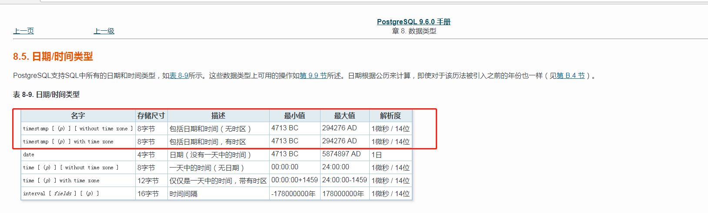

## 时区解决方案

直接用数据库时区字段，从timestamp-->timestamptz，这两个类型在pg上都是占用8字节:

  

数据库修改脚本类似如下：

```
set time zone 'GMT';
alter table bank_cards alter created_at type timestamptz(6);
```

快速生成目标表ddl语句

```
SELECT
	a.relname,
	c.attname,
	c.atttypid,
	format_type (c.atttypid, c.atttypmod) AS TYPE,
	concat('alter table ',relname,' alter ',attname,' type timestamptz(6);')
FROM
	pg_class a,
	pg_attribute c
WHERE
	a.relname IN ('bank_cards')
AND c.attrelid = a.oid
AND c.attnum > 0
AND c.atttypid = 1114;
```

#### pg命令行测试(正常）

```
set time zone 'GMT';
## alter table bank_cards alter created_at type timestamptz(6);
select * from bank_cards limit 1;
set time zone 'PRC';
select * from bank_cards limit 1;
```

#### dds测试(正常）
目前已经支持，java应用是东八区，查询数据库0时区数据后会自动加8个小时

#### mybatis(未测试，确认下是否使用)

