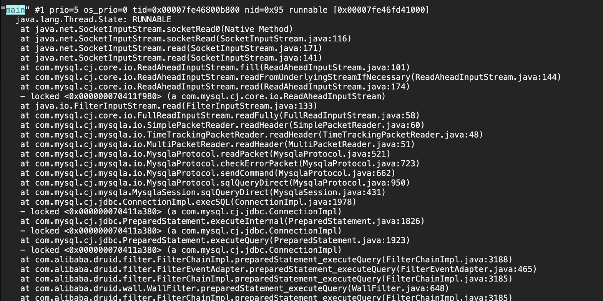

## linux常用命令

#### jps
JDK提供的一个显示当前所有java进程pid的命令，类似linux的ps命令，只列出系统中Java应用进程。
默认执行-V选项是显示pid \[classname | JARfilename\] 。
通过用于快速查看系统当前运行的java进程pid，其中Jps是命令自身的进程。

```
[root@welab-skyscanner-dataworks-575d6bcfc5-mt4jn /]# jps
1318 Jps
147 welab-skyscanner-dataworks.jar
```
#### top
Linux top命令用于实时显示process的动态。

常用选项
```
-H ： 线程模式  
-p ： 指定监控的pid
```

如下查看指定的java进程中各线程具体信息：
```
top -Hp 147
```

进入详细进程页面

```
top - 14:13:48 up 112 days,  3:53,  0 users,  load average: 6.66, 5.97, 5.12
Threads: 5529 total,   0 running, 5529 sleeping,   0 stopped,   0 zombie
%Cpu(s): 16.1 us,  8.1 sy,  0.0 ni, 73.0 id,  0.4 wa,  0.0 hi,  2.4 si,  0.0 st
KiB Mem : 65968092 total,  5164068 free, 31542232 used, 29261792 buff/cache
KiB Swap:        0 total,        0 free,        0 used. 32761372 avail Mem

  PID USER      PR  NI    VIRT    RES    SHR S %CPU %MEM     TIME+ COMMAND
  333 welab     20   0   21.9g   5.0g  18300 S  4.2  7.9   0:10.64 java
  397 welab     20   0   21.9g   5.0g  18300 S  4.2  7.9   0:33.64 java
  659 welab     20   0   21.9g   5.0g  18300 S  4.2  7.9   0:00.07 java
  994 welab     20   0   21.9g   5.0g  18300 S  4.2  7.9   0:00.06 java
 1907 welab     20   0   21.9g   5.0g  18300 S  4.2  7.9   0:00.06 java
 2451 welab     20   0   21.9g   5.0g  18300 S  4.2  7.9   0:00.06 java
 2999 welab     20   0   21.9g   5.0g  18300 S  4.2  7.9   0:00.18 java
 3405 welab     20   0   21.9g   5.0g  18300 S  4.2  7.9   0:00.14 java
 3985 welab     20   0   21.9g   5.0g  18300 S  4.2  7.9   0:00.11 java
 4262 welab     20   0   21.9g   5.0g  18300 S  4.2  7.9   0:00.14 java
 4499 welab     20   0   21.9g   5.0g  18300 S  4.2  7.9   0:00.16 java
```
进程模式下每项内容都比较重要：

```
PID         进程id  
USER        进程所有者  
PR          进程优先级  
NI          nice值。负值表示高优先级，正值表示低优先级  
VIRT        进程使用的虚拟内存总量，单位kb。VIRT=SWAP+RES  
RES         进程使用的、未被换出的物理内存大小，单位kb。RES=CODE+DATA  
SHR         共享内存大小，单位kb  
S           进程状态。D=不可中断的睡眠状态 R=运行 S=睡眠 T=跟踪/停止 Z=僵尸进程  
%CPU        上次更新到现在的CPU时间占用百分比  
%MEM        进程使用的物理内存百分比  
TIME+       进程使用的CPU时间总计，单位1/100秒  
COMMAND     进程名称（命令名/命令行）  
```

在线程模式下，重点关注下以下指标：
```
PID         线程id(十进制，jstack中是十六进制)
%CPU        每个线程上次更新到现在的CPU时间占用百分比  
TIME+       每个线程使用的CPU时间总计，单位1/100秒  
```

并且在第二行会显示线程的统计信息，如该进程共开启5529个线程，需进一步排查开启如此多线程的原因。
```
Threads: 5529 total,   0 running, 5529 sleeping,   0 stopped,   0 zombie
```

#### jstack命令

jstack能得到运行java程序的java stack和native stack的信息。
默认指定pid即可得到当前java进程所有线程堆栈信息，因为堆栈过多通常会重定向于文件用于分析。
```
jstack 147 > jstack.txt
```

进入jstack.txt挑选一个线程信息加以说明。

第一行是当前线程的统计信息，以下三个值比较重要：
1. "New I/O worker #3948"：线程名称
2. nid=0x118c：线程id的十六进值，配合top命令可以查看如些耗CPU最高的线程。
3. runnable：线程状态

第二行是线程堆栈信息，通过堆栈表明这是kudu连接工作线程。
```
"New I/O worker #3948" #4318 daemon prio=5 os_prio=0 tid=0x00007fbec1b6b000 nid=0x118c runnable [0x00007fbc2afae000]
   java.lang.Thread.State: RUNNABLE
    at sun.nio.ch.EPollArrayWrapper.epollWait(Native Method)
    at sun.nio.ch.EPollArrayWrapper.poll(EPollArrayWrapper.java:269)
    at sun.nio.ch.EPollSelectorImpl.doSelect(EPollSelectorImpl.java:93)
    at sun.nio.ch.SelectorImpl.lockAndDoSelect(SelectorImpl.java:86)
    - locked <0x00000006e2381bc0> (a sun.nio.ch.Util$3)
    - locked <0x00000006e2381ba8> (a java.util.Collections$UnmodifiableSet)
    - locked <0x00000006e211d238> (a sun.nio.ch.EPollSelectorImpl)
    at sun.nio.ch.SelectorImpl.select(SelectorImpl.java:97)
    at org.apache.kudu.shaded.org.jboss.netty.channel.socket.nio.SelectorUtil.select(SelectorUtil.java:68)
    at org.apache.kudu.shaded.org.jboss.netty.channel.socket.nio.AbstractNioSelector.select(AbstractNioSelector.java:434)
    at org.apache.kudu.shaded.org.jboss.netty.channel.socket.nio.AbstractNioSelector.run(AbstractNioSelector.java:212)
    at org.apache.kudu.shaded.org.jboss.netty.channel.socket.nio.AbstractNioWorker.run(AbstractNioWorker.java:89)
    at org.apache.kudu.shaded.org.jboss.netty.channel.socket.nio.NioWorker.run(NioWorker.java:178)
    at org.apache.kudu.shaded.org.jboss.netty.util.ThreadRenamingRunnable.run(ThreadRenamingRunnable.java:108)
    at org.apache.kudu.shaded.org.jboss.netty.util.internal.DeadLockProofWorker$1.run(DeadLockProofWorker.java:42)
    at java.util.concurrent.ThreadPoolExecutor.runWorker(ThreadPoolExecutor.java:1149)
    at java.util.concurrent.ThreadPoolExecutor$Worker.run(ThreadPoolExecutor.java:624)
    at java.lang.Thread.run(Thread.java:748)
```

在fat环境中需切换至welab用户再执行jstack命令
```
su welab
/opt/jdk1.8.0_152/bin/jstack -F 85
```

######　线上案例
现象：JAVA启动未报异常但一直未对外提供http服务，这种情况就可以去查看下主线程当前在执行哪行代码。
```
jstack -l 466 | grep main -C 50
```
 

从堆栈信息看可以判断当前是操作mysql数据库，一般隔5s中再jstack次观察下堆栈是否有变化就可确认是否block此处。
因为线程状态是RUNNABLE，说明IO流还是正常的，排除慢SQL的情况，很可能是个大结果集的SQL。
后面顺着这个思路，发现原因是启动时在特别条件下会查询千万级别的数据至内存中。

## ss

ss是Socket Statistics的缩写，可以用来获取socket统计信息，比netstat更快速更高效。  

常用选项：
```
-n:  端口用数字展示
```

如需要查看当前应用mysql连接。
```
[welab@welab-skyscanner-dataworks-54dc5b95fd-6g5dl ~]$ ss -n | grep 3306
Netid  State      Recv-Q Send-Q Local Address:Port               Peer Address:Port
tcp    ESTAB      0      0      10.101.5.4:55004              172.20.70.35:3306
tcp    ESTAB      0      0      10.101.5.4:37252              172.20.70.35:3306
tcp    ESTAB      0      0      10.101.5.4:48976              172.20.70.35:3306
tcp    ESTAB      0      0      10.101.5.4:47194              172.20.70.35:3306
tcp    ESTAB      0      0      10.101.5.4:41672              172.20.70.35:3306
tcp    ESTAB      0      0      10.101.5.4:50540              172.20.70.35:3306
tcp    ESTAB      0      0      10.101.5.4:45300              172.20.70.35:3306
tcp    ESTAB      0      0      10.101.5.4:37276              172.20.70.35:3306
tcp    ESTAB      0      0      10.101.5.4:45310              172.20.70.35:3306
```

## ps

TODO

## 参考资料
https://docs.oracle.com/javase/1.5.0/docs/tooldocs/share/jps.html