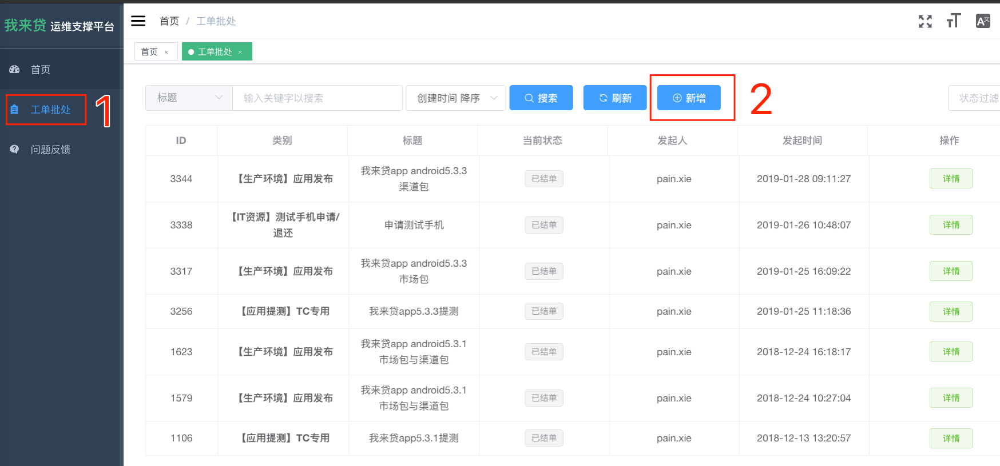

### wolaidai android app 打包及发布流程梳理(第二版)

作者:pain.xie      时间:2019-2-19


#### 1. wolaidai android app打包发布总体流程


目前android发布app流程主要是  打包 => 生产验证 => 发布  三个环节

打包过程是在jenkins上进行的, jenkins服务运行在一台mac mini上, 目前放在机房内.


#### 2. wolaidai app安卓包分类

1. 测试包(debug): 测试包  与生产包区别:android代码未压缩混淆, 可显示环境切换按钮
2. 生产包/市场包(Product): 发布到各个应用市场
3. 生产包/渠道包(Promotion): 各个活动/渠道分发的生产包


#### 3. jenkins 操作相关介绍

jenkins地址: http://172.30.35.170:8080/  需要在公司网络才能访问, 外网无法访问,访问之后需要账号登陆

##### 1. 登陆之后界面如下:(图1)


界面介绍:

1. 新建job
2. 目前wolaidai app 打包job
   - Rocket2-RN-VasDolly-Debug  —  构建测试包
   - Rocket2-RN-VasDolly-Product  —  构建市场包(生产包)
   - Rocket2-RN-VasDolly-Promotion  —  构建渠道包(生产包)
   - Rocket2-RN-VasDolly-Special — 构建指定渠道的生产包(暂时没用, 需要时配置自己需要渠道)
3. **升级提示, 注意大家不要点击进行升级**

> 这四个job大家不要删除, 在不熟悉下不要修改里面的配置其他内容, 里面的配置只允许修改分支名字


##### 2.点击打包的job进入下面页面:(图2)


界面介绍:

1. 立即构建当前job
2. 配置当前job
3. 目前正在进行/或者已经进行的构建  点击左侧小圆点可以进入构建的log
4. 最后一次构建的结果

> 


##### 3. 点击配置进入该job的配置:(图3)


界面介绍:

job的配置分为General / 源码管理 / 构建触发器 / 环境构建 / 构建 / 构建后操作 几个块

针对上面三个job, 我们平时的只要更改需要打包的分支即可, 其他配置是不需要修改的,分支名是对应gitlab上面的分支名的

1. 源码管理步骤
2. 更改/确认分支名  (格式为 */+分支名  如:  */release_5.1.6)
3. 更改完成 点击保存


#### 4. 测试包/市场包/渠道包 打包流程差别

这三个job主要打包流程大体上是一致的,主要在上图中  构建  步骤(也就是在job 配置 里的构建)有所差异,整体流程如下图.

所有构建脚本放在 项目/android/buildPy 目录下


 

#### 5. 打 测试包 操作流程

1. 点击进入 Rocket2-RN-VasDolly-Debug 这个job (图1 中 2标识)

2. 点击左侧配置 进入到项目配置页(图2 中2标识)
3. 确定/更改 图3中的 分支名
4. 保存/返回后 点击立即构建(图2 中1标识)
5. 构建完下载apk


#### 6. 打 市场包(生产包) 流程

​	点击进入 Rocket2-RN-VasDolly-Product

​	同测试包

 

#### 7. 打 渠道包(市场包)流程

​	点击进入 Rocket2-RN-VasDolly-Promotion

​	同测试包


#### 8. 打指定的市场包 

- 如果新增或者减少部分市场包, 可直接修改 wolaidai/android/buildPy/specialChannel.txt 文件新增或减少渠道后,push,打包


- 如果要临时打出部分市场包
  1. 在gitlab新建临时分支: 修改 wolaidai/android/buildPy/specialChannel.txt 文件指定渠道,push
  2. 进入 Rocket2-RN-VasDolly-Special 这个Job
  3. 修改 Job  的分支
  4. 立即构建


#### 9. 登录打包机(远程控制打包机)

前提, 需要连接内网网络(阿里: Welab-T, 钢构: WLD, 深圳湾1号: ??)

1. 打开自己电脑的Finder应用 

2. 快捷键 ⌘ + k连接服务器,输入 vnc://172.30.35.170 ,点击 连接

3. 登陆框: 连接身份 --> 注册用户; 用户名  --> mac; 密码 --> 123456   然后连接

   

注意两点: 

	打包机不要关机,(打包机在机房, 进去一次麻烦)
	目前钢构办公室已无法直接连接

 

#### 10. ssh登陆打包机

无法远程控制打包机的话, 也可以通过ssh登陆打包机, 利用命令行对打包机进行操作, 同样需要在内网网络, 步骤如下:

```
ssh -l mac 172.30.35.170
输入密码  123456
即可用命令行操作打包机

退出命令 exit
```


#### 11. 本地打包

本地也可以打测试包与生产包了, 构建命令已经配置在package.json中.

分别为:

​	npm run android:buildDebug        构建测试包

​	npm run android:buildProduct      构建市场包(生产包)

​	npm run android:buildPromotion    构建渠道包(生产包)

​	npm run android:buildSpecial          构建自定义渠道的包(生产包)

注意建议:

 	1. 修改一定要commit之后再构建, 因为构建过程会重置未提交的代码
 	2. 建议拷贝个项目文件夹单独打包, 这样不影响开发项目文件夹
 	3. 注意切换相对应的分支


#### 12. 发布应用

在产品发布生产验证完成邮件后就可以 发布 app了

1. 登陆 https://sa.wolaidai.com/#/login?redirect=%2Fdashboard我来贷工单系统,需要登录

   

2. 新增工单

   

3. 工单填写

   

   

   

4. 填写后申请审批工单, 运维上传apk到cdn之后,

5. 将jenkins apk下载地址告知,市场运营人员  (目前为 Palm王培苗)

6. 运维完成后, 上cdn下载安装包验证,地址为<http://welabcdn.wolaidai.com/wolaidai.渠道名.apk>

   例如: <http://welabcdn.wolaidai.com/wolaidai.meizu.apk>   http://welabcdn.wolaidai.com/wolaidai.a_promotion1000.apk

7. 验证完成后, 结束工单   市场包发布完成

8. 后续  tapd  bug跟踪