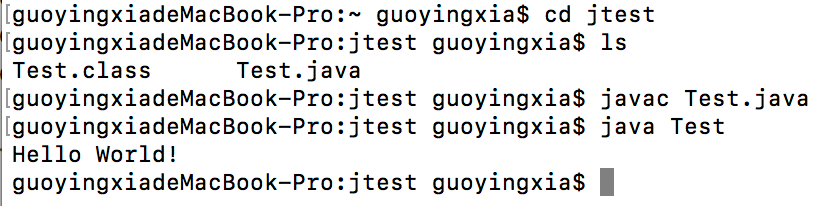
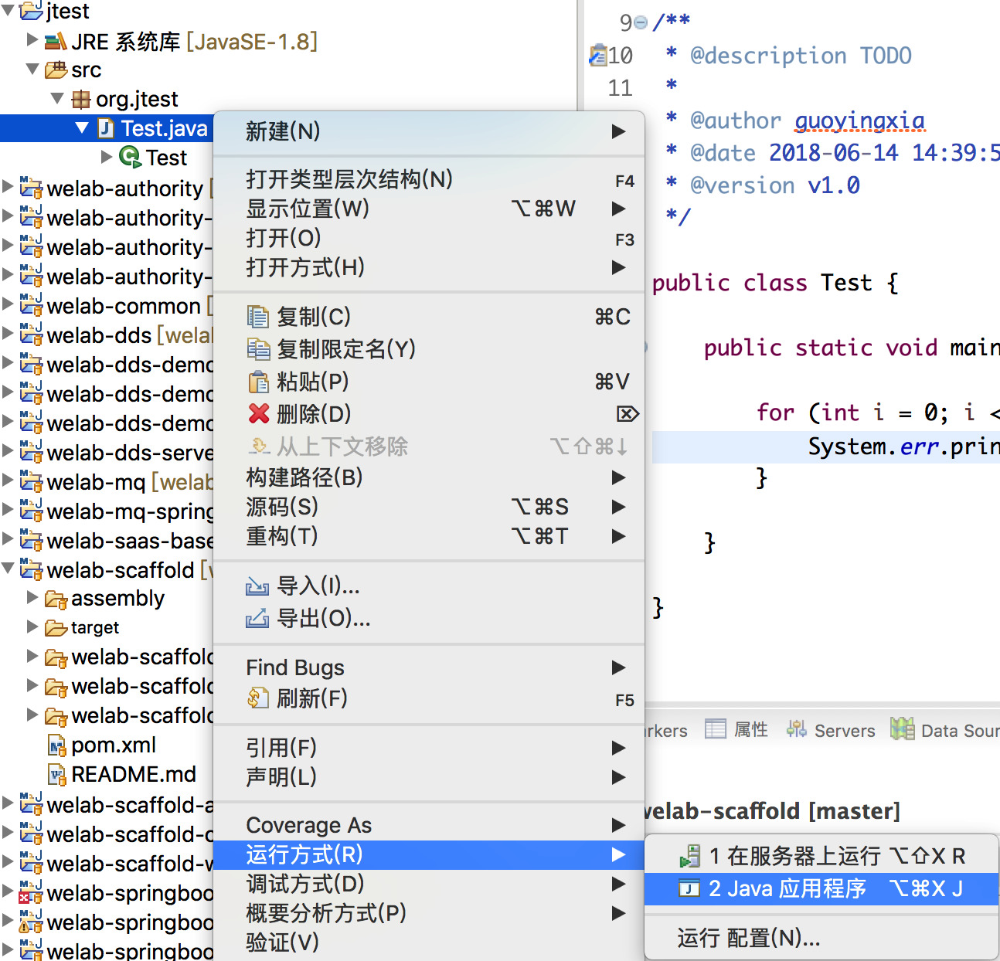

# 代码编写与调试

## 第1步：新建测试目录，例如：jtest，注意：一般目录不建议用中文，用英文也不建议目录名字有空格，避免一些意想不到的问题；

## 第2步：新建文件，例如：Test.java，编写代码：

    public class Test {
        public static void main(String[] args) {
    	      System.out.println("Hello World!");
        }
    }

## 第3步：打开命令行（WIN+R/Mac下打开终端），在测试文件所在目录下
编译：  
    > javac Test.java  
运行：  
    > java Test  
输出：  
    > Hello World!  
如下图（Mac下示例）：  

## 第4步：在IDE下运行，以Eclipse为例

1、“文件”—>“新建”—>“其它”—>“Java 项目”—>“项目名”  
项目名例如：jtest

2、在项目的src目录下右键新建包org.jtest，在包下新建Test.java文件，如下图：  

3、运行程序  

4、查看结果  

## 第5步：Debug调试程序
以Eclipse为例：
1、在包下新建类ForTest.java文件，代码如下：

    public class ForTest {
        public static void main(String[] args) {
            for (int i = 0; i < 5; i++) {
                System.out.println("i的值是：" + i);
            }
        }
    }
    
2、在需要打断点的行号上双击打断点  
  

3、然后右键选择调试   
  

4、可以看到程序执行到断点处停下来了   

5、停下来之后可以右键查看变量的值  
  

6、解释下几个按钮的意义：  
  
第1个按钮：执行到下一个断点，如果只有一个断点，程序直接执行完。如果是循环，则执行到下一次的当前断点  
第2个按钮：终止调试，程序结束  
第3个按钮：单步进入，意思是如果当前调试的程序有调用别的程序，也会跳入别的程序一行一行来调试  
第4个按钮：单步跳过，意思当前程序每次执行一行，有调用别的程序也不会跳进去，只执行当前的程序，除非调用的其它程序里也打了断点才会跳进去 
