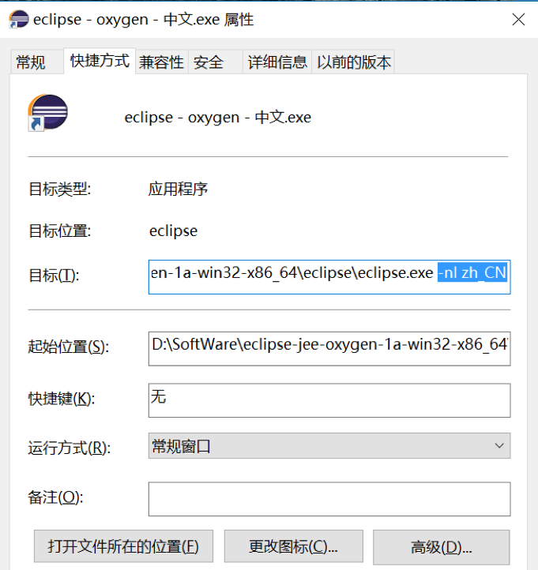
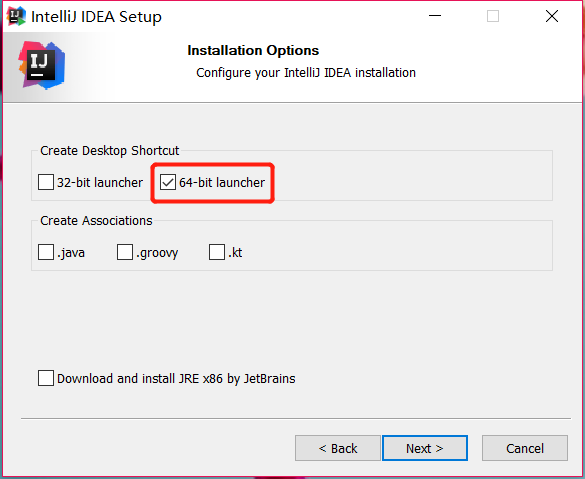
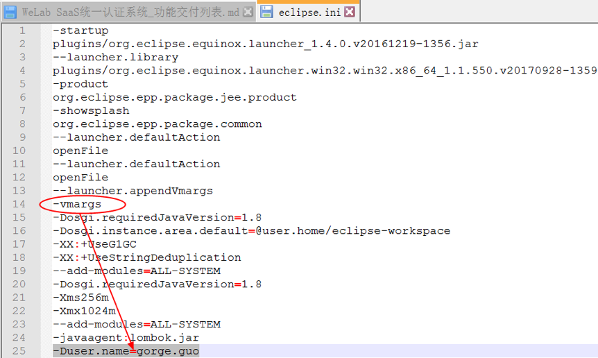

****
### 新员工入职指引-Java后端

## 目录
* [开发环境搭建](#开发环境搭建)
    * [第一步-安装openVPN客户端](#第一步-安装openvpn客户端)
    * [第二步-安装Nextcloud客户端](#第二步-安装nextcloud客户端)
    * [第三步-安装Maven](#第三步-安装maven)
    * [第四步-安装JDK](#第四步-安装jdk)
    * [第五步-安装IDE](#第五步-安装ide)
        * [eclipse安装](#eclipse安装)
        * [eclipse配置](#eclipse配置)
          * [eclipse配置JDK](#eclipse配置jdk)
          * [eclipse配置工作区编码](#eclipse配置工作区编码)
          * [eclipse配置代码自动补全](#eclipse配置代码自动补全)
          * [eclipse配置代码字体](#eclipse配置代码字体)
          * [eclipse配置tab缩进为4个空格](#eclipse配置tab缩进为4个空格)
        * [eclipse插件安装](#eclipse插件安装)
            * [第一步-eclipse安装Maven插件](#第一步-eclipse安装maven插件)
            * [第二步-eclipse安装中英文切换插件-可选](#第二步-eclipse安装中英文切换插件-可选)
            * [第三步-eclipse安装findbugs代码静态检查插件](#第三步-eclipse安装findbugs代码静态检查插件)
            * [第四步-eclipse安装阿里规范检查插件](#第四步-eclipse安装阿里规范检查插件)
            * [第五步-eclipse安装egit插件](#第五步-eclipse安装egit插件)
            * [第六步-eclipse安装代码测试覆盖率插件](#第六步-eclipse安装代码测试覆盖率插件)
            * [第七步-eclipse安装lombok插件](#第七步-eclipse安装lombok插件)
        * [附录-eclipse常用快捷键](#附录-eclipse常用快捷键)
        * [IDEA安装](#idea安装)
        * [IDEA配置](#idea配置)
          * [IDEA配置窗体字体和代码字体](#idea配置窗体字体和代码字体)
          * [IDEA配置JDK](#idea配置jdk)
          * [IDEA配置工作区编码](#idea配置工作区编码)
          * [IDEA配置代码自动补全](#idea配置代码自动补全)
          * [IDEA配置tab缩进为4个空格](#idea配置tab缩进为4个空格)
          * [IDEA配置Maven插件](#idea配置maven插件)
        * [IDEA插件安装](#idea插件安装)
        * [IDEA常用插件](#idea常用插件)
        * [附录-IDEA常用快捷键](#附录-idea常用快捷键)
    * [第六步-安装MySQL数据库及navicat管理客户端](#第六步-安装mysql数据库及navicat管理客户端)
    * [第七步-安装Git并在IDEA中进行配置](#第七步-安装git并在idea中进行配置)
        * [Git的安装](#git的安装)
        * [Git账户申请](#git账号申请)
        * [Git初始化](#git初始化)
        * [配置SSH](#配置ssh)
        * [IDEA中使用Git](#idea中使用git)
* [项目开发要求](#项目开发要求)
* [新项目开发流程](#新项目开发流程)
    * [第一步-导入eclipse配置文件](#第一步-导入eclipse配置文件)
    * [第二步-通过maven仓库的脚手架项目生成新的项目](#第二步-通过maven仓库的脚手架项目生成新的项目)
    * [第三步-给自己的项目申请返回码的号段](#第三步-给自己的项目申请返回码的号段)
    * [第四步-提供swagger接口描述以及单元测试](#第四步-提供swagger接口描述以及单元测试)
    * [第五步-将自己的项目文件推送到git仓库中](#第五步-将自己的项目文件推送到git仓库中)
* [开发阶段须输出的文档](#开发阶段须输出的文档)
    * [1-概要设计文档](#1-概要设计文档)
    * [2-详细设计文档](#2-详细设计文档)
    * [3-接口设计文档](#3-接口设计文档)
* [将项目部署到测试环境](#将项目部署到测试环境)
* [注意事项](#注意事项)
* [工作交接](#工作交接)

# 开发环境搭建
请选择你所使用的操作系统
<div>
	    <table border="1">
  		  <tr>
  		      <td>[Windows 64位](#第一步-安装JDK8)</td>
            <td>[Mac OS 64位](#工作交接)</td>
            <td>[Linux OS 64位](#工作交接)</td>
  		  </tr>
	    </table>
	</div>

## 第一步-安装openVPN客户端
由于公司测试数据库、gitlab、Maven私服等都部署在阿里云，所以需要先连接VPN才能连接以上资源，openVPN客户端安装文件如下：
> **openvpn-install-2.4.6-I602.exe**

安装完后，需要把如下配置文件压缩包拷贝到**安装目录**的`config`文件夹中，并解压即可：
> * WeLAB-AliYun-Dev.zip（DEV、FAT、UAT）

右击桌面右下方图标，查看是否成功加载配置文件，如下图所示为成功：


选择**WeLAB-AliYun-Dev(测试环境)**，单击后点击`Connect`菜单，出现如下图，后输入用户名密码（没有请找运维申请）：


点击`OK`，稍等片刻，连接成功后窗体会自动消失，查看右下角图标颜色，连接成功颜色为
> 如果图标颜色在和之间来回切换，请确认是否当前账号已在其他设备登陆

## 第二步-安装Nextcloud客户端
出于安全考虑，公司采用Nextcloud云盘共享资料，参考Nextcloud用户手册。

[Nextcloud用户手册.md](nextcloud/Nextcloud用户手册.md)

## 第三步-安装Maven
从 [Maven官网](https://maven.apache.org/download.cgi) 下载Maven的压缩包，如以下版本Maven压缩包：  

> apache-maven-3.2.3-bin.zip

将其解压到你所选择的安装目录（不要安装在中文目录下），如下图：  


在Maven的安装目录中创建一个新的文件夹作为Maven的本地库，如上图的 ”repo“  
参照 [settings.xml文件](settings.xml) 的内容更改你所安装的Maven的配置文件，配置文件位于Maven安装目录的 conf 文件目录下

接下来配置Maven的环境变量  
> 新建MAVEN_HOME变量（内容为Maven的安装目录）：D:\SoftWare\apache-maven-3.2.3<br />编辑Path变量，添加：%MAVEN_HOME%\bin

在命令行中使用 `mvn -v` 命令查看Maven版本，验证环境变量是否配置完成

## 第四步-安装JDK

[官网下载jdk](https://www.oracle.com/java/technologies/javase-downloads.html)


安装JDK(此次使用的版本是JDK1.8，64位版本)，如下：

> jdk-8u121-windows-x64.exe

本次安装到了D盘下的D:\\SoftWare\\Java\\jdk1.8.0\_121目录下（根据各自喜好，不要安装在中文目录下），如下图


配置下系统环境变量（以下项目，如果有没有即新增，如果已有在变量里添加，注意不要写错，写错可能导致系统无法启动，并需要在安全模式下修改正确后再启动）

> * JAVA\_HOME D:\\SoftWare\\Java\\jdk1.8.0\_121
> * CLASSPATH %JAVA\_HOME%\\lib\\dt.jar;%JAVA\_HOME%\\lib\\tools.jar;.;
> * PATH %JAVA\_HOME%\\bin;

安装配置完毕后验证一下，打开命令行：

> **java -version**


> **javac**


> **java**


## 第五步-安装IDE

公司不限制开发工具，请按您的喜好选择(**点击可跳转**)
> [eclipse](#eclipse安装) 、[IDEA](#IDEA安装)

### eclipse安装
此次使用免安装版本（解压即可），压缩包文件名如下所示：

> **eclipse-jee-oxygen-1a-win32-x86_64.zip**

### eclipse配置
#### eclipse配置JDK

> * **（英文）** "Windows" --- "Preferences" --- "Java" --- "Compiler"
> * **（中文）** "窗口"---"首选项-"--"Java"---"编译器"


#### eclipse配置工作区编码

>* **(英文)** "Windows" --- "Preferences" --- "Workspace"
>* **(中文)** "窗口" --- "首选项" --- "工作空间"


#### eclipse配置代码自动补全

>* **(英文)** "Windows" --- "Preferences" --- "Java" --- "Editor"---"Assist"
>* **(中文)** "窗口"---"首选项"---"Java"---"编辑器"---"内容辅助"

**配置内容如下：**
>.abcdefghijklmnopqrstuvwxyz.(,


#### eclipse配置代码字体

> * **（英文)** "Window" --- "Preferences" --- "General" --- "Appearance" --- "Color and
Fonts"
>* **（中文)** "窗口" --- "首选项" --- "常规" --- "外观" --- "颜色和字体"

建议使用等宽英文字体（等宽字体代码可读性更好），不限于下图中字体，不了解等宽字体的可以自行网上了解，没有字体的按各自喜好自行下载。


#### eclipse配置tab缩进为4个空格
使用 tab 缩进，必须设置 1 个 tab 为 4 个空格，必须勾选 insert spaces for tabs
> "Window" --- "Preferences" --- "General" --- "Editors" --- "Text Editors"


### eclipse插件安装

#### 第一步-eclipse安装Maven插件


#### 第二步-eclipse安装中英文切换插件-可选

下载最新语言插件BabelLanguagePack-eclipse-zh\_4.7.0.v20170819060001.zip，如下图：


采用links插件的方式安装，在myplugins目录(没有的话自行创建)下创建名为"zh"目录，名字可随便起

> D:\\SoftWare\\eclipse-jee-oxygen-1a-win32-x86\_64\\eclipse\\myplugins


压缩文件解压到zh目录下，如图：


在目录D:\\SoftWare\\eclipse-jee-oxygen-1a-win32-x86\_64\\eclipse\\links(没有的话自行创建)下创建`language.links`文件


内容如下：

> path=D:/SoftWare/eclipse-jee-oxygen-1a-win32-x86\_64/eclipse/myplugins/zh

如图：


下面为中英文切换，修改快捷方式里的部分参数就行了


英文：


中文：



#### 第三步-eclipse安装findbugs代码静态检查插件

下载最新的插件edu.umd.cs.findbugs.plugin.eclipse\_3.0.1.20150306-5afe4d1.zip


解压后直接拷贝到eclipse下的plugins目录下，然后重启eclipse就行了。


#### 第四步-eclipse安装阿里规范检查插件

直接在线安装，安装地址：**https://p3c.alibaba.com/plugin/eclipse/update**

> * **（英文）** "help"---"Install New Software"
> * **（中文）** "帮助"---"安装新软件"


如下图


#### 第五步-eclipse安装egit插件

直接在线安装，安装地址：**http://download.eclipse.org/egit/updates**

> * **（英文）** "help"---"Install New Software"
> * **（中文）** "帮助"---"安装新软件"


把GIT的视图调出来，如下图


#### 第六步-eclipse安装代码测试覆盖率插件

引入代码覆盖率测试的Maven插件，放在Maven的`pom.xml`下的`plugins`标签里

```Java
<plugin>
  <groupId>org.codehaus.mojo</groupId>
  <artifactId>cobertura-maven-plugin</artifactId>
  <version>2.7</version>
</plugin>
```

配置好后，可通过执行maven命令来进行覆盖率的测试

> **mvn cobertura:cobertura**

在项目的target目录下可以看到覆盖率的测试结果


#### 第七步-eclipse安装lombok插件

下载lombok插件，直接下载lombok.jar文件即可

> **lombok.jar**

右键打开jar包，点击"Specify
location"选择eclipse的安装路径，就是eclipse安装根目录下的eclipse目录，程序会自动识别eclipse.exe程序，然后点"Install
/ Update"就安装完成了。如下图：


**另：如果这种方式安装不成功，可以手动的方式来配置。将lombok.jar包直接拷贝到如下图路径里：**


打开`eclipse.ini`配置文件，在最后添加两行：

> * -Xbootclasspath/a:lombok.jar
> * -javaagent:lombok.jar

然后重启eclipse就OK了。

### 附录-eclipse常用快捷键

**（注：红色为非常常用，操作熟练后对效率的提升非常明显）**

> * `CTRL+SHIFT+L` 查看常用快捷键
> * `CTRL+SHIFT+F` 选中代码格式化或全部格式化
> * `CTRL+SHIFT+R` 全局查找文件，可用通配符
> * `CTRL+SHIFT+T` 全局查找类，可用通配符
> * `CTRL+SHIFT+G` 全局查找工作区中的引用
> * `CTRL+SHIFT+O` 快速生成import，缺少的将被导入，多余的将被删除
> * `CTRL+SHIFT+M` 光标放到需导入包的类，然后导入
> * `CTRL+SHIFT+K` 快速定位到上一个关键字
> * `CTRL+SHIFT+/` 添加注释/\*\*/
> * `CTRL+SHIFT+\` 删除注释/\*\*/
> * `CTRL+SHIFT+/` 收缩方法，注意是数字键盘上的/
> * `CTRL+SHIFT+*` 展开方法，注意是数字键盘上的\*
> * `CTRL+ALT+H` 查看方法的调用层次
> * `CTRL+T` 显示当前类的继承结构，从基类到当前类
> * `CTRL+K` 快速定位到下一个关键字
> * `CTRL+H` 全局，打开搜索对话框
> * `CTRL+L` 定位某一行
> * `CTRL+D` 删除当前行
> * `CTRL+/` 快速添加一行注释，重复取消注释
> * `F3` 定位变量或方法的声明处
> * `F4` 全局，显示当前类的父类和第一继承的子类
> * `F11` 运行应用程序
> * `ALT+SHIFT+Z` 自动添加语句块，例如try/catch
> * `ALT+SHIFT+O` 高亮选中内容快捷键
> * `ALT+SHIFT+S` 生成getter/setter方法等
> * `ALT+SHIFT+R` 代码重构的快捷键
> * `ALT+SHIFT+C` 方法重构的快捷键
> * `SHIFT+TAB` 代码块左移
> * `TAB` 代码块右移

## IDEA安装
下载后，按正常步骤安装即可，下载地址如下：
> [https://download.jetbrains.8686c.com/idea/ideaIU-2018.2.2.exe](https://download.jetbrains.8686c.com/idea/ideaIU-2018.2.2.exe)

安装过程





自定义自带插件


全新安装请选中第二项


根据个人爱好选择UI主题


禁用启用IDEA自带插件，红框为大部分后端开发人员使用不到的插件，直接禁用即可，其他插件根据个人使用情况自行调整，


### IDEA配置
#### IDEA配置窗体字体和代码字体
> "File"---"Settings"--- "Appearance & Behavior" --- "Appearance"


设置完以后点`Apply`预览、`OK`保存并退出

> "File"---"Settings"--- "Editor" --- "Font"


设置完以后点`Apply`预览、`OK`保存并退出

#### IDEA配置JDK
> "File" --- "Project Structure" --- "SDKs" --- "点击+号，选JDK"


#### IDEA配置工作区编码
> "File"---"Settings"---"Editor" --- "File Encodings"


设置完以后点`Apply`预览、`OK`保存并退出

#### IDEA配置代码自动补全

#### IDEA配置tab缩进为4个空格
使用 tab 缩进，必须设置 1 个 tab 为 4 个空格，请勿勾选 Use tab character
> "File" --- "Settings" --- "Editor" --- "Code Style" --- "Java"


#### IDEA配置Maven插件
如果您在安装的时候没有禁用Maven插件，默认是安装且启用的
> "File"---"New Projects Settings"---"settings for new projects"---"Build, Execution, Deployment" --- "Maven"(之所以不在Settings里面修改的原因是每次导入新的项目maven的安装目录都会变成idea自带的maven安装路径)


设置完以后点`Apply`预览、`OK`保存并退出

### IDEA插件安装

方法一、在线安装，不同的插件搜索不同的名字即可，例如：**FindBugs-IDEA、Alibaba Java Coding Guidelines、Lombok Plugin**等
> "File" --- "Settings" --- "Plugins" --- "Browse Respositories"


方法二、离线安装（从硬盘安装）
> [http://plugins.jetbrains.com/search](http://plugins.jetbrains.com/search)

从以上地址搜索下载离线包以后，打开如下界面：
> "File" --- "Settings" --- "Plugins" --- "Install plugin from disk"


**注意**：安装完重启IDEA即可

### IDEA常用插件

代码注解插件：Lombok

彩⾊括号：Rainbow Brackets

翻译插件：Translation

Mybatis插件：Free MyBatis plugin

阿⾥代码规约检测：Alibaba Java Coding Guidelines

Maven辅助神器：Maven Helper

代码质量管理插件：SonarLint

### 附录-IDEA常用快捷键


## 第六步-安装MySQL数据库及navicat管理客户端

下边两个包照方抓药安装就可以了
> * mysql5.5.16-winx64.zip
> * navicat_premium_x64.zip

**mysql解压版本安装**

1. 官网下载解压


2. 在 MySQL 根目录下新建目录 data，新建文件 my.ini ,文件内容如下

```ini
[client]
port=3306
default-character-set=utf8
[mysqld]
# 设置为自己MYSQL的安装目录
basedir=E:\mysql-5.7.30-winx64\mysql-5.7.30-winx64
# 设置为MYSQL的数据目录
datadir=E:\mysql-5.7.30-winx64\mysql-5.7.30-winx64\data
port=3306
character_set_server=utf8
sql_mode=NO_ENGINE_SUBSTITUTION,NO_AUTO_CREATE_USER
#开启查询缓存
explicit_defaults_for_timestamp=true
skip-grant-tables
```

3. 以管理员权限打开cmd


4. cmd 到 MySQL 的 bin 目录


5. 使用命令 `mysqld --initialize-insecure`

如出现如下图的错误，则安装 vc++ 2013的运行库


6. mysqld -install 安装
7. net start mysql (启动mysql服务)
8. mysqladmin -u root password 1234 (设置root密码)
9. mysql -u root -p 查看是否能正常登录

## 第七步-安装Git并在IDEA中进行配置

### Git的安装

1. 前往 [Git下载地址](  https://git-scm.com/downloads  )下载对应的Git版本。
2. 双击安装程序开始安装 Git。
3. 除了下面的步骤，其余安装步骤均可选择默认设置。
    - 设置你自己的安装目录，不要安装在中文目录下
    
    - 选择 Vim 作为编辑器
    
    - 选择第一项设置 `Use Git from Git Bash only`
    
    - 选择 `Use the OpenSSL library`
    

### Git账号申请
打开企业微信找到运维助手-Mr.Lai并打开，选择运维平台进而点击开通账号，系统会自动推送给你属于你的Git账号。


### Git初始化

初始化账号和密码

```git
git config --global user.name "用户名"
git config --global user.email "邮箱"
```

### 配置SSH

通过 `ssh-keygen -t rsa -C "账号"` 生成公钥和私钥

可在用户文件夹下的 `.ssh` 文件夹下面查看公钥和私钥  


在gitlab中配置公钥信息以便后续文件上传  


### IDEA中使用Git

一般情况下IDEA会自动配置Git所处路径,如果没有可以手动导入  


## 项目开发要求

> * 代码须完全符合阿里代码开发规范
> * 代码所有方法必须通过JUnit单元测试
> * 整体测试覆盖率需要达到**75%**以上
> * 代码通过findbugs静态检查出的错误需清零
> * 类文件要求（按导入的模板生成即可）:
```
 文件名   （例如：@Title UserServiceImpl.java）
 版权信息 （例如：@Copyright ©2017 我来数科）
 公司信息 （例如：@Company 深圳卫盈智信科技有限公司）
 类的描述 （例如：@description 用户中心服务实现类）
 作者     （例如：@author gorge.guo
 编写时间 （例如：@date 2017-12-12 18:08:08）
 版本     （例如：@version v1.0）
```
> * 数据库设计需完全符合阿里规范里数据库开发规范
> * 业务变更或BUG修复等涉及但不限于代码、数据库、配置有变化的，必须先更新文档，关键业务逻辑或分支注释一定要有，注释内容尽可能简洁
> * 项目内的业务返回码、常量等公共资源应集中管理，不要散落各处

## 新项目开发流程

### 第一步-导入eclipse配置文件

导入模板文件，先下载模板文件，文件以`.epf`结尾。模板内容主要是代码注释生成的模板，后面可能会扩展更多的内容（例如**文件过滤规则**等）。


选择"常规"---"首选项"


另外，配置一下eclipse的user信息，方面生成类的注释文件时作者信息自动填充。



另：dubbo命令行调用，dubbo校验框架、单元测试、自动化测试、工作交接

### 第二步-通过maven仓库的脚手架项目生成新的项目

在控制台执行如下命令，执行前请配置好Maven的环境变量
(**注意：如版本号有更新，后面会通知，后续以通知为准。另外，生成项目时下方命令中有且只有下方的红色标注的两处需修改**)：

> * mvn archetype:generate -DarchetypeCatalog=internal
-DarchetypeRepository=internal -DarchetypeGroupId=com.welab
-Dpackage=com.welab.<span style="color:red">template</span> -DgroupId=com.welab
-DartifactId=welab-<span style="color:red">template</span> -DarchetypeVersion=RELEASE
-DarchetypeArtifactId=welab-scaffold-archetype -DinteractiveMode=false
-Dversion=1.0.0-RELEASE

可以看到项目已经建好了，如下：


### 第三步-给自己的项目申请返回码的号段

目前系统各模块的错误返回码号段是分配的，每块业务不同，新的项目需分配。

如下图示例：


每个项目创建了自己项目返回码的枚举类后，还需要将数据注入到统一返回对象，详细见脚手架里枚举类的实例：


### 第四步-提供swagger接口描述以及单元测试

目前已经集成Swagger2.0组件，服务启动后可以通过网页来查看接口以及字段的描述，也可以通过网页来测试接口，如下图：


项目在开发阶段，项目中对于core和web项目，需要分别提供RPC及HTTP接口的测试用例，并且各开发人员需要跑单元测试，确保接口没有问题，如何写测试用例脚手架里都有具体的例子。

### 第五步-将自己的项目文件推送到git仓库中

在"**Git Respositories**"视图中选择要提交的项目，然后选中"Git Staging"视图：


如下图提示，可以通过"**Commit and Push**"提交到本地并推送到服务器GIT仓库，也可以通过"**Commit**"提交到本地，稍后再推送到GIT仓库。


## 开发阶段须输出的文档

### 1-概要设计文档

内容要求：

> * 描述系统或者模块的开发背景
> * 总体设计的业务流程图
> * 总体设计的方案，如果有多个方案备选需一并列出
> * 复杂业务的E-R图，复杂的关联关系需要（可裁剪）
> * 模块设计，重点描述主要的核心的模块
> * 对接外部系统的需重点调研下外部系统的情况，包括但不限于技术框架、开发语言、接口类型、部署情况、用户规模、运行时间等等（可裁剪）
> * 待确认、待解决或者待定的遗留问题（可裁剪）
> * 参考资料或文档（可裁剪）

### 2-详细设计文档

内容要求：

> * 模块功能描述，描述完成的具体功能，侧重于描述功能的业务逻辑
> * 数据库及表结构设计（遵照阿里的规范文档）
> * 表名
> * 描述
> * 索引（主键索引、普通索引、唯一索引）
> * 字段名称
> * 字段类型（明确标明字段长度）
> * 是否必填
> * 备注（字段涉及枚举值需将每一个值都写上）

### 3-接口设计文档

<font color=red>注意：HTTP接口需要，RPC接口不需要</font>

内容要求：

> * 接口功能描述，描述接口完成的具体功能
> * 接口的请求方式
> * 接口的请求地址
> * 接口请求和返回参数
> * 接口名
> * 参数名
> * 是否必填
> * 参数描述
> * 参数类型【注：数字类型需标明长度】
> * 备注

接口的请求和返回示例
```java
Request:
{
  ...
}

Response:
{
  ...
}
```

## 将项目部署到测试环境

各个项目涉及到的测试环境不同，这里只是说下大致流程，不介绍具体发布地址。

先找运维人员（可以问同事）在持续集成的服务里配置下项目（同时将整个项目的git地址发给运维同事），core项目的配置文件（一般是`server.properties`）发给运维同事。

## 注意事项

编码：

数据库设计（详细可参照[WeLab SQL审核平台](https://db.wolaidai.com/login/)里的相关文档）：
> * 在MySQL中，因为MySQL数据库没有设计单独的布尔类型，而使用tinyint(1)来表示布尔类型，所以设计数据库布尔类型字段时需注意类型要设置对；
> * 在数据库、表、字段、索引设计中，注意不要以MySQL的关键字来命名，在项目中生成持久化层时已强制；
> * 在建库建表时注意排序规则的区别：
`utf8mb4_bin`与`utf8mb4_general_ci`，对于`utf8mb4_bin`，表里的记录是区分大小写的，例如：a和A是不同的记录，而在`utf8mb4_general_ci`下认为是相同的记录。


## 工作交接

内容待补充。
