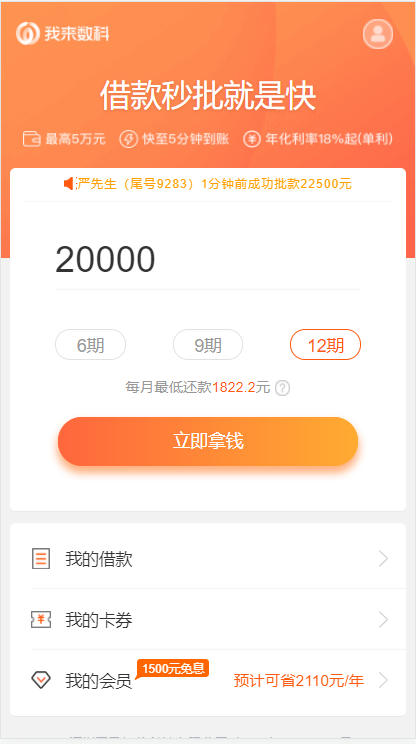
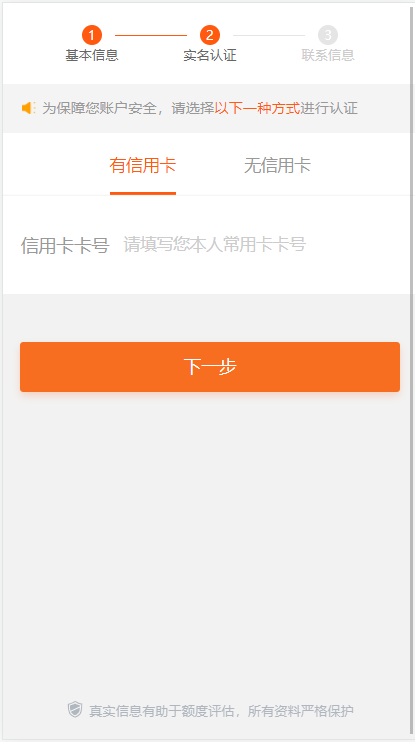

****
# 新员工入职指引-测试

[TOC]

# 测试环境搭建

## 基本账号申请

如果这些账号已申请，则忽略本步骤。

OA账号和密码在新员工指引中文档中，邮箱账号密码HR会帮忙申请。tapd账号为邮箱，密码同OA密码。
使用邮箱和账号登录工单系统[https://service.wolaidai.com/accounts/login/](https://service.wolaidai.com/accounts/login/)

第一步申请tapd,gitlab,vpn账号和权限方法：
1. 点击“工单系统” - “新增IT问题或服务”
2. 选择工单类型“1.权限申请（除数据库）”；上级负责人：填写对应人员;工单标题：申请开通tapd，gitlab，vpn权限；工单内容：表格中前六项都要填写，其中申请,访问系统名称填写“开通tapd，gitlab，vpn这些系统的账号及权限”

    

第二步申请开通数据库账号
1. 点击“工单系统” - “新增IT问题或服务”
2. 选择工单类型“7.修整数据（增，删，改，查）”；工单标题：申请开通i4,dev,fat环境的pg和mysql数据库权限
工单内容：麻烦开通下i4，dev，fat这些环境的pg和mysql数据库的增，删，改，查的权限

    

## vpn安装与配置
要访问测试环境和访问测试数据库，首先需VPN连接上阿里云测试环境，VPN配置阿里云测试环境如下：

第一步访问
[https://service.wolaidai.com/service/openvpn/](https://service.wolaidai.com/service/openvpn/)下载配置文件

第二步在OpenVPN安装目录下的config中解压刚下载的配置文件

第三步在电脑右下角vpn连接中选择阿里云测试环境，输入之前申请的Git用户名和密码，即可连接成功

## navicat客户端下载和数据库连接配置
待数据库连接账号申请下来后，可访问[https://www.tapd.cn/20039631/documents/file_list/1120039631001000153](https://www.tapd.cn/20039631/documents/file_list/1120039631001000153)下载Navicat客户端。

这里列出常用的FAT和I4环境数据库配置，配置的信息在工单审批后也可查看到。

配置FAT环境数据库:

主机：10.1.0.12    端口：5432 初始数据库：rocket2

配置I4环境数据库:

### 数据库账号

mysql:
10.1.0.33: 3306
用户名：db_public
密码：My&c+m(B128(*?A&q

10.0.0.13：3306
用户名：root
密码：com.mysql.cj.jdbc.Driver

postgresql:
10.1.0.86：1433
用户名：tc_public
密码：PNn@x40nWg

mysql(电商):
10.1.0.120 : 3306
用户名：dev_online_mall 
密码： X*!ONSbPMlr@

## 日志查询方法

访问运维支撑平台[https://sa.wolaidai.com/#/dashboard](https://sa.wolaidai.com/#/dashboard)

如下图：1.选择服务总览V2； 2. 选择服务名称；3. 选择fat环境；4. 进入服务器查看log; 

如果是从上图中4点击进入服务器后，查看日志方法：
日志从容器中映射到服务器的路径为：/data/logs/xxx/xxx.log(日志的路径对所有服务也一样，如apply-gateway是对应服务名)

### 查看日志常用部分命令：

#### vi命令和常用快捷键

> * `vi apply-gateway.log` : 打开文件
> * `/xxx` : 命令模式下从文件开始查找xxx内容
> * `?xxx` : 命令模式下从文件结尾开始查找xxx内容
> * `n` : 当查找到匹配字符后，按n继续向下查找
> * `N` : 当查到的匹配字符后，按N继续向上查找
> * `Ctrl+u/Ctrl+d`: 向上翻半页/向下翻半页
> * `Ctrl+b/Ctrl+f`: 向后翻一页/向前翻一页

#### grep命令

> * `grep xxx capital-allocation.log` : 在capital-allocation.log文件中搜索xxx的字符

> * `grep xxx capital-allocation.log | grep abc`: 在capital-allocation.log文件中搜索满足xxx和abc条件的字符

#### tail命令
> * `tail -f abc.log` : 实时查看日志

> * `tail -500f abc.log` : 显示abc.log最后500行记录，并不断更新日志

> * `tail -n 10 abc.log` : 显示abc.log中最后10行记录

#### less命令
> * `less abc.log` : 关键字日志搜索

# 基本业务流程和操作

## 常用系统链接
> [测试支撑平台](https://autotest-fat.wolaidai.com/welab-speed/index.html#/login): 添加白名单，生成姓名及身份证号码、数据加解密、冒烟流程等，功能非常强大。

> [统一认证用户自助系统](https://sso.tianmiantech.com/#/login)： git、轻舟等

> [运维支撑平台](https://sa.wolaidai.com/#/dashboard)： 服务发布，日志查询　

> [审批系统](http://admin-fat.wolaidai.com/approval/#/login)： 风控审批　

> [运营平台](https://admin-fat.wolaidai.com)： 奖励发送等

> [阿里云平台](https://signin.aliyun.com/weleb/login.htm)：查询上传文件等信息

> [测试app下载](https://fir.im/apps): 测试app下载

## 基本系统结构图

## 基本业务流程图

## 基本业务操作

我们的产品类型有多种，如下以[光速贷](https://m-fat.wld.net/gsd/enter/1595244214234)为例进行基本流程操作和测试中常见的模拟数据操作。

### 登录
1. 点击齿轮输入环境：fat环境配置：[https://japi-fat.wld.net/](https://japi-fat.wld.net/)

2. 输入手机号，手机号可以先去测试平台添加白名单；

   

3. 输入手机号，点击获取验证码，默认为888888

### 填写借款信息
输入借款金额，借款期数，点立即拿钱

### 上传身份证正反面

### 身份证识别

上传身份证正面照片后，系统会调用OCR进行识别，可以修改识别出来的姓名与身份证号（身份证信息不能重复使用）

### 姓名身份证号码生成

姓名与身份证号码可以去测试平台生成，然后复制过来替换即可

地区、出生日、有效期可以不用填写，系统会随机生成，也可以指定地区，出生日跟有效期

### 填写基本信息

填写单位名称、学历、婚烟状况

### 实名认证

输入信用卡或储蓄卡

### 银行卡号生成

银行卡号可以去测试平台生成

### 添加联系人信息

### 提交审核后，进入人脸认证页

### 人脸认证

一般测试环境人脸验证，都是在测试平台的通过刷脸来跳过此步骤，使用当前进件的手机号，点击查一下，然后再点击通过刷脸

### 提交审核

通过刷脸后，点击提交审核，等待审批

### 审批状态

提交审核后，此时可以去loan_applications表去查看审批的状态

也可以在测试平台直接根据手机号查看,init_aip 为初审通过; aip为终审通过

### 申请提现

审批通过后，可以点击立即提现

点击立即提现后，会进入到绑卡页面：

绑卡验证码默认111111

绑卡完成后，回到首页再次点击提现，进入确认提现页面，勾选同意后，点击确认提现

此时会去匹配资金方,如果未匹配到资金方，需要到财务管理系统添加对应资金方

可以去测试平台查看资金方匹配的结果

可以根据匹配结果（资金方未设置额度）去财务管理系统的额度管理页面，设置额度：

额度设置完成后，可以到测试平台再次查看资金匹配结果

匹配成功后，再次提现页面发起提现，即可完成提现操作；

进入放款中后，需要去测试平台进行放款操作，根据手机号找到对应的贷款单号，点击秒放，即可完成放款操作

选择资金方jmxcfc放款即可。放款成功后接下可操作还款

### 还款操作

刚提现完成后，页面是无法直接操作还款的，需要去测试平台修改账单的还款日

测试平台修改账单还款日，先在测试平台点击还款账单，查看还款日期

然后点击逾期，点击自定义，根据还款日期设置即可。设置后再次查看还款日期。

 设置完成后，再次回到还款页面，点击还款即可。

初审，终审在审批系统的流程

1. 在loan_applications表中查到application_id,参考sql为：SELECT tt.* from loan_applications tt, users u where tt.borrower_id = u."id" and u.mobile='13508311010'
   
    

2. 访问[审批系统](http://admin-fat.wolaidai.com/approval/#/login),审批系统账号找测试同事帮忙开通并加权限，通过刚查到的application_id查到订单，分单给自己，进行初审和终审
   
    
    
    

# 常用业务sql

## 进件资料相关表查询 

    -- pg - toc_rocket2 -public
    -- 手机号
    select * from users where id=2455527;
    -- 姓名、身份证号码、婚姻状况
    select * from profiles where borrower_id = 2363604;
    -- 联系人
    select * from liaisons where user_id = 2460023;
    -- 学历
    select * from educations where user_id = 2460023;
    -- 单位名称
    select * from companies where user_id = 2460023;
    -- 居住地址（location：resident_address）
    select * from addresses where addressable_id in (select id from profiles where borrower_id = 2458217);
    --额度授信申请(额度进件)
    select * from  credit_applications where uuid='1208099405794639872'
    --贷款列表（普通进件）
    select * from loan_applications where borrower_id='2464185'

​    
​    
​    -- mysql - documents 身份证正反面
​    select * from documents13 where documentable_id = 2459873;
​    --mysql -finance_loan 银行卡
​    select  * from  bank_cards where user_id=2455974
​    --mysql -welab_creditline 额度授信
​    select * from quota where user_id = 1153040752331194368(users.uuid)

​    

## 钱夹谷谷查询（1）

    --pg - finance_wallet - public 
    
    -- 还款时看这张表可以区分是国民的还是通联，debit_channel_code，判断是否有处理中账单
    select * from wallet_user_repay_records where user_id = '2426659';
    
    -- 贷款属性表。提前结清is_allow_early_settle=true
    select * from wallet_loan_attribute where is_allow_early_settle = 'true';
    
    -- 长银授信
    select * from wallet_cycfc_grant_record where user_id = 2436286;
    
    -- 修改还款计划
    -- update wallet_user_due set due_date = due_date - interval '1 month' where  application_id='WL210618151646155669200';
    -- update wallet_charge_due set due_date = due_date - interval '1 month' where  application_id='WL210618151646155669200';
    -- update wallet_loan_attribute set next_repayment_date = next_repayment_date - interval '1 month',next_reimbursement_date=next_reimbursement_date - interval '1 month' where application_id='WL210618151646155669200';
    
    select * from wallet_charge_due where application_id = 'WL210618163729689582275' order by due_date;
    select * from wallet_user_due where application_id = 'WL210618163729689582275' order by due_date;
    select * from wallet_loan_attribute where application_id = 'WL210618183743258942006';
    
    -- 
    -- update wallet_user_due set due_date = due_date + interval '5 month' where user_id ='2425613';
    -- update wallet_charge_due set due_date = due_date + interval '5 month' where user_id ='2425613';
    -- update wallet_loan_attribute set next_repayment_date = next_repayment_date + interval '5 month',next_reimbursement_date=next_reimbursement_date + interval '5 month' where user_id ='2425613';
    -- 
    -- 提前结清开关
    -- update wallet_loan_attribute  set is_allow_early_settle='true' where application_id='WL201201142235418688609'; 
    
    -- 放款表
    select * from wallet_loan where application_id ='WL21013017272046181462';
    select * from wallet_loan where user_id=2426659;
    -- 还款表
    select * from wallet_user_repay_records where user_id = '2440335';
    select * from wallet_user_repay_details where user_id ='2431625';
    -- 还款
    select * from wallet_user_repay_task where application_id = 'WL210618183743258942006';
    select * from wallet_user_repay_task where user_id  = 2440771;
    select * from wallet_user_due where application_id = 'WL210617144719623767596'; 
    select sum(outstanding_amount) from wallet_user_due where application_id = 'WL210617144719623767596'; 
    select sum(outstanding_amount) from wallet_user_due where application_id = 'WL200924164238506540864' and due_type in ('principal'); 
    select sum(outstanding_amount) from wallet_user_due where application_id = 'WL200924164238506540864' and due_type in ('guarantee_fee', 'interest') ; 
    
    select * from wallet_loan_attribute where application_id = 'WL210618183743258942006'; 
    
    -- 消费费率
    select * from wallet_loan_rate where application_id = 'WL200928135919672949553'; 
    
    select * from wallet_charge_due_settlement where application_id = 'WL210618183743258942006';
    select * from wallet_user_due_settlement where application_id = 'WL210618183743258942006';
    select sum(due_amount) from wallet_user_due_settlement where application_id = 'WL210618183743258942006';
    
    -- 营销 -- 消费
    select * from wallet_user_repay_records where user_id = '2416687';
    select * from wallet_user_repay_details where user_id ='2416687';
    select * from wallet_loan where user_id ='2455527';
    select * from wallet_charge_due where user_id = '2455527' order by due_date;
    select * from wallet_user_due where user_id = '2455527' order by due_date;
    select * from wallet_loan_attribute where user_id = '2426659';
    
    select * from wallet_user_due where user_id = '2426659' and due_type = 'overdue_penalty';
    select * from wallet_charge_due where user_id = '2426659' and due_type = 'overdue_penalty';

​    
​    -- 长银消费，disbursed_at放款时间改到2023-08-19
​    select * from wallet_cycfc_task  where user_id = 2440807 order by id; 
​    -- 长银还款，repayment_date还款日期改到2023-08-19
​    select * from wallet_user_repay_records where user_id='2440807'; 

## 钱夹谷谷查询（2）

    mysql - wallet 
    
    -- 授信分流
    select * from partner_allocation where user_id='2460901';
    -- 合作伙伴批准记录
    select * from partner_approval_records where user_id='2460901'; 
    select * from partner_approval_records where user_id in (select user_id from wallet_user where channel_code != 'aibank') GROUP BY created_at; 
    select * from partner_approval_records where status = 'rejected'; 
    select * from partner_approval_records where partner_code = 'gmtrust'; 
    select * from partner_approval_records order by updated_at desc; 
    
    -- 开户分流配置表
    select * from wallet_channel_priority;

​    
​    -- 钱包用户(pay_password支付密码)  total_rate 授信费率,原上海银行二类户用户升级前需手动更改channel_code为:bosc
​    select * from wallet_user where user_id='2460954';
​    select * from wallet_user where channel_code = 'aibank' order by created_at desc;
​    select * from wallet_user where elec_card_no = '6236431686000501147';
​    
​    -- 微信支付宝绑卡记录表 binding为已绑358265
​    select * from aibank_bindcard_record where user_id='2440740'; 
​    
    -- 百信银行 elec_card_no百信银行卡号
    select * from aibank_user_profile where user_id = '2431732';

​    
​    -- 扫码支付
​    select * from qrcode_apply where user_id='2421160' order BY created_at DESC;
​    
​    -- 百信银行交易记录
​    select * from wallet_aibank_transactions where card_no = '6236431686000502434';
​    
    -- 钱包订单 （order_type字段记录订单类型trade-正常消费，coupon-发红包，transfer-转账） 记录消费时间
    select * from wallet_order where user_id='2456540' ORDER BY created_at DESC;
    select * from wallet_order ORDER BY created_at DESC;
    select * from wallet_order where bill_no='BL200925093450879575779' ORDER BY created_at DESC;
    -- 修改消费订单表的创建时间、更新时间、提款时间
    select tt.created_at,tt.updated_at,tt.transaction_date,tt.* from wallet_order tt where user_id='2455014' ORDER BY created_at DESC;
    
    select user_id, count(*) a from wallet_order group BY  user_id having count(user_id) > 20;
    
    select * from wallet_order where created_at <= '2020-09-12' GROUP BY user_id order by id ;
    select * from wallet_order where user_id = '2440771' ;
    
    -- 退款记录表  成功状态为succeed表示退款成功  init、failed在前端都是展示为处理中
    select * from aibank_refund_task where user_id = 2434034;
    select * from aibank_refund_task where order_no = "refundB202106220001";
    select * from njcb_refund_task where user_id = 2454145;
    select * from njcb_refund_task where order_no = 'Brefund2021072100001';
    
    select * from njcb_transactions where order_no = 'betty2021062400006';
    
    -- 钱包订单信息 消费渠道
    select * from wallet_order where user_id='2422166' ORDER BY created_at DESC;
    select * from wallet_order where user_id='2455014' and orig_order_no is not NULL;
    select * from wallet_order where order_no = 'betty2021072200001' ORDER BY created_at DESC;
    select * from wallet_order where orig_order_no = 'betty202107210003' ORDER BY created_at DESC;
    select * from wallet_order where status = 'partial_refund' ORDER BY created_at DESC;
    select * from wallet_order where status = 'refund_card' ORDER BY created_at DESC;
    select * from wallet_order where status = 'refund' ORDER BY created_at DESC;
    select * from wallet_order where status = 'refund' ORDER BY created_at DESC;
    select * from wallet_order order by created_at desc;
    select * from wallet_order_info where order_no ='betty2021062100010';
    select * from wallet_order_info where order_no in (select order_no from wallet_order where user_id='2426659');
    
    -- 构造账单合同
    -- 跑账单合同有两个条件，一个是已出账单，一个是账单日为当天
    -- 账单 - 一个月一条数据 还款状态:unpaid:未还, repaid:已还, installment:分期，出账状态：status：settled已出账、unsettled未出账
    select * from bill where user_id='2404832';
    select * from bill where repayment_status='unpaid';
    select * from bill where repayment_status != 'repaid' order by user_id, created_at desc;
    -- 账单分期 -- fiance-loan.dues会记录贷款号application_id对应的账单
    select * from bill_installment where user_id='2401965';
    -- 账单还款记录（分期前需要先还款成功，再分流资金方，再生成分期数据）
    select * from bill_repay_record where user_id='2401965';
    -- 账单还款任务（第三步调用我们agreement服务生成合同）
    select * from bill_repayment_task where user_id='2426920' ORDER BY created_at DESC;
    -- 银行账单
    select * from lender_bill where user_id='2417062';
    -- 银行账单结算
    select * from lender_bill_settlement where user_id='2421160';
    -- 银行费用
    select * from lender_fee where bill_no='BL191017164604449966686';
    
    -- 用户账单 
    select * from user_bill where user_id='2426659';
    select sum(outstanding_amount) from user_bill where user_id = '2401965';
    -- 用户账单结算
    select * from user_bill_settlement where user_id='2404738';
    -- 用户费用
    select * from user_fee where bill_no='BL191017164604449966686';
    
    -- 消费后还有一个放款流程要跑完  状态：00 则OK
    select * from gmtrust_wallet_tasks where user_id='2426732';

## 短信系统

    相关服务：
    message-sms

​    
​    相关表：
​    -- 查询供应商账号信息
​    SELECT * FROM t_message_vendor_account where vendor_channel_code='ALIYUN_CMPP'
​    -- 查询供应商列表
​    select  * from  t_message_vendor_channel  limit 10  
​    
​    -- 查询添加新增供应商模板
​    SELECT * FROM t_message_template_conf  order by  created_at  desc limit 30
​    
    -- 供应商计费方式
    SELECT * FROM t_message_fee where  vendor_channel_code='ALIYUN_CMPP'
    
    -- 供应商初始账户对账
    SELECT * FROM t_message_balance   where  vendor_channel_code='ALIYUN_CMPP'
    
    -- 供应商初始充值明细
    SELECT * FROM t_message_recharge_detail ORDER BY create_time desc   where  vendor_channel='ALIYUN_CMPP'
    
    -- 短信平台发送成功统计正常 
    SELECT * FROM t_message_send_statistics where template_name='open_super_vip_success' order by send_time desc   
    
    -- 提交计费  
    SELECT * FROM t_message_balance where vendor_channel_code='ALIYUN_CMPP'
    -- 到达计费
    SELECT * FROM t_message_balance where vendor_channel_code='ALIYUN_CMPP'
    
    -- 白名单
    select  * from  t_message_name_list where mobile='13714242546'
    
    -- 黑名单
    select  * from  t_message_black_list where mobile='13714242546'
    
    -- 查看模板
    select * from t_message_template_conf order by created_at desc  limit 10 
    
    -- 查看模板关联的供应商
    select * from t_message_template_conf_relation order by created_at desc limit 10 
    
    -- 个性发送/单发
    select  * from t_message_group_log order by send_time desc limit 10
    
    -- 查看供应商返回的发送用户短信的情况
    select * from t_message_cl_report  order by report_time desc  limit 10 
    
    -- 上行报告
    select * from t_message_feedback_report  order by report_time desc limit 10 
    
    -- 系统配置
    select * from  t_message_systm_conf limit 10;
    
    -- 月度对账
    select * from  t_message_reconciliation limit 10
    
    -- 短信验证码 
    select *  from  t_message_vcode；

## 就享买
    相关服务：
    客户端：eb-facade-mall-bbc
    运营平台：eb-facade-platform-admin
    商家后台：eb-facade-merchant-admin

​    
​    相关表：
​    【用户相关】
​    # 查询用户信息
​    select * from gs_user where phone = '18664929999'
​    
​    # 用户收藏的商品
​    select * from gs_user_favorites_goods where user_id = (select id from gs_user where phone = '18664925885')
​    # 用户收藏的店铺
​    select * from gs_user_favorites_shop where user_id = (select id from gs_user where phone = '18664925885')
​    
    # 用户购物车商品
    select * from gs_user_shopping_car where user_id = (select id from gs_user where phone = '18664925885')
    
    # 用户第三方登录
    select * from gs_user_third_login where user_id = (select id from gs_user where phone = '18664925885')

​    
​    【商品相关】
​    # 查询商品信息
​    select * from gs_goods_info where goods_name = 'iphone13'
​    # sku商品信息
​    select * from gs_sku_good_info where good_id = (select id from gs_goods_info where goods_name = 'iphone13')
​    
​    # 查询商品类目信息
​    select * from gs_goods_category where gs_category_name = '测试手机' limit 10
​    
    # 查询类目关联属性
    select * from gs_goods_category_attribute where category_id = (select id from gs_goods_category where gs_category_name = '测试手机')
    
    # 商品库存
    select * from gs_stock where goods_id = (select id from gs_goods_info where goods_name = 'iphone13')
    
    #商品属性规则
    select * from gs_goods_spec_info where good_id = '1372405670619463681' 

​    
​    【订单相关】
​    # 交易订单表  trade_state,订单状态:10:待支付,20:待发货,30:待收货,40:已完成,50:已取消
​    select * from gs_trade where user_id = (select id from gs_user where phone = '18664929999')
​    
​    # 订单支付记录表
​    select * from gs_trade_pay where trade_code = 'T20210730151743646214076'
​    
    # 查询订单支付方式，钱包支付还是微信小程序支付，pay_type60,为微信小程序支付。100为钱包支付
    select a.id,a.user_id,a.shop_id,a.trade_code, a.pay_type,
    b.pay_code,b.pay_info,b.pay_type,b.pay_state from gs_trade as a left join gs_trade_pay as b 
    on a.id = b.trade_id where a.id = 1440930631197577217

​    
​    
​    【退款相关】
​     # 运营平台退款申请单
​    select * from gs_trade_rights where trade_id = (select id from gs_trade where user_id = (select id from gs_user where phone = '18664929999') order by create_time desc limit 1)
​    
​    # 售后订单表
​    select * from gs_trade_rights where trade_id = '1440647543544532994' or order_code = 'T20210330202434520072858'
​    
    # 售后商品表
    select * from gs_trade_rights_goods where user_id = 1433705873337733121
    
    # 售后退款表
    select * from gs_trade_rights_refund where trade_id = '1377935194154213377' (select id from gs_trade_rights where trade_id = '1440647543544532994') 
    
    # 查询用户收货地址
    select * from gs_stock_address where owner_id = '1439055315724005377'

​    
​    
​    【活动相关】
​    # 活动
​    select * from gs_market_pt_activity where name = '活动测试01'
​    
​    # 活动报名表
​    select * from gs_market_pt_activity_merchant where activity_id = (select id from gs_market_pt_activity where name = '活动测试01')

​    
​    【营销相关】
​    # 商家满减券
​    select * from gs_market_merchant_cut where cut_name = '测试电脑满减券'
​    
​    # 商家满赠
​    select * from gs_market_merchant_gift where gift_name = '满赠test'
​    
    # 限时折扣
    select * from gs_market_merchant_discount where scount_name = '双11活动测试'
    
    #优惠券
    select * from gs_market_merchant_card where card_name = '测试优惠券'
    
    # 查询物流公司
    
    select * from gs_stock_logistics_corp where id = '1366567741472919553'

# 常用测试地址
> 光速贷：https://m-fat.wld.net/gsd/enter/1595244214234
> 闪电贷：https://m-fat.wld.net/sdd/main.html#/home
>
> 淘新机运营平台：https://mf-fat.wolaidai.com/manage-web/home  
> 淘新机促销系统：https://mf-fat.wolaidai.com/promotions-web/grant/add
> 淘新机H5:https://mf-fat.wld.net/aif-lease/login
>
> 钱包H5:https://m-fat.walletgugu.com/wallet/pgHome/1629278557160
> 钱夹谷谷运营平台：https://admin-fat.wolaidai.com/woss/wssCoupon/list
> 交叉营销：https://m-fat.walletgugu.com/wallet/spare2/comm
>
> 就享买商家管理中心：https://madmin-fat.wld.net/jxm-merchant/admin/login
> 就享买平台运营管理中心：https://admin-fat.wld.net/jxm-platform/admin/login
> 就享买H5:https://jxm-fat.wld.net/mall/
>
> WeSSO自助平台：https://sso-fat.tianmiantech.com/#/login?redirect=%2Fhome
> 轻舟-敏捷研发平台：https://sa.welab-inc.com/#/okr/tapd/story/1120329381001070705
> 测试支撑平台：https://autotest-fat.wolaidai.com/welab-speed/index.html#/dashboard
> Apollo配置中心：http://apollo-portalweb.wolaidai.com/signin#/appid=message-sms&env=FAT&cluster=default
> Wiki平台：https://www.tapd.cn/20039631/markdown_wikis/show/#1120039631001000472
> OA系统:https://oa.welab-inc.com/seeyon/main.do?method=index
> Elastic注册中心（定时任务）：http://10.5.0.201:8898/elastic-job-console/overview#

# 测试流程规范
1. 参与需求评审
2. 项目开始开发后,在tapd中创建测试子任务，填写预估时间

3. 用例设计，完成后并组织项目组人员用例评审

    [测试用例模板下载](https://www.tapd.cn/20329381/imports/import_tcase) 
    
4. 每日发送项目进度邮件

    [项目进度邮件模板](https://www.tapd.cn/20039631/documents/show/1120039631001000446)

5. 在tapd上bug管理流程：

    提交bug => 跟踪bug =>验证bug =>关闭bug
    
6. 测试环境完成并im测试通过后，协助UAT测试和项目上线

7. 项目结束在tapd上修改实际工时，并修改任务状态为结束

# 埋点上报青鸾分析

说明：通过sql分析，检查埋点是否上报青鸾以及埋点数据是否正确

1.登录WeSSO自助平台：https://sso-fat.tianmiantech.com/#/login?redirect=%2Fhome，从’安全平台‘进入

2.选择’数据分析‘平台

3.粘贴查询sql    (根据查询结果，分析埋点数据)

select

  t.event_name,

  t.ename,

  t.etype,

  t.page_name,

  t.activity_code,

  t.login,

  t.event_time,

  t.create_date_time,

  t.x_product_code,

  t.apply_id,

  t.action_name,

  t.action_code,

  t.pop_action_name

from

  welab_events t

where

  t.event_name = 'g_agreement_check_click'  

  and t.event_time >= 1631606036000;

补充：

查询sql可以通过t.event_name，事件key 过滤，部分需求有可能新增增补属性，也可以通过增补属性过滤，具体增补属性字段以埋点规范文档https://docs.qq.com/sheet/DS3JpbHpKWHBWYmNp?tab=bb08j5为准

部分协议合同增加日志记录需青鸾入库，埋点数据库如下：

mysql  -- welab_log库

-- 合同模板

select * from agreement_template where agreement_code='wld_user_register_service'

-- 协议日志上报 （青鸾入库）

select * from    user_agreement_action  order by created_at desc limit 100

# 进件接口梳理

说明：内部初审接口校验[准入规则AB](https://docs.qq.com/sheet/DYmJ5bVVCTWNrTWhZ?tab=BB08J2)、资料是否完整等规则，如果命中则不推风控一审。二审同理

## 进件

我来数科app：

一审: Url.getV4Path('/application/api/v1/appNew/loan_application/credit'); post
二审: Url.getV4Path(`/application/api/v1/application/credit/${applicationId}`); put     人脸活体验证通过后提交二审

光速贷H5:

一审：https://japi-fat.wld.net/application/api/v1/appNew/loan_application
二审：https://japi-fat.wld.net/application/api/v1/loan_applications

## 补推

一审二审补推进件单：当前时间的90天前~4小时前这个时间段内的进件单（不满足时间条件，可手动修改进件单创建时间）

一审补推条件：

1.贷款状态：applied

2.Apollo配置中心执行定时任务：creditResendApprovalSchedule（application-center服务）

二审补推条件：

1.贷款状态：init_aip

2.Apollo配置中心执行定时任务：creditResendApprovalSchedule（application-center服务）

## 被拒导流

说明：进件过程中命中我司被拒规则，为用户引流第三方产品,第三方产品相关配置可在我来数科运营平台操作

当进件接口返回标识：drainage=True时，前端跳转被拒导流页面：https://m-fat.wld.net/mix/refusedGuide

数据库：

mysql -- welab_log

用户被拒表:

select* from user_reason_code_log(包含reject_code等)

被拒导流记录表：

select* from rejected_drainage_log (包含userid，reject_code等)

pg  --public

可通过审批节点过滤被拒状态

select * from loan_push_type where push_type=2 and state='rejected'

select * from loan_reject_type where push_type=2 and diversion_tag='Y'

被拒导流第三方产品相关设置

1.登录我来数科运营平台

2.进入被拒导流设置页面，可进行编辑删除等操作   （表：mysql  --marketing.diversion_platform）

# 钱包卡券活动

有钱包额度用户

select  user_id  from  quota where quota_type='PAY-QIANBAO-APP' ORDER BY gmt_create desc limit 10

卡券相关的表   mysql --markting

-- 钱包卡券

select * from wallet_coupons 

-- 钱包活动

select * from wallet_activitys

-- 发券记录表 

select * from wallet_coupons_users where uuid = '622396965363122176' order by redeemed_at desc;

查看是否绑定微信open_id（是:有记录）  pg --public

SELECT * FROM "user_public_accounts"  where open_id = 'oWhf4s_OQTyu4NXhYpwBT9U7EHU4'

钱包交叉营销标签用户   
 select * from wallet_marketing_user where user_id = 2454666;

查看黑名单被拒原因

welab_log.application_check_failed_data_log