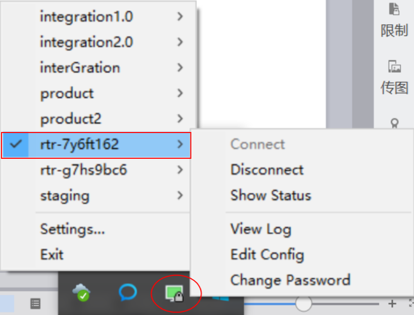
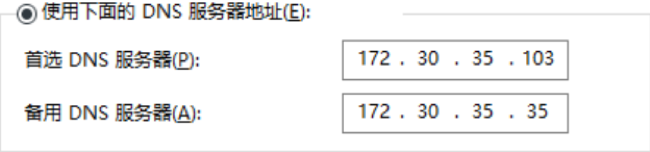

****
### 新员工入职指引-通用

## 目录
* [我来数科工作常用信息](#我来数科工作常用信息)
    * [域账号及密码](#域账号及密码)
    * [网络账号及密码](#网络账号及密码)
    * [oa系统地址账号及密码](#oa系统地址账号及密码)
    * [邮箱地址账号及密码](#邮箱地址账号及密码)
    * [工单系统地址账号及密码](#工单系统地址账号及密码)
    * [github地址账号及密码](#github地址账号及密码)
    * [公司wiki](#公司wiki)
    * [项目管理tapd地址账号及密码](#项目管理tapd地址账号及密码)
    * [环境配置相关文档](#环境配置相关文档)
* [welab工作环境配置](#welab工作环境配置)
    * [第一步-安装公司VPN](#第一步-安装公司vpn)
* [各小组入职指引链接](#各小组入职指引链接)
 

# 我来数科工作常用信息

特别提醒：建议各系统的密码改成统一的，好记！！！

公司官网：[https://m.wolaidai.com](https://m.wolaidai.com)

## 域账号及密码：

账号：英文名.姓（例如gorge.guo）

密码：初始密码或者自己设置的密码（windows下为初次登录电脑的密码）

## 网络账号及密码：

使用域账号及密码（**个人电脑找运维同事配置下域信息，安装安全软件**）

电脑端WI-FI名：WeLab

手机端WI-FI名：WeLab-C

## oa系统地址账号及密码：

地址：[https://oa.wolaidai.com](https://oa.wolaidai.com)

账号：账号为分配的OA账号

密码：域密码

## 邮箱地址账号及密码：

地址：[http://mail.wolaidai.com](http://mail.wolaidai.com)

账号：英文名.姓@wolaidai.com（例如：gorge.guo@wolaidai.com）

密码：域密码

## 工单系统地址账号及密码：

地址：[https://sa.wolaidai.com](https://sa.wolaidai.com)

账号：git用户名

密码：git密码

## github地址账号及密码：

（需要提交工单申请，具体可以问同事）

地址：[https://git.wolaidai.com](https://git.wolaidai.com)

账号：英文名.姓（例如：gorge.guo）

密码：初始密码或自己设置的密码

## 公司wiki：

地址：[https://wiki.wolaidai.com](https://wiki.wolaidai.com)

## 项目管理tapd地址账号及密码：

地址：[https://www.tapd.cn)

账号：英文名.姓@wolaidai.com（例如：gorge.guo@wolaidai.com）

密码：域密码

## 环境配置相关文档：

地址：[http://gitbook.service.ops.welab.co:4000/](http://gitbook.service.ops.welab.co:4000/)

# welab工作环境配置

## 第一步-安装公司VPN

下载VPN客户端(连接Maven私有仓库以及连接数据库需要使用VPN)

（**注意：安装好后问同事要下配置文件，配置文件有配置和密码等相关信息**）

例如：下图rtr-7y6ft162为连接开发环境

注意连接Maven时还需要配置DNS才可以，使用以下两个地址：

172.30.35.35

  

## 各小组入职指引链接  

Java后端 [新员工入职指引-Java后端.md](新员工入职指引-Java后端.md)  
H5前端 [新员工入职指引-H5前端.md](新员工入职指引-H5前端.md)  
APP前端 [新员工入职指引-APP前端.md](新员工入职指引-APP前端.md)  
测试 [新员工入职指引-测试.md](新员工入职指引-测试.md)  