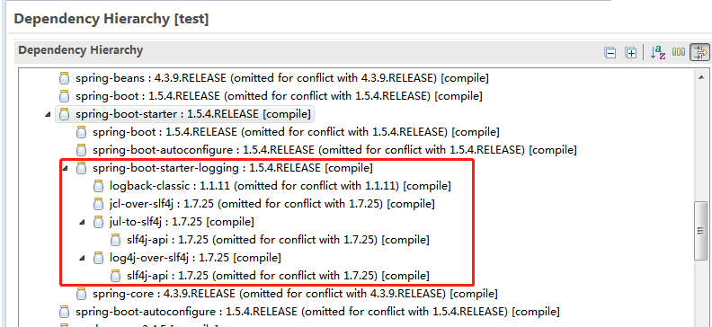
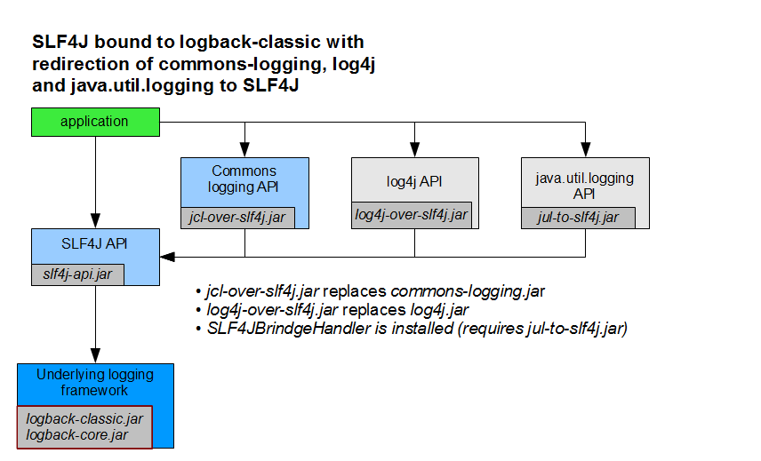

## 日志打印规范
一. 现有日志技术规范

目前后端技术体系是使用springboot，日志底层使用logback，直接在pom.xml中引入相应版本的spring-boot-starter-logging即可，该starter配合logback框架使用的，它的maven依赖关系见下图

该starter主要是适配以下不同日志组件：
- 项目底层日志实现是采用logback，所以需要logback-classic、logback-core和slf4j-api包；
- 部分组件使用commons-logging打印日志，需要jcl-over-slf4j，如spring框架；
- 部分组件使用log4j打印日志，需要log4j-over-slf4j，如dubbo；
- 至于jul-to-slf4j，是适配java.util.logging API。  

所以项目禁止引入log4j、log4j2、commons-logging jar包。详细原理可详见[sfl4j官方](https://www.slf4j.org/legacy.html)

二. logback配置文件介绍，示例[logback.xml](prop/logback.xml)

日志级别
- debug：测试开发环境使用，生产环境禁止输出debug日志，除非是线上不可重现问题。
- info：用于记录应用正常流程中的每一步关键步骤，后续用于问题追查及日志分析。
- warn：用于记录各类警告、输入参数错误的情况，如调用第三方接口超时可以用该级别，单次调用超时可能由于突发网络抖动，但频繁的超时可能是网络故障需要介入处理。
- error：用于记录系统逻辑出错、异常或者重要的错误信息。error级别日志必须要处理，若属于正常业务情况，可降级成warn。

appender  
- ConsoleAppender：输出控制台
- RollingFileAppender：输出至文件，当符合某个条件时，将日志记录到其他文件，如目前文件移动、重命名及压缩。
- AsyncAppender：异步记录日志，能提高性能，要与其他appender配合使用

三. 实际使用

<pre>
@Slf4j 
public class LogService {

    public void execute(String orderId) {
        log.info("开始订单处理{}",orderId);
        try {
            // TODO,业务处理
        } catch (Exception e) {
            log.error("订单处理异常", e);
        }
        log.info("结束订单处理{}",orderId);
    }

}
</pre>
使用lombok中的lombok.extern.slf4j.Slf4j注解，直接在类上加上@Slf4j，本质在编译期间加上私有静态变量log
<pre>
private static Logger log = LoggerFactory.getLogger("com.welab.scaffold.web.controller.ProductController");
</pre>

四. 错误样例  
参考[阿里p3c日志规范](https://github.com/alibaba/p3c/tree/master/p3c-gitbook/%E5%BC%82%E5%B8%B8%E6%97%A5%E5%BF%97)，针对目前项目中常见的错误进行重点说明

1. 【强制】 禁止使用以下三个api进行日志输出
 说明：往标准输出流和标准错误流打印日志未进行格式化及持久化，若需要输出至控制台可以使用ConsoleAppender
<pre style="color:green">
	System.out.println();
	System.err.println();
	e.printStackTrace();
</pre> 
2. 【强制】对各级别的日志输出，必须使用条件输出形式或者使用占位符的方式。 
 说明：logger.debug("Processing trade with id: " + id + " and symbol: " + symbol); 如果日志级别是warn，上述日志不会打印，但是会执行字符串拼接操作，如果symbol是对象，会执行toString()方法，浪费了系统资源，执行了上述操作，最终日志却没有打印。 
 反例：
    <pre style="color:green">（条件，虽然无性能问题，代码略显复杂） 
    if (logger.isDebugEnabled()) {  
        logger.debug("Processing trade with id: " + id + " and symbol: " + symbol);  
    }  </pre>     
正例：
<pre style="color:green">（占位符）: 
logger.debug("Processing trade with id: {} and symbol : {} ", id, symbol);  
</pre>
3. 【推荐】日志信息既要打印完全，又要避免出现重复打印。如不打印异常堆栈，常常底层的堆栈信息更关键，忽略了导致问题排查困难
 反例：只打印message，把异常堆栈信息给忽略
<pre style="color:green">
log.error("业务处理异常{}",e.getMessage());
</pre>
4. 【推荐】logger名称与类名保持一致，方便查看日志就清楚执行哪个类
 反例：类名是JpushPushMessageServiceImpl，但logger名称是PushMessageServiceImpl,应该是代码复制时没有相应修改。随意复制和粘贴代码，必然会导致代码的重复，建议用lombok中的Slf4j注释。
<pre style="color:green">
public class JpushPushMessageServiceImpl implements PushMessageService {
	private static Logger logger = LoggerFactory.getLogger(PushMessageServiceImpl.class);
</pre>
